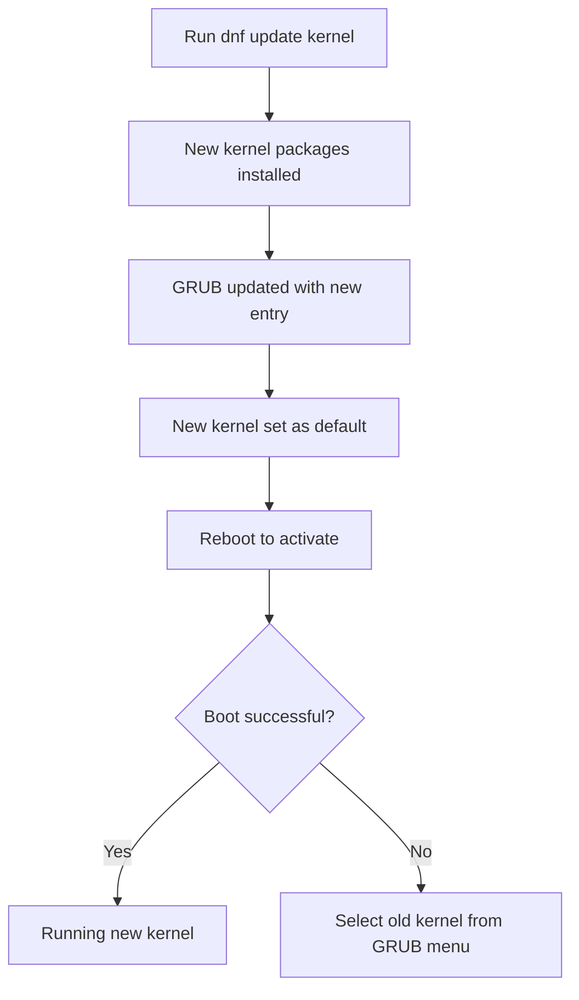

# How to Update the Kernel on RHEL

Author: [nawazdhandala](https://www.github.com/nawazdhandala)

Tags: RHEL, Kernel, Update, Linux

Description: A step-by-step guide to safely updating the kernel on RHEL using dnf, covering pre-update checks, the update process itself, verification, rollback options, and kernel lifecycle management.

---

## Why Update the Kernel?

Kernel updates on RHEL bring security patches, bug fixes, driver updates, and occasionally new features. Unlike most package updates, kernel updates install a new kernel alongside the existing one rather than replacing it. This means you always have a fallback if the new kernel causes issues.

Red Hat backports security fixes to their kernel releases without changing the major version number, so a kernel update on RHEL is generally low-risk. Still, you should follow a process, especially on production systems.

## Pre-Update Checks

Before updating, verify the current state of your system.

```bash
# Check your running kernel version
uname -r

# List all installed kernels
rpm -qa kernel-core

# Check available disk space (you need at least 200 MB free in /boot)
df -h /boot

# Verify your system is registered and has access to repositories
sudo subscription-manager status
sudo dnf repolist
```

## Checking for Available Kernel Updates

```bash
# Check for kernel updates specifically
sudo dnf check-update kernel

# See the full details of available kernel packages
sudo dnf info kernel --available
```

## Performing the Kernel Update

```bash
# Update the kernel
sudo dnf update kernel -y

# Or update the kernel along with all packages
sudo dnf update -y
```

The `dnf update kernel` command installs the new kernel without removing the old one. RHEL keeps the three most recent kernel versions by default.



## Rebooting into the New Kernel

The update does not take effect until you reboot.

```bash
# Check which kernel will boot next
sudo grubby --default-kernel

# Reboot the system
sudo systemctl reboot
```

After reboot, confirm the new kernel is running.

```bash
# Verify the running kernel version
uname -r

# Check that the kernel matches what was installed
rpm -qa kernel-core | sort
```

## Controlling How Many Kernels Are Kept

RHEL uses the `installonly_limit` setting in dnf to control how many kernel versions to keep.

```bash
# Check the current limit
grep installonly_limit /etc/dnf/dnf.conf

# Default is 3 - you can change it
sudo sed -i 's/installonly_limit=3/installonly_limit=5/' /etc/dnf/dnf.conf
```

Keeping more kernels gives you more rollback options. The tradeoff is disk space in `/boot`.

## Rolling Back to a Previous Kernel

If the new kernel causes issues, you can boot into the previous one.

### From the GRUB Menu

1. Reboot the system
2. When the GRUB menu appears, select the older kernel
3. Press Enter to boot

### Changing the Default Kernel

```bash
# List all available kernels
sudo grubby --info=ALL | grep -E "^kernel|^title"

# Set the previous kernel as default
sudo grubby --set-default=/boot/vmlinuz-<old-version>

# Verify the change
sudo grubby --default-kernel
```

### Removing a Problematic Kernel

```bash
# Remove a specific kernel version
sudo dnf remove kernel-core-<version>

# Clean up associated packages
sudo dnf remove kernel-modules-<version> kernel-modules-extra-<version>
```

## Kernel Lifecycle and Support

RHEL kernels follow Red Hat's support lifecycle. Each minor release gets a specific kernel version that receives backported security fixes.

```bash
# Check the kernel changelog for security fixes
rpm -q --changelog kernel-core | head -50

# Check for specific CVE fixes
rpm -q --changelog kernel-core | grep CVE | head -20
```

## Automating Kernel Updates

For environments where you want automatic kernel updates but with control:

```bash
# Install dnf-automatic
sudo dnf install dnf-automatic -y

# Configure it to download but not install automatically
sudo sed -i 's/apply_updates = no/apply_updates = no/' /etc/dnf/automatic.conf

# Enable the download timer
sudo systemctl enable --now dnf-automatic-download.timer
```

This downloads kernel updates automatically so they are ready when you schedule your maintenance window.

## Post-Update Tasks

After a successful kernel update, there are a few housekeeping items.

```bash
# Rebuild the initramfs if you have custom modules or dracut configurations
sudo dracut --force

# Check for any kernel-related warnings in the journal
sudo journalctl -b -k --priority=warning

# Verify DKMS modules rebuilt (if applicable)
dkms status

# Check that all expected kernel modules loaded
lsmod | wc -l
```

## Updating Kernel on Systems with Custom Modules

If you use third-party kernel modules (like NVIDIA drivers or custom DKMS modules), plan for rebuilding them.

```bash
# Check DKMS status before update
dkms status

# After kernel update and reboot, verify DKMS rebuilt modules
dkms status

# If a module failed to build, rebuild it manually
sudo dkms autoinstall
```

## Wrapping Up

Kernel updates on RHEL are straightforward thanks to the multi-kernel installation approach. The process is: check current state, update with dnf, reboot, verify. If something goes wrong, boot the old kernel from GRUB. Keep at least three kernels installed for rollback safety, and always test kernel updates on non-production systems first when possible. For large deployments, stage the updates and use a configuration management tool to roll them out in batches.
