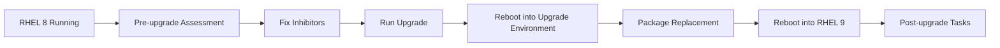
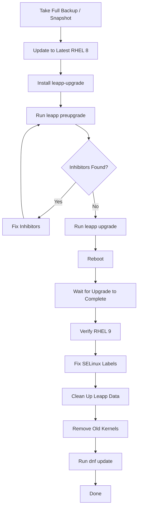

# How to Perform an In-Place Upgrade from RHEL 8 to RHEL 9 Using Leapp

Author: [nawazdhandala](https://github.com/nawazdhandala)

Tags: RHEL, Leapp, Upgrade, Linux, Migration

Description: A practical guide to upgrading RHEL 8 to RHEL 9 in place using the Leapp framework, covering pre-upgrade assessment, resolving inhibitors, performing the upgrade, and post-upgrade verification.

---

Rebuilding servers from scratch is clean but not always practical. Sometimes you have a running RHEL 8 system with services, configurations, and data that would take significant effort to migrate. That is where Leapp comes in. It is Red Hat's supported tool for performing in-place major version upgrades, taking your RHEL 8 system to RHEL 9 without reinstalling.

Fair warning: in-place upgrades always carry some risk. Test this on a non-production system first, have backups, and have a rollback plan. That said, Leapp has matured significantly and works well when you follow the process.

## How Leapp Works

Leapp performs the upgrade in stages. It analyzes the current system, identifies potential problems, downloads new packages, and then reboots into a special upgrade environment where it replaces RHEL 8 packages with RHEL 9 equivalents.



## Prerequisites

Before starting, make sure your system meets these requirements:

- RHEL 8.8 or later (ideally the latest RHEL 8 minor release)
- An active Red Hat subscription
- At least 2 GB of free space in `/var/lib/leapp`
- A full backup of the system (or a VM snapshot if virtualized)

Update your RHEL 8 system to the latest packages first:

```bash
# Update to the latest RHEL 8 packages
sudo dnf update -y

# Reboot to apply any kernel updates
sudo reboot
```

After the reboot, verify your starting point:

```bash
# Check the current RHEL version
cat /etc/redhat-release
```

You should see something like "Red Hat Enterprise Linux release 8.10 (Ootpa)".

## Installing Leapp

Install the Leapp packages from the Red Hat repository:

```bash
# Install Leapp and the upgrade data package
sudo dnf install -y leapp-upgrade
```

This installs the `leapp` command-line tool and the upgrade data files that contain the rules and mappings for the RHEL 8 to RHEL 9 transition.

## Running the Pre-Upgrade Assessment

The pre-upgrade check analyzes your system and reports anything that would block or complicate the upgrade. Always run this first.

```bash
# Run the pre-upgrade assessment
sudo leapp preupgrade --target 9.4
```

This takes several minutes. When it finishes, it generates a report at `/var/log/leapp/leapp-report.txt` and a JSON version at `/var/log/leapp/leapp-report.json`.

Read the report:

```bash
# View the pre-upgrade report
sudo less /var/log/leapp/leapp-report.txt
```

The report categorizes findings by severity:

- **Inhibitor** - blocks the upgrade entirely. You must fix these.
- **High** - significant issues that could cause problems after upgrade.
- **Medium** - things that may need attention but will not block the upgrade.
- **Low/Info** - informational items.

## Common Inhibitors and How to Fix Them

Here are the issues you will most likely encounter:

### Unsigned or Third-Party Packages

Leapp flags packages that are not signed by Red Hat because it cannot guarantee they will work on RHEL 9.

```bash
# List installed packages not from Red Hat repositories
sudo rpm -qa --qf '%{NAME} %{VENDOR}\n' | grep -v "Red Hat"
```

For each third-party package, you have two options: remove it before the upgrade and reinstall the RHEL 9 version afterward, or tell Leapp to allow it.

### Removed PAM Modules

Some PAM modules from RHEL 8 do not exist in RHEL 9. The report will tell you which ones. Remove references to them from `/etc/pam.d/` configuration files.

### Deprecated Kernel Drivers

If your system uses hardware drivers that were removed in RHEL 9, the upgrade will be blocked. Check the report for details and plan for alternative drivers.

### Answer Files

Some inhibitors require you to confirm a decision by creating an answer file. Leapp will tell you exactly what to do:

```bash
# Example: confirm you want to proceed despite a known issue
sudo leapp answer --section check_vdo.confirm --answer True
```

### Custom Repository Configuration

If you have custom repositories enabled, Leapp needs to know how to map them to RHEL 9 equivalents. You may need to create custom repository mappings or disable repos that are not needed during the upgrade.

```bash
# Disable a repository that is causing issues
sudo dnf config-manager --disable problematic-repo
```

## Performing the Upgrade

Once all inhibitors are resolved and the pre-upgrade report is clean (or at least has no inhibitors), start the actual upgrade:

```bash
# Run the upgrade
sudo leapp upgrade --target 9.4
```

This downloads all the RHEL 9 packages and prepares the upgrade environment. Depending on your internet speed and the number of packages, this can take 20 to 60 minutes.

When it completes, it will tell you to reboot:

```bash
# Reboot to start the upgrade process
sudo reboot
```

After the reboot, the system boots into a special Leapp upgrade environment. You will see upgrade progress on the console (if you have physical or console access). Do not interrupt this process. It replaces packages, updates configuration files, rebuilds the initramfs, and updates the bootloader.

This phase typically takes 15 to 45 minutes depending on the number of installed packages and disk speed.

When it finishes, the system reboots again, this time into RHEL 9.

## Post-Upgrade Verification

Log in and verify the upgrade:

```bash
# Verify the new RHEL version
cat /etc/redhat-release
```

You should see "Red Hat Enterprise Linux release 9.4 (Plow)" or similar.

Run through these checks:

```bash
# Verify the running kernel
uname -r

# Check SELinux status
getenforce

# Check for any failed services
systemctl --failed

# Verify subscription status
sudo subscription-manager status

# Verify network connectivity
ip addr show
ping -c 3 8.8.8.8
```

### Fix SELinux Relabeling

The upgrade triggers an SELinux relabel on the next boot. If it did not happen automatically, force it:

```bash
# Force SELinux relabeling on next boot
sudo fixfiles -F onboot

# Reboot to apply the relabel
sudo reboot
```

### Clean Up Leapp Data

After confirming everything works, remove the Leapp packages and leftover data:

```bash
# Remove Leapp packages and data
sudo dnf remove -y leapp-upgrade-el8toel9 leapp-deps-el9 leapp-repository-deps-el9

# Remove leftover Leapp data
sudo rm -rf /var/log/leapp /var/lib/leapp
```

### Remove Old RHEL 8 Kernels

The upgrade may leave old RHEL 8 kernels in the boot menu. Remove them:

```bash
# List installed kernels
rpm -qa kernel-core

# Remove old RHEL 8 kernels (replace with actual version)
sudo dnf remove -y kernel-core-4.18.0*
```

### Update Remaining Packages

```bash
# Run a final update to get the latest RHEL 9 packages
sudo dnf update -y
```

## Rollback Options

If the upgrade fails during the reboot phase, Leapp creates a rollback snapshot (if your system uses LVM with enough free space). You can boot into the old kernel from the GRUB menu.

If you are running VMs, always take a snapshot before starting:

```bash
# Take a VM snapshot before upgrading (on the hypervisor)
sudo virsh snapshot-create-as rhel8-server pre-leapp-upgrade "Before RHEL 9 upgrade"
```

To restore from a snapshot if the upgrade goes wrong:

```bash
# Revert to the pre-upgrade snapshot
sudo virsh snapshot-revert rhel8-server pre-leapp-upgrade
```

For physical servers without snapshots, your options are more limited. That is why backups are non-negotiable before attempting this.

## Upgrade Checklist

Here is a summary checklist for the entire process:



## Things to Watch Out For

- **Third-party software**: Applications installed from non-Red Hat repos may not have RHEL 9 builds. Check with vendors before upgrading.
- **Custom kernel modules**: If you compile kernel modules (like NVIDIA drivers from source), they will break after the upgrade. Plan to rebuild them for the RHEL 9 kernel.
- **Application compatibility**: Python 3.6 is the default in RHEL 8, while RHEL 9 ships Python 3.9. If your applications depend on the exact Python version, test them beforehand.
- **Deprecated features**: Some RHEL 8 features are removed in RHEL 9 (like iptables in favor of nftables). Check the RHEL 9 release notes for the full list.
- **Network interface naming**: Interface names might change between major versions. Verify your network configuration after the upgrade.

Leapp is not magic. It is a well-engineered automation tool that handles the tedious parts of a major version upgrade. But it still requires preparation, testing, and verification. Treat it like any other significant infrastructure change: plan it, test it, have a rollback strategy, and do not run it in production on a Friday afternoon.
