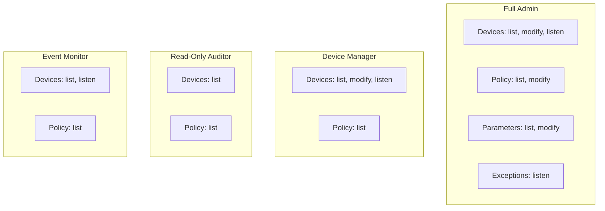

# How to Configure USBGuard Access Control Lists for Non-Root Users on RHEL

Author: [nawazdhandala](https://www.github.com/nawazdhandala)

Tags: RHEL, USBGuard, ACL, Linux

Description: Configure USBGuard IPC access control lists on RHEL to allow non-root users and groups to manage USB device authorization without full root access.

---

By default, only root can interact with USBGuard. But in many environments, you want help desk staff or specific users to be able to allow or block USB devices without giving them full root access. USBGuard's IPC access control system lets you delegate specific permissions to users and groups.

## Understanding USBGuard IPC Access

USBGuard uses a local IPC (Inter-Process Communication) interface for management commands. Access to this interface is controlled through the IPC access control file at `/etc/usbguard/IPCAccessControl.d/`.

The IPC interface supports these permission sections:

| Section | Controls |
|---------|----------|
| `Devices` | Listing and managing connected USB devices |
| `Policy` | Viewing and modifying the rule policy |
| `Exceptions` | Exception handling |
| `Parameters` | Daemon parameters |

Within each section, you can grant these privileges:

- `list` - view information
- `modify` - make changes
- `listen` - receive event notifications

## Checking Current IPC Configuration

```bash
# View the IPC access control configuration
ls -la /etc/usbguard/IPCAccessControl.d/

# Check the daemon config for IPC settings
grep -i ipc /etc/usbguard/usbguard-daemon.conf
```

## Creating Access Control Files

Each file in `/etc/usbguard/IPCAccessControl.d/` defines access for a user or group. The filename determines who gets access.

### Grant a User Permission to List Devices

```bash
# Create an ACL file for user "helpdesk"
sudo tee /etc/usbguard/IPCAccessControl.d/helpdesk << 'EOF'
user=helpdesk
Devices=list
Policy=list
EOF
```

This allows the `helpdesk` user to list connected devices and view the policy, but not modify anything.

### Grant a User Permission to Allow/Block Devices

```bash
# Create an ACL file for user "secadmin"
sudo tee /etc/usbguard/IPCAccessControl.d/secadmin << 'EOF'
user=secadmin
Devices=list,modify,listen
Policy=list
EOF
```

The `secadmin` user can now list devices, allow/block them, and receive event notifications.

### Grant a Group Permission

```bash
# Create an ACL file for the "usbmanagers" group
sudo tee /etc/usbguard/IPCAccessControl.d/usbmanagers << 'EOF'
group=usbmanagers
Devices=list,modify,listen
Policy=list,modify
EOF
```

All members of the `usbmanagers` group can manage devices and modify the policy.

## Setting Proper Permissions

The ACL files need correct ownership and permissions:

```bash
# Set ownership and permissions on ACL files
sudo chown root:root /etc/usbguard/IPCAccessControl.d/*
sudo chmod 600 /etc/usbguard/IPCAccessControl.d/*
```

## Applying Changes

Restart USBGuard after modifying IPC access:

```bash
# Restart to apply IPC access changes
sudo systemctl restart usbguard
```

## Creating the User and Group

If the users and groups do not exist yet:

```bash
# Create the usbmanagers group
sudo groupadd usbmanagers

# Add users to the group
sudo usermod -aG usbmanagers helpdesk
sudo usermod -aG usbmanagers secadmin
```

## Testing Non-Root Access

Switch to the non-root user and test:

```bash
# Switch to the helpdesk user
su - helpdesk

# Try listing devices (should work)
usbguard list-devices

# Try allowing a device (should fail - only has list permission)
usbguard allow-device 15
```

The second command should fail with an access denied error because the `helpdesk` user only has `list` permission for devices.

```bash
# Switch to secadmin (has modify permission)
su - secadmin

# List devices
usbguard list-devices

# Allow a blocked device (should work)
usbguard allow-device 15
```

## Permission Levels Reference



## Practical ACL Examples

### Help Desk - Can view and temporarily allow devices

```bash
sudo tee /etc/usbguard/IPCAccessControl.d/helpdesk-role << 'EOF'
group=helpdesk
Devices=list,modify
Policy=list
EOF
```

### Security Auditor - Read-only access to everything

```bash
sudo tee /etc/usbguard/IPCAccessControl.d/auditor-role << 'EOF'
group=auditors
Devices=list,listen
Policy=list
Parameters=list
Exceptions=listen
EOF
```

### Security Admin - Full management access

```bash
sudo tee /etc/usbguard/IPCAccessControl.d/secadmin-role << 'EOF'
group=secadmins
Devices=list,modify,listen
Policy=list,modify
Parameters=list,modify
Exceptions=listen
EOF
```

## Auditing IPC Access

Monitor who is using USBGuard commands:

```bash
# Check USBGuard logs for IPC activity
sudo journalctl -u usbguard | grep -i ipc

# Monitor real-time USBGuard activity
sudo journalctl -u usbguard -f
```

## Security Considerations

- Keep the number of users with `modify` permissions small
- Use group-based access rather than individual user ACLs when possible
- Regularly audit who has access to USBGuard management
- The `Policy=modify` permission is particularly sensitive since it allows permanent rule changes
- Users with `Devices=modify` can allow blocked devices, so only grant this to trusted staff

## Troubleshooting IPC Access

If a user cannot connect to USBGuard:

```bash
# Check if the IPC socket exists and has correct permissions
ls -la /var/run/usbguard/usbguard-ipc.sock

# Verify the user's groups
groups username

# Check the ACL file syntax
cat /etc/usbguard/IPCAccessControl.d/filename

# Restart USBGuard after any ACL changes
sudo systemctl restart usbguard
```

Delegating USBGuard access through IPC ACLs keeps your security posture strong while making USB management practical for teams that need to handle device authorization in their daily workflow.
