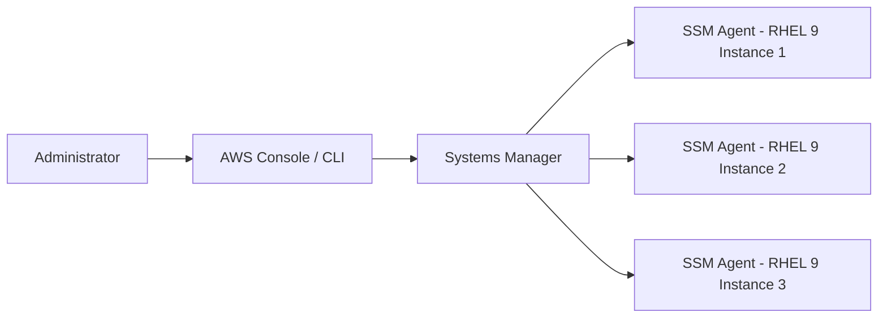

# How to Use AWS Systems Manager with RHEL 9 Instances

Author: [nawazdhandala](https://www.github.com/nawazdhandala)

Tags: RHEL, AWS, Systems Manager, SSM, Cloud, Linux

Description: Set up AWS Systems Manager on RHEL 9 instances for remote management, patching, inventory, and compliance without SSH access.

---

AWS Systems Manager (SSM) provides agentless-like management for RHEL 9 instances through the SSM Agent. It enables remote command execution, automated patching, inventory collection, and compliance checking without opening SSH ports. This guide covers setting up and using SSM with RHEL 9.

## SSM Architecture



## Step 1: Install the SSM Agent

```bash
# The SSM Agent is pre-installed on official AWS RHEL 9 AMIs
# Verify it is running
sudo systemctl status amazon-ssm-agent

# If not installed, install it manually
sudo dnf install -y https://s3.amazonaws.com/ec2-downloads-windows/SSMAgent/latest/linux_amd64/amazon-ssm-agent.rpm

# Start and enable the agent
sudo systemctl enable --now amazon-ssm-agent
```

## Step 2: Configure IAM Role for SSM

```bash
# Create an IAM role with SSM permissions
aws iam create-role \
  --role-name RHEL9-SSM-Role \
  --assume-role-policy-document '{
    "Version": "2012-10-17",
    "Statement": [{
      "Effect": "Allow",
      "Principal": {"Service": "ec2.amazonaws.com"},
      "Action": "sts:AssumeRole"
    }]
  }'

# Attach the SSM managed policy
aws iam attach-role-policy \
  --role-name RHEL9-SSM-Role \
  --policy-arn arn:aws:iam::aws:policy/AmazonSSMManagedInstanceCore

# Create an instance profile and attach the role
aws iam create-instance-profile --instance-profile-name RHEL9-SSM-Profile
aws iam add-role-to-instance-profile \
  --instance-profile-name RHEL9-SSM-Profile \
  --role-name RHEL9-SSM-Role

# Associate the profile with your instance
aws ec2 associate-iam-instance-profile \
  --instance-id i-0123456789abcdef0 \
  --iam-instance-profile Name=RHEL9-SSM-Profile
```

## Step 3: Use Session Manager for Remote Access

```bash
# Start a session (no SSH needed, no inbound ports required)
aws ssm start-session --target i-0123456789abcdef0

# Run a command remotely
aws ssm send-command \
  --instance-ids "i-0123456789abcdef0" \
  --document-name "AWS-RunShellScript" \
  --parameters 'commands=["hostname","uname -r","cat /etc/redhat-release"]' \
  --output text

# Get the command output
aws ssm get-command-invocation \
  --command-id "command-id-here" \
  --instance-id "i-0123456789abcdef0" \
  --query 'StandardOutputContent' \
  --output text
```

## Step 4: Configure Patch Manager

```bash
# Create a patch baseline for RHEL 9
aws ssm create-patch-baseline \
  --name "RHEL9-Security-Patches" \
  --operating-system REDHAT_ENTERPRISE_LINUX \
  --approval-rules '{
    "PatchRules": [{
      "PatchFilterGroup": {
        "PatchFilters": [
          {"Key": "CLASSIFICATION", "Values": ["Security"]},
          {"Key": "SEVERITY", "Values": ["Critical","Important"]}
        ]
      },
      "ApproveAfterDays": 7,
      "ComplianceLevel": "CRITICAL"
    }]
  }'

# Create a maintenance window for patching
aws ssm create-maintenance-window \
  --name "RHEL9-Patch-Window" \
  --schedule "cron(0 2 ? * SUN *)" \
  --duration 4 \
  --cutoff 1 \
  --allow-unassociated-targets
```

## Step 5: Collect Inventory

```bash
# Create an inventory association
aws ssm create-association \
  --name "AWS-GatherSoftwareInventory" \
  --targets "Key=tag:OS,Values=RHEL9" \
  --schedule-expression "rate(12 hours)" \
  --parameters '{
    "applications": ["Enabled"],
    "awsComponents": ["Enabled"],
    "networkConfig": ["Enabled"],
    "customInventory": ["Enabled"]
  }'

# View collected inventory
aws ssm get-inventory \
  --filters "Key=AWS:InstanceInformation.InstanceId,Values=i-0123456789abcdef0" \
  --result-attributes "TypeName=AWS:Application"
```

## Conclusion

AWS Systems Manager with RHEL 9 provides a centralized way to manage, patch, and monitor your fleet without requiring SSH access. It reduces your attack surface by eliminating the need for inbound SSH ports while giving you powerful automation and compliance capabilities.
