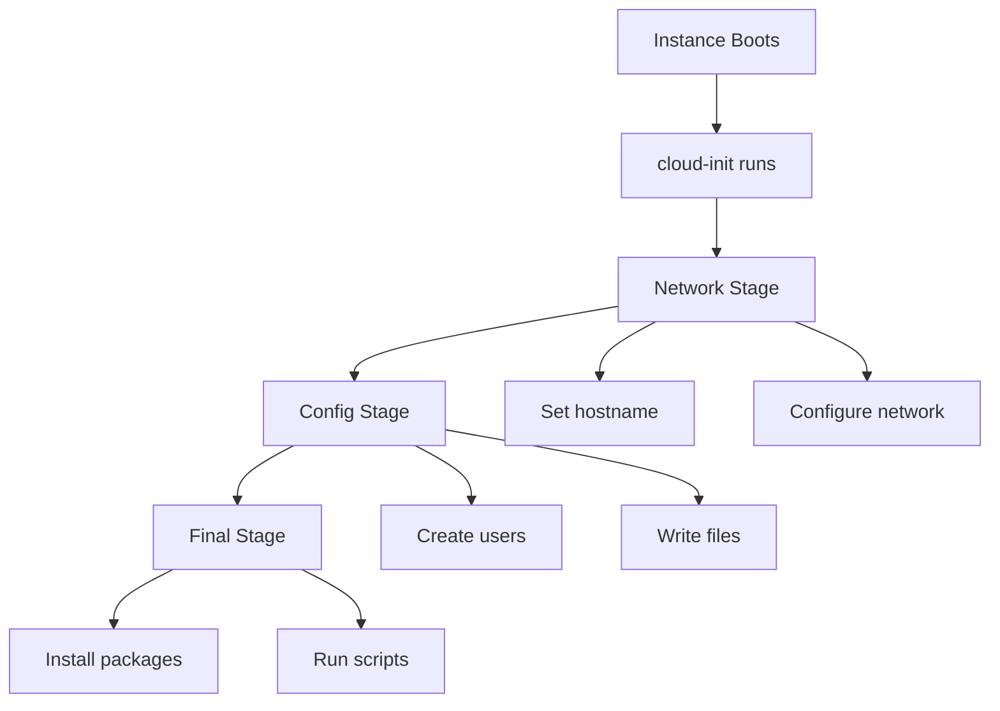

# How to Use Cloud-Init to Configure RHEL 9 on First Boot

Author: [nawazdhandala](https://www.github.com/nawazdhandala)

Tags: RHEL, Cloud-Init, Automation, Cloud, Linux

Description: Use cloud-init to automate RHEL 9 first-boot configuration including users, packages, network settings, and custom scripts.

---

Cloud-init is the standard tool for automating the initial configuration of cloud instances. On RHEL 9, it handles everything from setting the hostname to installing packages and running custom scripts on first boot. This guide covers writing effective cloud-init configurations.

## Cloud-Init Execution Flow



## Step 1: Basic Cloud-Init Configuration

```yaml
#cloud-config
# Basic RHEL 9 cloud-init configuration

# Set the hostname
hostname: web-server-01
fqdn: web-server-01.example.com

# Create users
users:
  - name: admin
    groups: wheel
    sudo: ALL=(ALL) NOPASSWD:ALL
    shell: /bin/bash
    ssh_authorized_keys:
      - ssh-rsa AAAAB3... your-public-key

# Set the timezone
timezone: America/New_York

# Install packages on first boot
packages:
  - vim
  - git
  - tmux
  - htop
  - firewalld
  - dnf-automatic

# Update all packages
package_update: true
package_upgrade: true
```

## Step 2: Advanced Configuration with Scripts

```yaml
#cloud-config

# Write custom configuration files
write_files:
  # Custom sysctl settings
  - path: /etc/sysctl.d/99-custom.conf
    content: |
      net.core.somaxconn = 4096
      vm.swappiness = 10
    permissions: '0644'

  # Custom SSH banner
  - path: /etc/ssh/banner
    content: |
      *** Authorized access only ***
      All activity is monitored and logged.
    permissions: '0644'

  # Systemd service for your application
  - path: /etc/systemd/system/myapp.service
    content: |
      [Unit]
      Description=My Application
      After=network.target
      [Service]
      Type=simple
      ExecStart=/opt/myapp/run.sh
      Restart=on-failure
      [Install]
      WantedBy=multi-user.target

# Run commands on first boot
runcmd:
  # Apply sysctl settings
  - sysctl --system

  # Configure firewall
  - systemctl enable --now firewalld
  - firewall-cmd --permanent --add-service=https
  - firewall-cmd --reload

  # Configure SSH
  - sed -i 's/#Banner none/Banner \/etc\/ssh\/banner/' /etc/ssh/sshd_config
  - systemctl restart sshd

  # Enable automatic updates
  - sed -i 's/apply_updates = no/apply_updates = yes/' /etc/dnf/automatic.conf
  - systemctl enable --now dnf-automatic-install.timer

  # Signal that cloud-init is done
  - echo "Cloud-init completed at $(date)" >> /var/log/cloud-init-done.log
```

## Step 3: Using Cloud-Init with AWS

```bash
# Launch an EC2 instance with cloud-init user data
aws ec2 run-instances \
  --image-id ami-rhel9-id \
  --instance-type t3.large \
  --user-data file://cloud-init-config.yaml \
  --key-name my-key
```

## Step 4: Using Cloud-Init with Azure

```bash
# Create a VM with custom data
az vm create \
  --resource-group rg-rhel9 \
  --name rhel9-vm \
  --image RedHat:RHEL:9_3:latest \
  --custom-data cloud-init-config.yaml \
  --admin-username azureuser \
  --generate-ssh-keys
```

## Step 5: Disk Configuration with Cloud-Init

```yaml
#cloud-config

# Configure and mount additional disks
disk_setup:
  /dev/sdb:
    table_type: gpt
    layout: true
    overwrite: false

fs_setup:
  - device: /dev/sdb1
    filesystem: xfs
    label: data

mounts:
  - ["/dev/sdb1", "/data", "xfs", "defaults,noatime", "0", "0"]
```

## Step 6: Validate Cloud-Init Configuration

```bash
# Validate a cloud-init config file locally
cloud-init schema --config-file cloud-init-config.yaml

# Check cloud-init status on a running instance
cloud-init status

# View cloud-init logs
cat /var/log/cloud-init.log
cat /var/log/cloud-init-output.log

# Re-run cloud-init (for testing)
sudo cloud-init clean
sudo cloud-init init
```

## Conclusion

Cloud-init on RHEL 9 lets you define your entire server configuration as code, making deployments repeatable and consistent across cloud providers. Start with basic settings like users and packages, then add custom scripts and file configurations as needed. Always validate your cloud-config files before deployment.
