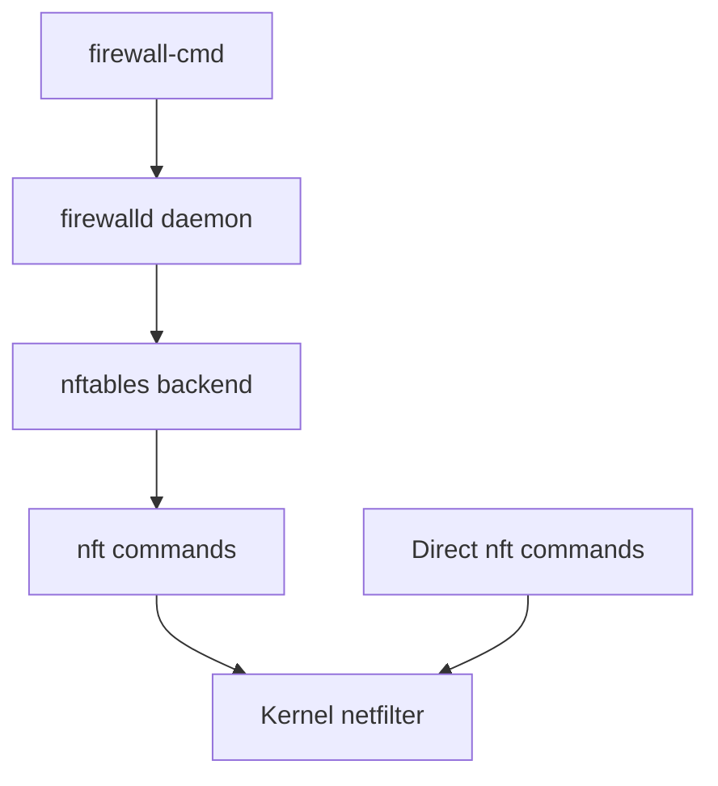

# How to Use nftables with firewalld on RHEL

Author: [nawazdhandala](https://www.github.com/nawazdhandala)

Tags: RHEL, Nftables, Firewalld, Linux

Description: Understand how firewalld and nftables work together on RHEL, and learn how to configure firewall rules using both tools without conflicts.

---

RHEL ships with both firewalld and nftables, and this confuses a lot of people. The short version: firewalld is a frontend, nftables is the backend. firewalld generates nftables rules for you. But if you need to add custom nftables rules alongside firewalld, things get interesting. This post explains how the two interact and how to make them work together.

## How firewalld Uses nftables

On RHEL, firewalld uses nftables as its default backend. When you run `firewall-cmd` commands, firewalld translates them into nftables rules and applies them to the kernel.



Check which backend firewalld is using:

```bash
grep FirewallBackend /etc/firewalld/firewalld.conf
```

You should see `FirewallBackend=nftables`.

## Viewing firewalld's nftables Rules

You can see exactly what nftables rules firewalld has created:

```bash
nft list ruleset
```

You'll notice firewalld creates its own tables and chains with names like `firewalld`. Don't modify these directly, as firewalld will overwrite your changes.

To see firewalld's view of things:

```bash
firewall-cmd --list-all
```

## Adding Rules Through firewalld

For most use cases, adding rules through firewalld is the right approach. It handles persistence and zone management for you.

Allow a service:

```bash
firewall-cmd --permanent --add-service=http
firewall-cmd --permanent --add-service=https
firewall-cmd --reload
```

Allow a specific port:

```bash
firewall-cmd --permanent --add-port=8080/tcp
firewall-cmd --reload
```

Add a rich rule for more granular control:

```bash
firewall-cmd --permanent --add-rich-rule='rule family="ipv4" source address="10.0.0.0/8" port port="3306" protocol="tcp" accept'
firewall-cmd --reload
```

## When You Need Custom nftables Rules

There are times when firewalld's zone model doesn't fit your needs. Maybe you need:
- Complex set-based matching
- Custom chain jumping logic
- Rate limiting per source IP with meters
- NAT rules that firewalld can't express

In these cases, you can add custom nftables rules alongside firewalld.

## Adding Custom nftables Rules Without Breaking firewalld

The key rule is: never modify firewalld's tables directly. Create your own table instead.

Create a separate table for your custom rules:

```bash
nft add table inet custom_rules
nft add chain inet custom_rules prerouting { type filter hook prerouting priority -10 \; policy accept \; }
```

By using a different priority (like -10), your chain runs before firewalld's chains. Use a positive priority to run after.

## Using firewalld's Direct Interface

firewalld has a "direct" interface that lets you insert raw rules. However, this is deprecated in favor of policies and rich rules. If you must use it:

```bash
# Add a direct rule (deprecated but still works)
firewall-cmd --permanent --direct --add-rule inet filter INPUT 0 -s 203.0.113.0/24 -j DROP
firewall-cmd --reload
```

## Using firewalld Policies

The modern approach is to use firewalld policies. Policies define rules for traffic flowing between zones.

Create a policy:

```bash
firewall-cmd --permanent --new-policy=myserver-policy
firewall-cmd --permanent --policy=myserver-policy --add-ingress-zone=public
firewall-cmd --permanent --policy=myserver-policy --add-egress-zone=HOST
firewall-cmd --permanent --policy=myserver-policy --set-target=CONTINUE
firewall-cmd --reload
```

## Creating a Custom nftables Service File

For persistent custom nftables rules that coexist with firewalld, create a systemd service that loads your rules after firewalld starts.

Create the rules file:

```bash
cat > /etc/nftables/custom.nft << 'EOF'
table inet custom_filter {
    set rate_limited_ips {
        type ipv4_addr
        flags timeout
    }

    chain input_custom {
        type filter hook input priority 10; policy accept;

        # Rate limit SSH connections per source
        tcp dport 22 ct state new meter ssh_limit { ip saddr limit rate 5/minute } accept

        # Drop known scanner IPs
        ip saddr @rate_limited_ips drop
    }
}
EOF
```

Create a systemd service to load these rules:

```bash
cat > /etc/systemd/system/nftables-custom.service << 'EOF'
[Unit]
Description=Custom nftables rules
After=firewalld.service

[Service]
Type=oneshot
ExecStart=/usr/sbin/nft -f /etc/nftables/custom.nft
RemainAfterExit=yes

[Install]
WantedBy=multi-user.target
EOF
```

Enable and start it:

```bash
systemctl daemon-reload
systemctl enable --now nftables-custom
```

## Checking for Conflicts

After adding custom rules, verify that both firewalld and your custom rules are present:

```bash
# Check firewalld's rules
nft list table inet firewalld

# Check your custom rules
nft list table inet custom_filter
```

Make sure chain priorities don't conflict. firewalld typically uses priority 0 for its filter chains. Use different priorities for your custom chains.

## Troubleshooting Common Issues

**firewalld reload wipes custom rules in firewalld tables.** This is expected. Never put custom rules in firewalld's tables. Always use your own table.

**Rules disappear after reboot.** Make sure your custom service is enabled and starts after firewalld.

**Double NAT or double filtering.** If both firewalld and your custom rules do NAT, you'll get conflicts. Pick one tool for NAT.

Check the order of chain evaluation:

```bash
nft list chains | grep -E "hook|priority"
```

## Choosing Between firewalld and Raw nftables

For most servers, firewalld is fine. Use it when:
- You want zone-based management
- Your rules are standard allow/deny patterns
- You want a simpler interface

Use raw nftables when:
- You need sets, maps, or meters
- You have complex forwarding rules
- You're building a dedicated firewall or router
- Performance is critical and you want to minimize rule count

If you go with raw nftables only, disable firewalld:

```bash
systemctl stop firewalld
systemctl disable firewalld
systemctl enable --now nftables
```

The two tools can coexist, but keeping things simple by choosing one approach and sticking with it saves headaches down the road.
