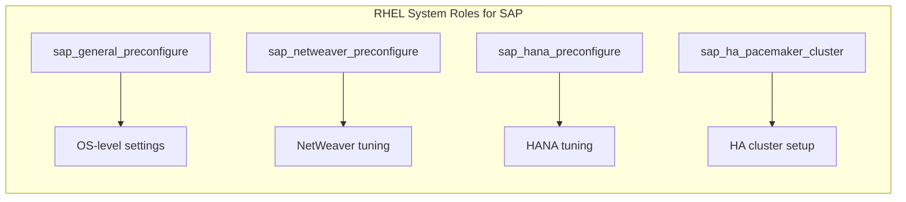

# How to Use RHEL System Roles for SAP Configuration

Author: [nawazdhandala](https://www.github.com/nawazdhandala)

Tags: RHEL, SAP, Ansible, System Roles, Automation, Linux

Description: Automate SAP system preparation on RHEL using Red Hat's official Ansible System Roles for consistent and repeatable configurations.

---

Red Hat provides official Ansible roles that automate the preparation of RHEL systems for SAP workloads. These roles ensure that every server meets SAP requirements consistently, eliminating manual configuration errors and saving significant setup time.

## Available SAP System Roles



## Prerequisites

- RHEL with an SAP Solutions subscription
- Ansible installed on a control node
- SSH access to target SAP hosts

## Step 1: Install the System Roles

```bash
# Install the SAP system roles package
sudo dnf install -y rhel-system-roles-sap ansible-core

# Verify the roles are available
ansible-galaxy list | grep sap
```

## Step 2: Create an Inventory File

```bash
# Create a project directory
mkdir -p ~/sap-automation
cd ~/sap-automation

# Create the inventory file
cat <<'INVENTORY' > inventory.yml
all:
  children:
    sap_hana:
      hosts:
        hana-primary:
          ansible_host: 192.168.1.10
        hana-secondary:
          ansible_host: 192.168.1.11
    sap_app:
      hosts:
        app-server-01:
          ansible_host: 192.168.1.20
        app-server-02:
          ansible_host: 192.168.1.21
INVENTORY
```

## Step 3: Create Playbook for SAP HANA Preparation

```bash
cat <<'PLAYBOOK' > prepare-hana.yml
---
- name: Prepare RHEL for SAP HANA
  hosts: sap_hana
  become: true
  vars:
    # General preconfigure settings
    sap_general_preconfigure_modify_etc_hosts: true
    sap_general_preconfigure_update: true
    sap_general_preconfigure_fail_if_reboot_required: false
    sap_general_preconfigure_reboot_ok: true

    # HANA-specific settings
    sap_hana_preconfigure_update: true
    sap_hana_preconfigure_reboot_ok: true
    # Set to false in production if you want manual reboot control
    sap_hana_preconfigure_fail_if_reboot_required: false

  roles:
    # First role handles general OS preparation
    - role: sap_general_preconfigure

    # Second role handles HANA-specific preparation
    - role: sap_hana_preconfigure
PLAYBOOK
```

## Step 4: Create Playbook for SAP NetWeaver Preparation

```bash
cat <<'PLAYBOOK' > prepare-netweaver.yml
---
- name: Prepare RHEL for SAP NetWeaver
  hosts: sap_app
  become: true
  vars:
    sap_general_preconfigure_modify_etc_hosts: true
    sap_general_preconfigure_update: true
    sap_general_preconfigure_reboot_ok: true

    sap_netweaver_preconfigure_fail_if_not_enough_swap_space_configured: false

  roles:
    - role: sap_general_preconfigure
    - role: sap_netweaver_preconfigure
PLAYBOOK
```

## Step 5: Run the Playbooks

```bash
# Test with a dry run first (check mode)
ansible-playbook -i inventory.yml prepare-hana.yml --check --diff

# Apply the HANA preparation
ansible-playbook -i inventory.yml prepare-hana.yml

# Apply the NetWeaver preparation
ansible-playbook -i inventory.yml prepare-netweaver.yml
```

## Step 6: Verify the Configuration

```bash
# Create a verification playbook
cat <<'PLAYBOOK' > verify-sap.yml
---
- name: Verify SAP configuration
  hosts: all
  become: true
  tasks:
    - name: Check kernel parameters
      ansible.builtin.command: sysctl kernel.shmmax kernel.shmall kernel.sem
      register: sysctl_output
      changed_when: false

    - name: Display kernel parameters
      ansible.builtin.debug:
        var: sysctl_output.stdout_lines

    - name: Check THP status
      ansible.builtin.command: cat /sys/kernel/mm/transparent_hugepage/enabled
      register: thp_output
      changed_when: false

    - name: Display THP status
      ansible.builtin.debug:
        var: thp_output.stdout

    - name: Check tuned profile
      ansible.builtin.command: tuned-adm active
      register: tuned_output
      changed_when: false

    - name: Display tuned profile
      ansible.builtin.debug:
        var: tuned_output.stdout
PLAYBOOK

ansible-playbook -i inventory.yml verify-sap.yml
```

## What the Roles Configure

The `sap_general_preconfigure` role handles:
- Package installation for SAP prerequisites
- Kernel parameter tuning (sysctl)
- User limit configuration
- Hostname and /etc/hosts configuration
- SELinux settings
- Time synchronization

The `sap_hana_preconfigure` role adds:
- HANA-specific kernel parameters
- THP disabling
- SAP HANA tuned profile activation
- Required package groups for HANA
- Memory and CPU governor settings

## Conclusion

RHEL System Roles for SAP eliminate the guesswork from preparing servers for SAP workloads. By using these Ansible roles, you get consistent, tested configurations across all your SAP hosts. Integrate these playbooks into your provisioning pipeline so every new SAP server starts with the correct baseline.
