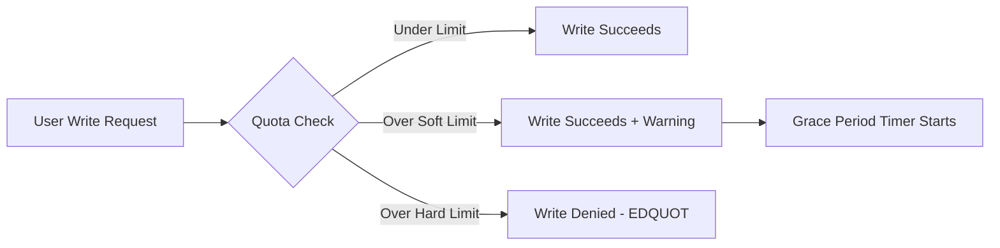

# How to Set Up User and Group Quotas on ext4 File Systems on RHEL 9

Author: [nawazdhandala](https://www.github.com/nawazdhandala)

Tags: RHEL, ext4, Quotas, Linux

Description: A practical guide to enabling user and group quotas on ext4 file systems in RHEL 9, covering setup, configuration, and verification of disk usage limits.

---

While XFS is the default filesystem on RHEL 9, plenty of environments still run ext4 - especially on older partitions migrated from RHEL 7 or 8, or on systems where ext4's specific characteristics are preferred. If you need disk quotas on ext4, the process involves a few more steps than XFS, but it is well-tested and reliable.

## How ext4 Quotas Work

ext4 quotas rely on external quota files (or, with newer kernels, internal quota inodes) to track usage. The Linux quota subsystem intercepts filesystem operations and enforces limits based on these records.



## Prerequisites

Install the quota tools package:

```bash
# Install quota utilities
dnf install -y quota
```

You need an ext4 partition to work with. For this guide, I will use `/dev/vg_data/lv_home` mounted at `/home`.

## Step 1: Enable Quota Support in fstab

Edit `/etc/fstab` and add quota options to your ext4 mount:

```bash
# Edit fstab
vi /etc/fstab
```

Add `usrquota` and `grpquota` to the options field:

```
/dev/vg_data/lv_home  /home  ext4  defaults,usrquota,grpquota  0 2
```

Remount the filesystem:

```bash
# Remount to apply new options
mount -o remount /home
```

Verify the mount options took effect:

```bash
# Confirm quota options are active
mount | grep /home
```

## Step 2: Create Quota Database Files

ext4 quotas need database files to be initialized. Run `quotacheck` to scan the filesystem and build these files:

```bash
# Create quota files - scan the entire /home filesystem
# -c creates new files, -u for user, -g for group, -m skips remount
quotacheck -cugm /home
```

This creates `aquota.user` and `aquota.group` in the root of `/home`.

Verify the files were created:

```bash
# Check that quota database files exist
ls -la /home/aquota.*
```

## Step 3: Turn On Quota Enforcement

Enable quota enforcement:

```bash
# Turn on both user and group quotas
quotaon /home
```

Check the status:

```bash
# Verify quotas are active
quotaon -p /home
```

You should see output confirming that user and group quotas are enabled.

## Step 4: Set User Quotas

Use `edquota` to set limits for a user. This opens an editor with the current quota values:

```bash
# Edit quotas for user 'jsmith' interactively
edquota -u jsmith
```

The editor shows something like:

```
Disk quotas for user jsmith (uid 1001):
  Filesystem   blocks   soft     hard   inodes   soft   hard
  /dev/vg_data/lv_home  0   5242880  6291456  0   0   0
```

Block values are in kilobytes. So 5242880 KB = 5 GB soft, 6291456 KB = 6 GB hard.

For non-interactive scripting, use `setquota`:

```bash
# Set quotas non-interactively
# Format: setquota -u USER BLOCK_SOFT BLOCK_HARD INODE_SOFT INODE_HARD FILESYSTEM
# Set 5 GB soft, 6 GB hard block limits, no inode limits
setquota -u jsmith 5242880 6291456 0 0 /home
```

## Step 5: Set Group Quotas

Group quotas are similar:

```bash
# Set group quota - 20 GB soft, 25 GB hard for 'engineering'
setquota -g engineering 20971520 26214400 0 0 /home
```

Or use the interactive editor:

```bash
# Edit group quotas interactively
edquota -g engineering
```

## Step 6: Verify Quota Settings

Check a specific user's quota:

```bash
# Show quota for user jsmith
quota -u jsmith
```

Generate a full report for all users:

```bash
# Report all user quotas on /home
repquota -ua /home
```

For group quotas:

```bash
# Report all group quotas on /home
repquota -ga /home
```

Human-readable output:

```bash
# Show human-readable quota report
repquota -uas /home
```

## Step 7: Copy Quotas Between Users

When you have a template user with the right quota values, copy those limits to other users:

```bash
# Use jsmith's quotas as a template for new users
edquota -p jsmith -u newuser1
edquota -p jsmith -u newuser2
edquota -p jsmith -u newuser3
```

This is a big time saver when onboarding multiple users.

## Step 8: Set Grace Periods

Configure how long users can exceed their soft limit:

```bash
# Set grace periods interactively
edquota -t
```

Or set them for specific durations:

```bash
# Set block grace period to 7 days, inode grace to 7 days
setquota -t 604800 604800 /home
```

The values are in seconds. 604800 seconds = 7 days.

## Automating Quota Setup for New Users

Here is a script that sets up quotas when creating new users:

```bash
#!/bin/bash
# create-user-with-quota.sh
# Creates a user and applies standard quota limits

USERNAME=$1
QUOTA_SOFT_GB=${2:-5}   # Default 5 GB soft limit
QUOTA_HARD_GB=${3:-6}   # Default 6 GB hard limit

if [ -z "$USERNAME" ]; then
    echo "Usage: $0 <username> [soft_gb] [hard_gb]"
    exit 1
fi

# Create the user
useradd "$USERNAME"

# Convert GB to KB for setquota
SOFT_KB=$((QUOTA_SOFT_GB * 1048576))
HARD_KB=$((QUOTA_HARD_GB * 1048576))

# Apply quota
setquota -u "$USERNAME" "$SOFT_KB" "$HARD_KB" 0 0 /home

echo "User $USERNAME created with ${QUOTA_SOFT_GB}G soft / ${QUOTA_HARD_GB}G hard quota on /home"

# Verify
quota -u "$USERNAME"
```

Make it executable and use it:

```bash
chmod +x create-user-with-quota.sh
./create-user-with-quota.sh jdoe 10 12
```

## Monitoring Quota Usage

Set up a cron job to email weekly reports:

```bash
# Add to root's crontab
cat >> /var/spool/cron/root << 'EOF'
# Weekly quota report every Monday at 7 AM
0 7 * * 1 /usr/sbin/repquota -uas /home | mail -s "Weekly Quota Report" admin@example.com
EOF
```

## Using Journaled Quotas (Recommended)

For better crash recovery, use journaled quotas instead of the older format. Change your fstab options:

```
/dev/vg_data/lv_home  /home  ext4  defaults,usrjquota=aquota.user,grpjquota=aquota.group,jqfmt=vfsv1  0 2
```

Then remount and re-initialize:

```bash
# Remount and reinitialize with journaled quotas
mount -o remount /home
quotaoff /home
quotacheck -cugm /home
quotaon /home
```

Journaled quotas recover automatically after a crash, so you do not need to run `quotacheck` after unclean shutdowns.

## Troubleshooting

**Quotas not enforcing after reboot:**
Make sure `quotaon` runs at boot. On systemd systems, create a simple service or confirm that the `quota_nld` service is running:

```bash
# Check if quota services are running
systemctl status quota_nld
```

**"Cannot find filesystem to check" error:**
This usually means fstab does not have quota options. Double-check your fstab entry and remount.

**Quota files corrupted:**
Turn off quotas, rebuild the database, and turn them back on:

```bash
quotaoff /home
rm /home/aquota.user /home/aquota.group
quotacheck -cugm /home
quotaon /home
```

## Summary

ext4 quotas on RHEL 9 require a bit more setup than XFS, but they work reliably once configured. The key steps are: add mount options, create quota databases with `quotacheck`, enable enforcement with `quotaon`, and set limits with `setquota` or `edquota`. Use journaled quotas for resilience, and automate reporting so you catch issues early.
