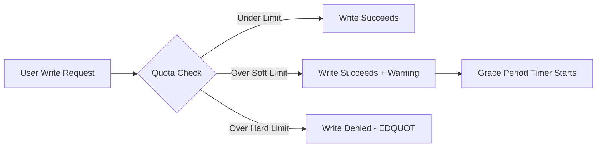

# How to Set Up User and Group Quotas on ext4 File Systems on RHEL

Author: [nawazdhandala](https://www.github.com/nawazdhandala)

Tags: RHEL, Ext4, Quota, Linux

Description: A practical guide to enabling user and group quotas on ext4 file systems in RHEL, covering setup, configuration, and verification of disk usage limits.

---

While XFS is the default filesystem on RHEL, plenty of environments still run ext4 - especially on older partitions migrated from RHEL 7 or 8, or on systems where ext4's specific characteristics are preferred. If you need disk quotas on ext4, the process involves a few more steps than XFS, but it is well-tested and reliable.

## How ext4 Quotas Work

On RHEL 9, ext4 quotas should use the ext4 `quota` filesystem feature, which stores quota data in internal quota inodes. The Linux quota subsystem intercepts filesystem operations and enforces limits based on these records.


```mermaid
graph LR
    A[User Write Request] --> B{Quota Check}
    B -->|Under Limit| C[Write Succeeds]
    B -->|Over Soft Limit| D[Write Succeeds + Warning]
    B -->|Over Hard Limit| E[Write Denied - EDQUOT]
    D --> F[Grace Period Timer Starts]
```

## Prerequisites

Install the quota tools package:

```bash
# Install quota utilities

dnf install -y quota
```

You need an ext4 partition to work with. For this guide, I will use `/dev/vg_data/lv_home` mounted at `/home`.

## Step 1: Enable Quota Support in fstab

Edit `/etc/fstab` and add quota options to your ext4 mount:

```bash
# Edit fstab
vi /etc/fstab
```

Add `usrquota` and `grpquota` to the options field:

```bash
/dev/vg_data/lv_home  /home  ext4  defaults,usrquota,grpquota  0 2
```

Before mounting with those options, make sure the ext4 quota feature is enabled. For an existing filesystem, unmount it and enable the feature with `tune2fs`:

```bash
# Unmount the filesystem and enable the ext4 quota feature
umount /home
tune2fs -O quota /dev/vg_data/lv_home
mount /home
```

Verify the mount options took effect:

```bash
# Confirm quota options are active
mount | grep /home
```

## Step 2: Verify Quota Initialization

With the ext4 quota feature enabled, quota data is initialized in hidden quota inodes. You do not need to create visible `aquota.user` or `aquota.group` files.

If you are creating a new filesystem instead of enabling quotas on an existing one, enable the quota feature at creation time:

```bash
# Enable quotas when creating a new ext4 filesystem
mkfs.ext4 -O quota /dev/vg_data/lv_home
```

Verify the feature on an existing filesystem:

```bash
# Confirm the quota feature is enabled
tune2fs -l /dev/vg_data/lv_home | grep 'Filesystem features'
```

## Step 3: Turn On Quota Enforcement

Enable quota enforcement:

```bash
# Turn on both user and group quota enforcement
quotaon -vug /home
```

Check the status:

```bash
# Verify user and group quotas are active
quotaon -pug /home
```

You should see output confirming that user and group quotas are enabled.

## Step 4: Set User Quotas

Use `edquota` to set limits for a user. This opens an editor with the current quota values:

```bash
# Edit quotas for user 'jsmith' interactively
edquota -u jsmith
```

The editor shows something like:

```bash
Disk quotas for user jsmith (uid 1001):
  Filesystem   blocks   soft     hard   inodes   soft   hard
  /dev/vg_data/lv_home  0   5242880  6291456  0   0   0
```

Block values are in 1024-byte blocks. So 5242880 KiB = 5 GiB soft, 6291456 KiB = 6 GiB hard.

For non-interactive scripting, use `setquota`:

```bash
# Set quotas non-interactively
# Format: setquota -u USER BLOCK_SOFT BLOCK_HARD INODE_SOFT INODE_HARD FILESYSTEM
# Set 5 GiB soft, 6 GiB hard block limits, no inode limits
setquota -u jsmith 5242880 6291456 0 0 /home
```

## Step 5: Set Group Quotas

Group quotas are similar:

```bash
# Set group quota - 20 GiB soft, 25 GiB hard for 'engineering'
setquota -g engineering 20971520 26214400 0 0 /home
```

Or use the interactive editor:

```bash
# Edit group quotas interactively
edquota -g engineering
```

## Step 6: Verify Quota Settings

Check a specific user's quota:

```bash
# Show quota for user jsmith
quota -u jsmith
```

Generate a full report for all users:

```bash
# Report all user quotas on /home
repquota -ua /home
```

For group quotas:

```bash
# Report all group quotas on /home
repquota -ga /home
```

Human-readable output:

```bash
# Show human-readable quota report
repquota -uas /home
```

## Step 7: Copy Quotas Between Users

When you have a template user with the right quota values, copy those limits to other users:

```bash
# Use jsmith's quotas as a template for new users
edquota -p jsmith -u newuser1
edquota -p jsmith -u newuser2
edquota -p jsmith -u newuser3
```

This is a big time saver when onboarding multiple users.

## Step 8: Set Grace Periods

Configure how long users can exceed their soft limit:

```bash
# Set grace periods interactively
edquota -t
```

Or set them for specific durations:

```bash
# Set user block grace period to 7 days and inode grace to 7 days
setquota -u -t 604800 604800 /home

# Set group block grace period to 7 days and inode grace to 7 days
setquota -g -t 604800 604800 /home
```

The `setquota -t` values are in seconds. 604800 seconds = 7 days.

## Automating Quota Setup for New Users

Here is a script that sets up quotas when creating new users:

```bash
#!/bin/bash
# create-user-with-quota.sh
# Creates a user and applies standard quota limits

USERNAME=$1
QUOTA_SOFT_GIB=${2:-5}   # Default 5 GiB soft limit
QUOTA_HARD_GIB=${3:-6}   # Default 6 GiB hard limit

if [ -z "$USERNAME" ]; then
    echo "Usage: $0 <username> [soft_gib] [hard_gib]"
    exit 1
fi

# Create the user
useradd "$USERNAME"

# Convert GiB to KiB for setquota
SOFT_KB=$((QUOTA_SOFT_GIB * 1048576))
HARD_KB=$((QUOTA_HARD_GIB * 1048576))

# Apply quota
setquota -u "$USERNAME" "$SOFT_KB" "$HARD_KB" 0 0 /home

echo "User $USERNAME created with ${QUOTA_SOFT_GIB}GiB soft / ${QUOTA_HARD_GIB}GiB hard quota on /home"

# Verify
quota -u "$USERNAME"
```

Make it executable and use it:

```bash
chmod +x create-user-with-quota.sh
./create-user-with-quota.sh jdoe 10 12
```

## Monitoring Quota Usage

Set up a cron job to email weekly reports:

```bash
# Add to root's crontab
cat >> /var/spool/cron/root << 'EOF'
# Weekly quota report every Monday at 7 AM
0 7 * * 1 /usr/sbin/repquota -uas /home | mail -s "Weekly Quota Report" admin@example.com
EOF
```

## Using Journaled Quotas (Recommended)

For better crash recovery, use the ext4 quota filesystem feature instead of the older external quota file format. The feature uses journaled quotas automatically, so keep the user and group enforcement options in fstab:

```bash
/dev/vg_data/lv_home  /home  ext4  defaults,usrquota,grpquota  0 2
```

If the feature is not already enabled, unmount the filesystem, enable it, and mount it again:

```bash
# Enable internal journaled ext4 quotas
umount /home
tune2fs -O quota /dev/vg_data/lv_home
mount /home
quotaon -vug /home
```

Journaled quotas recover automatically after a crash, so you do not need to run `quotacheck` after unclean shutdowns.

## Troubleshooting

**Quotas not enforcing after reboot:**
Make sure the ext4 quota feature is enabled and that the filesystem is mounted with `usrquota` and `grpquota` enforcement options:

```bash
# Check quota state and mount options
quotaon -pug /home
findmnt -no OPTIONS /home
```

**"Cannot find filesystem to check" error:**
This usually means the target is not mounted where expected or the filesystem is not listed with quota options. Double-check your fstab entry and mount state.

**Quota metadata needs a consistency check:**
Turn off quota enforcement and check the filesystem while it is unmounted:

```bash
quotaoff -vug /home
umount /home
e2fsck -f /dev/vg_data/lv_home
mount /home
quotaon -vug /home
```

## Summary

ext4 quotas on RHEL require a bit more setup than XFS, but they work reliably once configured. The key steps are: enable the ext4 quota feature, add mount options, enable enforcement with `quotaon`, and set limits with `setquota` or `edquota`. Use journaled quotas for resilience, and automate reporting so you catch issues early.
