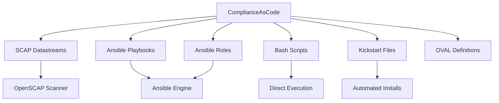

# How to Validate RHEL Compliance Using the ComplianceAsCode Project

Author: [nawazdhandala](https://www.github.com/nawazdhandala)

Tags: RHEL, ComplianceAsCode, Compliance, Security, Linux

Description: Use the ComplianceAsCode project to validate RHEL against multiple security frameworks including CIS, STIG, PCI-DSS, and NIST 800-53.

---

ComplianceAsCode is the upstream project that produces all the security compliance content for RHEL. It is maintained on GitHub and is the source for what ships as the scap-security-guide RPM. Understanding how to use ComplianceAsCode directly gives you access to the latest content, the ability to customize profiles, and the tools to build your own compliance validation pipeline.

## What ComplianceAsCode Provides



## Install from RPM

The simplest way to get started:

```bash
# Install the RPM package
dnf install -y scap-security-guide openscap-scanner

# Check the installed version
rpm -qi scap-security-guide

# List all available profiles
oscap info /usr/share/xml/scap/ssg/content/ssg-rhel9-ds.xml
```

## Install from Source for Latest Content

For the most up-to-date rules and fixes:

```bash
# Clone the repository
git clone https://github.com/ComplianceAsCode/content.git /opt/complianceascode
cd /opt/complianceascode

# Install build dependencies
dnf install -y cmake make openscap-utils python3-pyyaml python3-jinja2 \
  python3-setuptools libxml2 python3-lxml

# Build RHEL content
mkdir build && cd build
cmake ..
make rhel9

# The built content is in:
ls /opt/complianceascode/build/ssg-rhel9-ds.xml
```

## Validate Against Multiple Frameworks

### CIS Benchmark

```bash
# CIS Level 1 Server
oscap xccdf eval \
  --profile xccdf_org.ssgproject.content_profile_cis_server_l1 \
  --results /var/log/compliance/cis-l1.xml \
  --report /var/log/compliance/cis-l1.html \
  /usr/share/xml/scap/ssg/content/ssg-rhel9-ds.xml || true

# CIS Level 2 Server
oscap xccdf eval \
  --profile xccdf_org.ssgproject.content_profile_cis \
  --results /var/log/compliance/cis-l2.xml \
  --report /var/log/compliance/cis-l2.html \
  /usr/share/xml/scap/ssg/content/ssg-rhel9-ds.xml || true
```

### DISA STIG

```bash
oscap xccdf eval \
  --profile xccdf_org.ssgproject.content_profile_stig \
  --results /var/log/compliance/stig.xml \
  --report /var/log/compliance/stig.html \
  /usr/share/xml/scap/ssg/content/ssg-rhel9-ds.xml || true
```

### PCI-DSS

```bash
oscap xccdf eval \
  --profile xccdf_org.ssgproject.content_profile_pci-dss \
  --results /var/log/compliance/pci-dss.xml \
  --report /var/log/compliance/pci-dss.html \
  /usr/share/xml/scap/ssg/content/ssg-rhel9-ds.xml || true
```

### OSPP (Maps to NIST 800-53)

```bash
oscap xccdf eval \
  --profile xccdf_org.ssgproject.content_profile_ospp \
  --results /var/log/compliance/ospp.xml \
  --report /var/log/compliance/ospp.html \
  /usr/share/xml/scap/ssg/content/ssg-rhel9-ds.xml || true
```

## Build a Multi-Framework Validation Script

```bash
cat > /usr/local/bin/validate-all-frameworks.sh << 'SCRIPT'
#!/bin/bash
DATE=$(date +%Y%m%d)
REPORT_DIR="/var/log/compliance/${DATE}"
CONTENT="/usr/share/xml/scap/ssg/content/ssg-rhel9-ds.xml"

mkdir -p "$REPORT_DIR"

echo "=== Multi-Framework Compliance Validation ==="
echo "Host: $(hostname)"
echo "Date: $(date)"
echo ""

for PROFILE in cis_server_l1 cis stig pci-dss ospp; do
    FULL_PROFILE="xccdf_org.ssgproject.content_profile_${PROFILE}"
    echo "Scanning profile: ${PROFILE}..."

    oscap xccdf eval \
      --profile "$FULL_PROFILE" \
      --results "${REPORT_DIR}/${PROFILE}.xml" \
      --report "${REPORT_DIR}/${PROFILE}.html" \
      "$CONTENT" 2>/dev/null || true

    PASS=$(grep -c 'result="pass"' "${REPORT_DIR}/${PROFILE}.xml" 2>/dev/null || echo 0)
    FAIL=$(grep -c 'result="fail"' "${REPORT_DIR}/${PROFILE}.xml" 2>/dev/null || echo 0)
    TOTAL=$((PASS + FAIL))
    if [ "$TOTAL" -gt 0 ]; then
        SCORE=$((PASS * 100 / TOTAL))
    else
        SCORE=0
    fi

    echo "  ${PROFILE}: ${PASS} passed, ${FAIL} failed (${SCORE}% compliant)"
done

echo ""
echo "Reports saved to: ${REPORT_DIR}"
SCRIPT
chmod +x /usr/local/bin/validate-all-frameworks.sh
```

## Generate Remediation from ComplianceAsCode

### Ansible remediation

```bash
# Use the pre-built Ansible playbooks
ls /usr/share/scap-security-guide/ansible/rhel9-playbook-*.yml

# Apply CIS Level 1 remediation
ansible-playbook -i localhost, -c local \
  /usr/share/scap-security-guide/ansible/rhel9-playbook-cis_server_l1.yml
```

### Bash remediation

```bash
# Use the pre-built bash scripts
ls /usr/share/scap-security-guide/bash/rhel9-script-*.sh

# Apply STIG remediation
bash /usr/share/scap-security-guide/bash/rhel9-script-stig.sh
```

### Targeted remediation from scan results

```bash
# Generate fixes for only the failed rules
oscap xccdf generate fix \
  --fix-type ansible \
  --result-id "" \
  --output /tmp/targeted-remediation.yml \
  /var/log/compliance/stig.xml
```

## Customize Profiles with Tailoring

```bash
# Create a tailoring file to customize which rules are active
# SCAP Workbench provides a GUI for this
dnf install -y scap-workbench

# Or manually create tailoring XML
# The tailoring file lets you:
# - Disable rules that do not apply
# - Change rule values (like minimum password length)
# - Add organizational-specific selections

# Apply a scan with tailoring
oscap xccdf eval \
  --profile xccdf_org.ssgproject.content_profile_stig \
  --tailoring-file /path/to/tailoring.xml \
  --results /tmp/tailored-results.xml \
  /usr/share/xml/scap/ssg/content/ssg-rhel9-ds.xml || true
```

## Contribute Back to ComplianceAsCode

If you find a rule that is incorrect or missing, you can contribute:

```bash
# The project structure:
# /opt/complianceascode/
#   linux_os/guide/       - Rule definitions
#   products/rhel9/       - RHEL specific content
#   tests/                - Test suites

# Rules are defined in YAML files
# Each rule has:
#   - description
#   - rationale
#   - remediation (bash, ansible, etc.)
#   - OVAL check definition
```

## Track Compliance Over Time

```bash
# Create a compliance history tracker
cat > /usr/local/bin/compliance-history.sh << 'SCRIPT'
#!/bin/bash
DATE=$(date +%Y%m%d)
HISTORY="/var/log/compliance/history.csv"

# Add header if file does not exist
if [ ! -f "$HISTORY" ]; then
    echo "date,hostname,profile,pass,fail,score" > "$HISTORY"
fi

for PROFILE in cis_server_l1 stig pci-dss; do
    RESULT="/var/log/compliance/${DATE}/${PROFILE}.xml"
    if [ -f "$RESULT" ]; then
        PASS=$(grep -c 'result="pass"' "$RESULT")
        FAIL=$(grep -c 'result="fail"' "$RESULT")
        TOTAL=$((PASS + FAIL))
        [ "$TOTAL" -gt 0 ] && SCORE=$((PASS * 100 / TOTAL)) || SCORE=0
        echo "${DATE},$(hostname),${PROFILE},${PASS},${FAIL},${SCORE}" >> "$HISTORY"
    fi
done
SCRIPT
chmod +x /usr/local/bin/compliance-history.sh
```

ComplianceAsCode is the single source of truth for RHEL security compliance content. Whether you need CIS, STIG, PCI-DSS, or NIST controls, it has you covered. Use the RPM for stable production environments, build from source when you need the latest updates, and contribute back when you find something that needs fixing.
