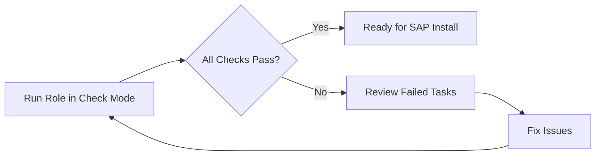

# How to Validate RHEL Configuration for SAP with sap_preconfigure Role

Author: [nawazdhandala](https://www.github.com/nawazdhandala)

Tags: RHEL, SAP, Ansible, Validation, Linux

Description: Use the RHEL sap_preconfigure Ansible role in check mode to validate that your RHEL system meets all SAP requirements.

---

Before installing any SAP software, you need to verify that your RHEL system meets all the requirements specified in SAP Notes. The sap_general_preconfigure and sap_hana_preconfigure Ansible roles can run in check mode to validate your system without making changes.

## Validation Workflow



## Prerequisites

- RHEL system targeted for SAP
- Ansible installed on a control node or locally

## Step 1: Install the Validation Roles

```bash
# Install the SAP system roles
sudo dnf install -y rhel-system-roles-sap ansible-core
```

## Step 2: Create a Validation Playbook

```bash
cat <<'PLAY' > /tmp/validate-sap.yml
---
- name: Validate RHEL for SAP HANA
  hosts: localhost
  become: true
  vars:
    # Run in assert mode to just check without changing
    sap_general_preconfigure_assert: true
    sap_general_preconfigure_assert_ignore_errors: true
    sap_hana_preconfigure_assert: true
    sap_hana_preconfigure_assert_ignore_errors: true
  roles:
    - role: sap_general_preconfigure
    - role: sap_hana_preconfigure
PLAY
```

## Step 3: Run the Validation

```bash
# Run in check mode - no changes will be made
ansible-playbook /tmp/validate-sap.yml --check --diff 2>&1 | tee /tmp/sap-validation.log

# Review the output for any failed assertions
grep -E "(FAILED|CHANGED|ok=)" /tmp/sap-validation.log
```

## Step 4: Interpret the Results

The validation checks include:

```bash
# Key items validated by sap_general_preconfigure:
# - Required packages are installed
# - Kernel parameters match SAP requirements
# - /etc/hosts is properly configured
# - SELinux is in the correct state
# - Required services (chronyd) are running

# Key items validated by sap_hana_preconfigure:
# - HANA-specific packages are present
# - THP is disabled
# - CPU governor is set to performance
# - HANA-specific kernel parameters are set
# - tuned profile sap-hana is active

# Check specific assertions
grep "ASSERT" /tmp/sap-validation.log
```

## Step 5: Fix and Re-validate

If issues are found, fix them and run again:

```bash
# To auto-fix all issues, run without check mode
ansible-playbook /tmp/validate-sap.yml

# Then re-validate
ansible-playbook /tmp/validate-sap.yml --check --diff
```

## Step 6: Generate a Compliance Report

```bash
# Create a simple compliance report
cat <<'SCRIPT' > /tmp/sap-compliance-check.sh
#!/bin/bash
echo "=== SAP RHEL Compliance Report ==="
echo "Date: $(date)"
echo "Hostname: $(hostname)"
echo ""

echo "--- Kernel Parameters ---"
sysctl kernel.shmmax kernel.shmall kernel.sem vm.max_map_count vm.swappiness

echo ""
echo "--- THP Status ---"
cat /sys/kernel/mm/transparent_hugepage/enabled

echo ""
echo "--- Tuned Profile ---"
tuned-adm active

echo ""
echo "--- Required Packages ---"
rpm -q tuned-profiles-sap-hana resource-agents-sap-hana compat-openssl11

echo ""
echo "--- RHEL Version ---"
cat /etc/redhat-release
uname -r
SCRIPT

chmod +x /tmp/sap-compliance-check.sh
sudo /tmp/sap-compliance-check.sh
```

## Conclusion

Running the SAP preconfigure roles in check/assert mode is the most reliable way to validate RHEL systems before SAP installation. It catches misconfigurations early, and the same roles can then be used to automatically fix any issues found. Make this validation part of your standard SAP deployment pipeline.
