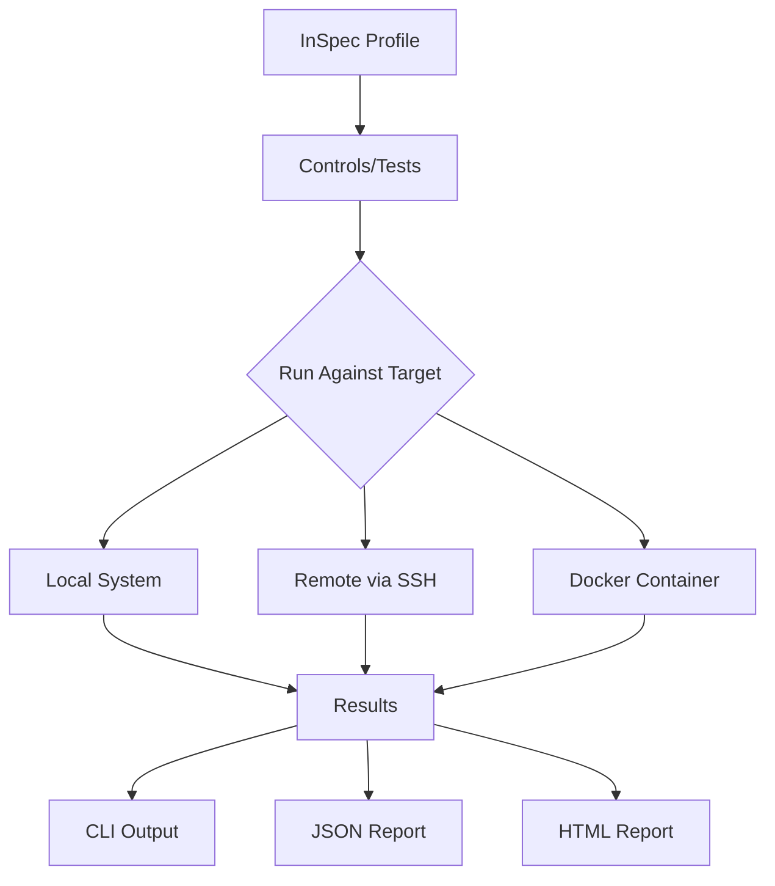

# How to Validate STIG Compliance on RHEL 9 with Chef InSpec

Author: [nawazdhandala](https://www.github.com/nawazdhandala)

Tags: RHEL, STIG, Chef InSpec, Compliance, Linux

Description: Validate DISA STIG compliance on RHEL 9 using Chef InSpec profiles, providing an alternative to OpenSCAP for compliance testing and continuous auditing.

---

Chef InSpec is a testing framework that lets you write human-readable compliance checks. Unlike OpenSCAP, which relies on XCCDF/OVAL content, InSpec uses a Ruby-based DSL that is easier to customize and extend. The MITRE SAF (Security Automation Framework) team maintains an InSpec profile for the RHEL 9 STIG, making it a solid alternative for organizations already using the Chef ecosystem.

## Install Chef InSpec

```bash
# Download and install InSpec
curl -L https://omnitruck.chef.io/install.sh | bash -s -- -P inspec

# Verify the installation
inspec version

# Accept the license (required for first run)
inspec --chef-license=accept
```

## Get the RHEL 9 STIG InSpec Profile

The MITRE SAF team publishes InSpec profiles on GitHub:

```bash
# Clone the RHEL 9 STIG InSpec profile
git clone https://github.com/CMSgov/redhat-enterprise-linux-9-stig-baseline.git \
  /opt/rhel9-stig-inspec

# Or use the profile directly from GitHub without cloning
inspec exec https://github.com/CMSgov/redhat-enterprise-linux-9-stig-baseline \
  --reporter cli json:/tmp/stig-results.json
```



## Run a Local STIG Compliance Check

```bash
# Run against the local system
cd /opt/rhel9-stig-inspec
inspec exec . --reporter cli

# Run with detailed output
inspec exec . --reporter cli --show-progress

# Save results in multiple formats
inspec exec . \
  --reporter cli json:/tmp/stig-inspec.json html:/tmp/stig-inspec.html
```

## Run Against Remote Systems

InSpec can scan remote systems over SSH:

```bash
# Scan a remote RHEL 9 host
inspec exec /opt/rhel9-stig-inspec \
  -t ssh://sysadmin@server1.example.com \
  --sudo \
  --reporter cli json:/tmp/server1-stig.json

# Scan using a key file
inspec exec /opt/rhel9-stig-inspec \
  -t ssh://sysadmin@server1.example.com \
  -i ~/.ssh/id_rsa \
  --sudo \
  --reporter cli
```

## Understand InSpec Control Structure

Each STIG control is written as a readable test:

```ruby
# Example InSpec control for STIG V-257987 (no root SSH login)
control 'V-257987' do
  title 'RHEL 9 must not allow direct root login via SSH'
  desc 'Even though root login is disabled by default, explicitly
        setting this prevents accidental re-enablement.'
  impact 0.7
  tag severity: 'high'
  tag stig_id: 'RHEL-09-255040'

  describe sshd_config do
    its('PermitRootLogin') { should cmp 'no' }
  end
end
```

## Customize the Profile with Input Files

Override default values without modifying the profile:

```bash
# Create an inputs file
cat > /opt/rhel9-stig-inspec/inputs.yml << 'EOF'
# Customize thresholds and expected values
password_min_length: 15
password_max_age: 60
ssh_client_alive_interval: 600
failed_login_attempts: 3
lockout_time: 0
exempt_home_users:
  - sysadmin
  - serviceaccount
EOF

# Run with custom inputs
inspec exec /opt/rhel9-stig-inspec \
  --input-file /opt/rhel9-stig-inspec/inputs.yml \
  --reporter cli json:/tmp/stig-custom.json
```

## Skip Controls That Do Not Apply

```bash
# Create a waiver file for non-applicable controls
cat > /opt/rhel9-stig-inspec/waivers.yml << 'EOF'
V-257844:
  expiration_date: '2027-01-01'
  run: false
  justification: 'FIPS mode breaks legacy application XYZ - POA&M 2024-001'

V-258000:
  run: false
  justification: 'Smart card authentication not used in this environment'
EOF

# Run with waivers applied
inspec exec /opt/rhel9-stig-inspec \
  --waiver-file /opt/rhel9-stig-inspec/waivers.yml \
  --reporter cli
```

## Generate Reports with SAF CLI

The MITRE SAF CLI provides additional reporting capabilities:

```bash
# Install SAF CLI
npm install -g @mitre/saf

# Convert InSpec JSON results to a summary
saf summary --input /tmp/stig-inspec.json

# Generate a detailed HTML report
saf view summary --input /tmp/stig-inspec.json --output /tmp/stig-report.html

# Convert to checklist format (CKL) for STIG Viewer
saf convert hdf2ckl --input /tmp/stig-inspec.json --output /tmp/stig-checklist.ckl
```

## Integrate InSpec into CI/CD

Add STIG validation to your server build pipeline:

```bash
# Example CI/CD script
#!/bin/bash
set -e

echo "Running STIG compliance check..."
inspec exec /opt/rhel9-stig-inspec \
  --reporter json:/tmp/stig-ci.json cli \
  --input-file /opt/rhel9-stig-inspec/inputs.yml \
  --waiver-file /opt/rhel9-stig-inspec/waivers.yml

# Check for CAT I failures (exit code handling)
FAILURES=$(inspec exec /opt/rhel9-stig-inspec \
  --reporter json:/dev/stdout 2>/dev/null | \
  python3 -c "import sys,json; d=json.load(sys.stdin); print(sum(1 for c in d.get('profiles',[{}])[0].get('controls',[]) if c.get('results',[{}])[0].get('status')=='failed' and c.get('impact',0)>=0.7))")

if [ "$FAILURES" -gt 0 ]; then
    echo "FAILED: $FAILURES high-severity STIG findings"
    exit 1
fi

echo "PASSED: No high-severity STIG findings"
```

## Schedule Regular InSpec Scans

```bash
# Create a cron job for daily STIG checks
cat > /usr/local/bin/inspec-stig-scan.sh << 'SCRIPT'
#!/bin/bash
DATE=$(date +%Y%m%d)
HOSTNAME=$(hostname -s)
REPORT_DIR="/var/log/compliance/inspec"
mkdir -p "$REPORT_DIR"

/usr/bin/inspec exec /opt/rhel9-stig-inspec \
  --input-file /opt/rhel9-stig-inspec/inputs.yml \
  --waiver-file /opt/rhel9-stig-inspec/waivers.yml \
  --reporter json:"${REPORT_DIR}/${HOSTNAME}-${DATE}.json" 2>/dev/null

# Clean up old reports
find "$REPORT_DIR" -name "*.json" -mtime +90 -delete
SCRIPT
chmod +x /usr/local/bin/inspec-stig-scan.sh

echo "0 4 * * * root /usr/local/bin/inspec-stig-scan.sh" >> /etc/crontab
```

## InSpec vs OpenSCAP

Both tools have their place. InSpec is better if you want human-readable tests that are easy to modify, and if you are already in the Chef ecosystem. OpenSCAP is better if you need strict SCAP standard compliance and integration with Red Hat Satellite. Many organizations use both: OpenSCAP for official compliance scanning and InSpec for continuous validation in their CI/CD pipelines.

Chef InSpec gives you a flexible, developer-friendly way to validate STIG compliance. The readable test format makes it easy to understand what each control checks, and the waiver system lets you document exceptions cleanly.
