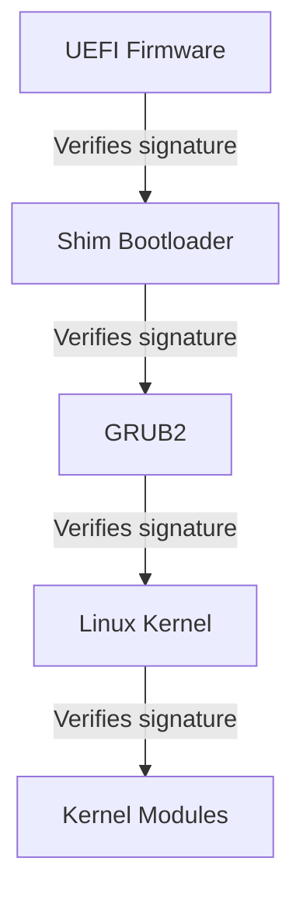

# How to Verify and Enable UEFI Secure Boot on RHEL

Author: [nawazdhandala](https://www.github.com/nawazdhandala)

Tags: RHEL, UEFI, Secure Boot, Security, Linux

Description: Learn how to verify the status of UEFI Secure Boot on RHEL and enable it to protect your system against unauthorized bootloaders and rootkits.

---

Secure Boot is a UEFI firmware feature that ensures only signed and trusted software runs during the boot process. It prevents rootkits and boot-level malware from loading before the operating system starts. RHEL fully supports Secure Boot, and most enterprise hardware ships with it available. Here is how to check your current status and enable it.

## Checking Secure Boot Status

The quickest way to check if Secure Boot is active:

```bash
# Check Secure Boot status
mokutil --sb-state
```

This returns either `SecureBoot enabled` or `SecureBoot disabled`.

You can also check through the kernel:

```bash
# Alternative check through sysfs
cat /sys/firmware/efi/efivars/SecureBoot-* 2>/dev/null | od -An -t u1 | tail -1
```

If the last byte is `1`, Secure Boot is enabled. If it is `0`, it is disabled.

## Verifying UEFI Mode

Secure Boot only works in UEFI mode, not legacy BIOS. Verify your system is booted in UEFI mode:

```bash
# Check if the system is using UEFI
ls /sys/firmware/efi
```

If this directory exists, you are running in UEFI mode. If it does not exist, the system is using legacy BIOS and Secure Boot is not available without a reinstall in UEFI mode.

## Enabling Secure Boot

Secure Boot is enabled in the UEFI firmware settings, not from the operating system. The general process:

1. Reboot the system
2. Enter the UEFI firmware setup (usually by pressing F2, Del, or F12 during POST)
3. Navigate to the Security or Boot tab
4. Find the Secure Boot option and set it to Enabled
5. Save and exit

The exact steps vary by hardware vendor (Dell, HP, Lenovo, Supermicro all have different interfaces), but the concept is the same.

## What Happens When You Enable Secure Boot

When Secure Boot is enabled, the firmware verifies the digital signature of each component in the boot chain:



RHEL uses a "shim" bootloader that is signed by Microsoft's UEFI CA. The shim then verifies GRUB2, which verifies the kernel. This chain of trust ensures nothing unauthorized runs during boot.

## Checking the Secure Boot Certificate Chain

View the enrolled certificates:

```bash
# List enrolled Machine Owner Keys (MOK)
mokutil --list-enrolled

# List the UEFI Secure Boot keys
mokutil --list-enrolled | grep "Subject:"
```

## Verifying Kernel Module Signatures

With Secure Boot enabled, the kernel only loads signed modules:

```bash
# Check if a specific module is signed
modinfo -F sig_id <module_name>

# Check the signature on the running kernel
pesign -S -i /boot/vmlinuz-$(uname -r)
```

## Common Issues After Enabling Secure Boot

### Third-Party Kernel Modules

If you use third-party drivers (NVIDIA, VirtualBox, custom modules), they may not be signed by a trusted key. You will see errors like:

```bash
module verification failed: signature and/or required key missing
```

Solutions:
- Use DKMS with module signing configured
- Sign modules with your own key and enroll it via MOK

### Old Bootloader

If the bootloader was installed without UEFI support:

```bash
# Reinstall the shim and GRUB2 for UEFI
sudo dnf reinstall shim-x64 grub2-efi-x64
```

## Verifying the Boot Chain

Check that all boot components are properly signed:

```bash
# Verify the shim
pesign -S -i /boot/efi/EFI/redhat/shimx64.efi

# Verify GRUB
pesign -S -i /boot/efi/EFI/redhat/grubx64.efi

# Verify the kernel
pesign -S -i /boot/vmlinuz-$(uname -r)
```

## Checking Secure Boot Violations

If Secure Boot blocks something, it shows up in the system log:

```bash
# Check for Secure Boot related messages
sudo dmesg | grep -i "secure boot"
sudo dmesg | grep -i "signature"

# Check journal for boot-time security messages
sudo journalctl -b | grep -iE "secure.boot|uefi|signature|verification"
```

## Disabling Secure Boot (When Necessary)

Sometimes you need to temporarily disable Secure Boot for troubleshooting or to load unsigned modules:

1. Reboot and enter UEFI firmware setup
2. Disable Secure Boot
3. Do your work
4. Re-enable Secure Boot when done

From the OS, you cannot disable Secure Boot. It must be done through the firmware interface, which requires physical or BMC console access.

## Secure Boot and Virtual Machines

If you are running RHEL as a VM:

- **KVM/libvirt**: Secure Boot requires OVMF firmware. Set the VM to use UEFI firmware with Secure Boot enabled.
- **VMware**: Supported in vSphere 6.5 and later.
- **Hyper-V**: Supported as a Generation 2 VM.

```bash
# For KVM, check if OVMF is installed
rpm -q edk2-ovmf
```

## Best Practices

- Enable Secure Boot on all production systems
- Test Secure Boot compatibility before deploying to production
- Keep the firmware updated to get the latest security fixes and key revocations
- Monitor for Secure Boot violations in system logs
- Have a documented procedure for handling unsigned module issues

Secure Boot adds an important layer to your RHEL security posture. It is not a silver bullet, but it significantly raises the bar for boot-level attacks.
