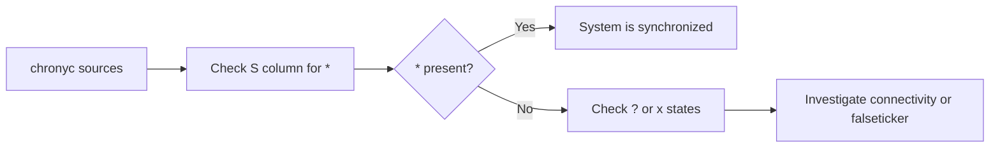

# How to Verify NTP Synchronization Using chronyc Commands on RHEL 9

Author: [nawazdhandala](https://www.github.com/nawazdhandala)

Tags: RHEL, chronyc, NTP, Verification, Linux

Description: A comprehensive reference for using chronyc commands on RHEL 9 to verify, monitor, and analyze NTP time synchronization status.

---

chronyc is the command-line interface for interacting with the chronyd daemon. If you manage time synchronization on RHEL 9, you will use chronyc regularly to verify that everything is working, investigate problems, and gather statistics. This post covers all the chronyc commands you need for day-to-day NTP management.

## Getting Started with chronyc

chronyc can run interactively or with a single command:

```bash
# Run a single command
chronyc tracking

# Enter interactive mode
chronyc
```

In interactive mode, you get a `chronyc>` prompt where you can type commands. Type `quit` to exit.

For remote management (if configured):

```bash
# Connect to a remote chrony instance
chronyc -h ntp-server.example.com
```

## The tracking Command

This is the most important command for verifying synchronization:

```bash
# Show detailed synchronization tracking info
chronyc tracking
```

Sample output:

```
Reference ID    : C0A80001 (ntp1.internal.example.com)
Stratum         : 3
Ref time (UTC)  : Tue Mar 04 15:30:00 2026
System time     :     0.000023456 seconds fast of NTP time
Last offset     :    +0.000012345 seconds
RMS offset      :     0.000025678 seconds
Frequency       :    12.345 ppm slow
Residual freq   :    +0.001 ppm
Skew            :     0.012 ppm
Root delay      :     0.034567890 seconds
Root dispersion :     0.001234567 seconds
Update interval :    64.0 seconds
Leap status     : Normal
```

Here is what each field means:

| Field | What it Tells You |
|-------|-------------------|
| Reference ID | The server chrony is currently synced to |
| Stratum | Distance from a reference clock (lower is better) |
| System time | Current offset from NTP time |
| Last offset | The offset measured at the last update |
| RMS offset | Long-term average offset |
| Frequency | How fast/slow the system clock runs (in PPM) |
| Skew | Estimated error bound on the frequency |
| Root delay | Network round-trip time to the reference clock |
| Root dispersion | Estimated error of the reference clock |
| Leap status | Normal, or indicates an upcoming leap second |

For a healthy system, `System time` should be well under 1 millisecond, and `Leap status` should be `Normal`.

## The sources Command

See all configured NTP sources and their status:

```bash
# Show NTP sources with column descriptions
chronyc sources -v
```

The columns:

- **M**: Mode (`^` = server, `=` = peer, `#` = local reference clock)
- **S**: State (`*` = current best, `+` = combined, `-` = not combined, `?` = unreachable, `x` = falseticker)
- **Name**: Server hostname or IP
- **Stratum**: The server's stratum level
- **Poll**: Current polling interval in seconds (as a power of 2)
- **Reach**: Octal bitmask of the last 8 attempts (377 = all successful)
- **LastRx**: Time since last good response
- **Last sample**: Measured offset and error bounds



## The sourcestats Command

Get statistical data about each source:

```bash
# Show source statistics
chronyc sourcestats -v
```

This shows:

- **NP**: Number of sample points
- **NR**: Number of runs of residuals (indicates randomness of measurements)
- **Span**: Time span of the measurements
- **Frequency**: Estimated frequency offset
- **Freq Skew**: Uncertainty of the frequency estimate
- **Offset**: Estimated current offset
- **Std Dev**: Standard deviation of measurements

A good source will have low Std Dev and many sample points.

## The activity Command

Check how many sources are online and offline:

```bash
# Show source activity summary
chronyc activity
```

Output example:

```
200 OK
4 sources online
0 sources offline
0 sources doing burst (return to online)
0 sources doing burst (return to offline)
0 sources with unknown address
```

## The ntpdata Command

Get detailed NTP-level data for each source:

```bash
# Show detailed NTP data for all sources
chronyc ntpdata
```

This shows the raw NTP response data, including:

- Remote and local timestamps
- Delay and dispersion
- Authentication status
- Interleaved mode status

Useful for debugging protocol-level issues.

## The serverstats Command

If your system is also serving as an NTP server:

```bash
# Show server statistics
chronyc serverstats
```

This shows how many NTP requests the server has handled, dropped, and rate-limited.

## The clients Command

See which clients are querying this server:

```bash
# List NTP clients that have queried this server
chronyc clients
```

Each line shows the client's IP, the number of requests, and the last request time.

## The makestep Command

Force an immediate clock step (for when the offset is too large for gradual slewing):

```bash
# Force a clock step now
sudo chronyc makestep
```

This requires root or chrony group membership. Use it sparingly, as applications may not handle time jumps well.

## The waitsync Command

Wait until the clock is synchronized, useful in startup scripts:

```bash
# Wait up to 60 seconds for synchronization with max offset of 0.1 seconds
chronyc waitsync 30 0.1
```

The arguments are:
- Maximum number of tries (each try waits about 10 seconds)
- Maximum remaining correction in seconds

This returns 0 on success, non-zero on timeout.

## The selectdata Command

See why chrony selected or rejected each source:

```bash
# Show selection data for all sources
chronyc selectdata
```

This helps understand why chrony chose one source over another.

## Checking Time in Scripts

For monitoring and automation, here are some useful patterns:

### Check if the Clock is Synchronized

```bash
# Returns 0 if synchronized, non-zero if not
chronyc tracking | grep -q "Leap status.*Normal" && echo "Synced" || echo "NOT synced"
```

### Get the Current Offset

```bash
# Extract just the system time offset
chronyc tracking | grep "System time" | awk '{print $4}'
```

### Check if a Specific Source is Reachable

```bash
# Check reachability of sources
chronyc sources | grep -v "^\=" | awk '$2 == "?" {print "UNREACHABLE:", $3}'
```

### Monitor Offset Over Time

```bash
# Log the offset every 60 seconds for monitoring
#!/bin/bash
while true; do
    OFFSET=$(chronyc tracking | grep "System time" | awk '{print $4}')
    echo "$(date +%Y-%m-%dT%H:%M:%S) offset=${OFFSET}s"
    sleep 60
done
```

## Useful chronyc Command Summary

Here is a quick reference:

```bash
# Most common commands
chronyc tracking          # Synchronization status
chronyc sources -v        # NTP sources with details
chronyc sourcestats       # Source statistics
chronyc activity          # Online/offline source count
chronyc clients           # Connected clients (if serving)
chronyc serverstats       # Server request statistics
chronyc ntpdata           # Raw NTP protocol data
chronyc selectdata        # Source selection details
chronyc makestep          # Force a time step
chronyc online            # Set all sources to online
chronyc offline           # Set all sources to offline
chronyc refresh           # Refresh DNS for all sources
chronyc shutdown          # Stop the chronyd daemon
```

## Reading chronyc Output Effectively

When someone reports a time issue, my process is:

1. `chronyc tracking` - Is the system synced? What is the offset?
2. `chronyc sources -v` - Are sources reachable? Is one selected?
3. `chronyc sourcestats` - Are measurements consistent?
4. `timedatectl` - Is NTP enabled at the system level?

If all four look good, the time problem is probably somewhere else (application-level, timezone confusion, etc.).

## Wrapping Up

chronyc gives you full visibility into your time synchronization status. The `tracking` and `sources` commands handle 90% of verification needs. For deeper analysis, `sourcestats`, `ntpdata`, and `selectdata` fill in the details. Make `chronyc sources -v` part of your standard server health check routine.
