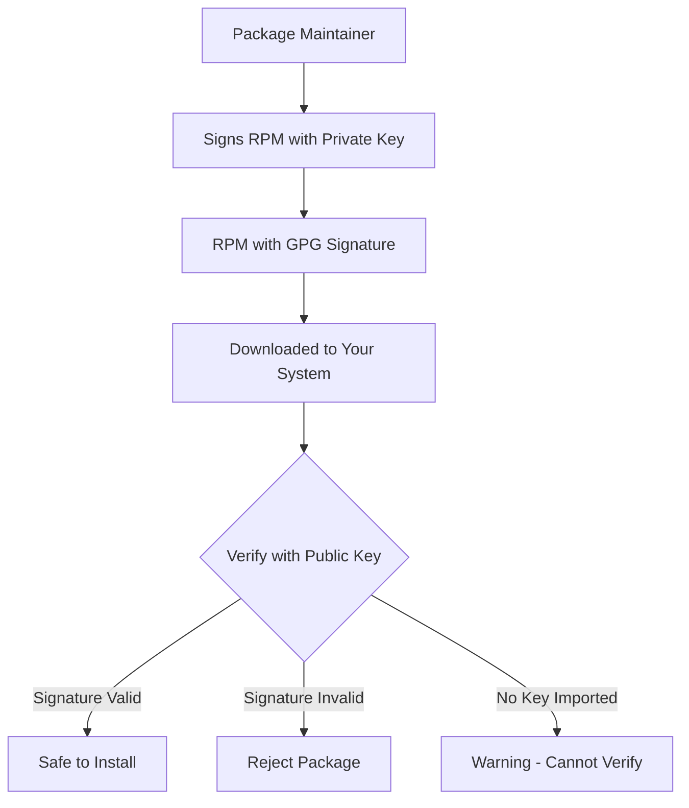
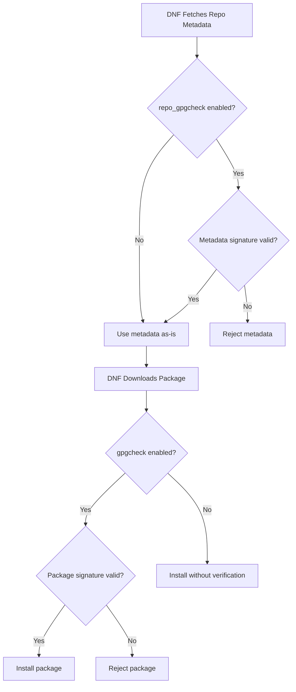

# How to Verify Package Integrity and GPG Signatures on RHEL

Author: [nawazdhandala](https://www.github.com/nawazdhandala)

Tags: RHEL, RPM, GPG, Package Integrity, Security, Linux

Description: Learn how to verify RPM package integrity and GPG signatures on RHEL to ensure your packages have not been tampered with and come from trusted sources.

---

Every RPM package you install runs scripts and drops files onto your system. If someone tampered with a package between the build server and your machine, you could be installing malware without knowing it. GPG signatures and integrity verification are your defense against this. RHEL has solid tooling for this, and you should be using it.

## How RPM Package Signing Works

RPM packages can be signed with a GPG key by the package maintainer. When you install a signed package, RPM checks the signature against the public key you have imported. If the signature does not match, the installation is rejected.



The process relies on asymmetric cryptography:
- The maintainer signs with their **private key**
- You verify with the corresponding **public key**
- If the package was modified after signing, the signature check fails

## Checking Imported GPG Keys

RHEL ships with Red Hat's GPG key pre-installed. Check what keys are on your system:

```bash
# List all imported RPM GPG keys
rpm -qa gpg-pubkey*
```

To see details about a specific key:

```bash
# Show information about a GPG key
rpm -qi gpg-pubkey-fd431d51-4ae0493b
```

This shows the key's name (usually the organization), creation date, and fingerprint.

### Where Keys Are Stored

RPM GPG keys on RHEL are typically stored in:

```bash
# List the GPG keys shipped with RHEL
ls /etc/pki/rpm-gpg/
```

You will see files like `RPM-GPG-KEY-redhat-release` which is Red Hat's signing key.

## Importing GPG Keys

### Import from a File

```bash
# Import a GPG key from the filesystem
sudo rpm --import /etc/pki/rpm-gpg/RPM-GPG-KEY-redhat-release
```

### Import from a URL

```bash
# Import the EPEL signing key from a URL
sudo rpm --import https://dl.fedoraproject.org/pub/epel/RPM-GPG-KEY-EPEL-9
```

### Verify the Key Before Importing

Before importing a third-party key, verify its fingerprint against the value published on the project's website:

```bash
# Download the key first
curl -o /tmp/RPM-GPG-KEY-vendor https://vendor.example.com/RPM-GPG-KEY-vendor

# Check the fingerprint
gpg --with-fingerprint /tmp/RPM-GPG-KEY-vendor

# Compare the fingerprint with the one published on the vendor's website
# If it matches, import it
sudo rpm --import /tmp/RPM-GPG-KEY-vendor
```

## Verifying Package Signatures

### Check a Downloaded RPM File

Before installing a package you downloaded manually, verify its signature:

```bash
# Verify the GPG signature of an RPM file
rpm --checksig package-name.rpm
```

Example output for a properly signed package:

```
package-name.rpm: digests signatures OK
```

If the key is not imported, you will see:

```
package-name.rpm: digests OK (MISSING KEYS: RSA#fd431d51)
```

### Detailed Signature Verification

For more detail about what checks passed or failed:

```bash
# Verbose signature check
rpm -Kv package-name.rpm
```

This breaks down the individual checks: MD5 digest, SHA256 digest, RSA signature, and header-only signature.

## Verifying Installed Package Integrity

Once packages are installed, you can verify that their files have not been modified on disk. This is critical for security auditing and intrusion detection.

### Basic Package Verification

```bash
# Verify all files from a specific package
rpm -V httpd
```

If everything is intact, there is no output. If files have been modified, you get output like:

```
S.5....T.  c /etc/httpd/conf/httpd.conf
```

### Understanding Verification Output

Each character in the output represents a specific check:

| Character | Meaning |
|-----------|---------|
| S | File size differs |
| M | Mode (permissions) differs |
| 5 | MD5 checksum differs |
| D | Device major/minor number mismatch |
| L | Symlink path mismatch |
| U | User ownership differs |
| G | Group ownership differs |
| T | Modification time differs |
| P | Capabilities differ |
| . | Test passed |
| ? | Test could not be performed |

The `c` after the flags indicates the file is a configuration file. Modified config files are usually expected and not a security concern.

### Verify All Installed Packages

This is a heavy operation, but useful for security audits:

```bash
# Verify all installed packages (this takes a while)
rpm -Va
```

To filter out expected config file changes:

```bash
# Verify all packages but exclude config files from output
rpm -Va | grep -v ' c /'
```

Anything showing up here that is not a config file warrants investigation.

### Verify Specific Files

If you suspect a specific binary has been tampered with:

```bash
# Check which package owns the file
rpm -qf /usr/sbin/sshd

# Verify that package
rpm -V openssh-server
```

## GPG Configuration in Repository Files

### Repository-Level GPG Settings

Each repo file in `/etc/yum.repos.d/` can specify GPG checking behavior:

```ini
[rhel-9-baseos]
name=Red Hat Enterprise Linux 9 - BaseOS
baseurl=https://cdn.redhat.com/content/dist/rhel9/$releasever/$basearch/baseos/os
enabled=1
# Verify GPG signatures on packages
gpgcheck=1
# Path to the GPG key
gpgkey=file:///etc/pki/rpm-gpg/RPM-GPG-KEY-redhat-release
# Also verify repository metadata signatures
repo_gpgcheck=1
```

### Understanding gpgcheck vs repo_gpgcheck

These are two different layers of protection:

- **gpgcheck** - Verifies the GPG signature on each individual RPM package
- **repo_gpgcheck** - Verifies the GPG signature on the repository metadata itself



### Global GPG Settings

You can set GPG checking globally in `/etc/dnf/dnf.conf`:

```ini
[main]
# Enable GPG checking for all repos by default
gpgcheck=1
# Packages that fail GPG checks are rejected
localpkg_gpgcheck=1
```

## Signing Your Own RPM Packages

If you build custom RPMs, signing them is good practice. It lets your client systems verify that the package came from you and was not modified.

### Generate a GPG Key Pair

```bash
# Generate a new GPG key for package signing
gpg --gen-key
```

Follow the prompts to set a name, email, and passphrase.

### Configure RPM to Use Your Key

Add your key details to `~/.rpmmacros`:

```bash
# Configure rpmbuild to use your signing key
cat >> ~/.rpmmacros << 'EOF'
%_gpg_name Your Name <you@example.com>
EOF
```

### Sign an RPM Package

```bash
# Sign an RPM with your GPG key
rpm --addsign ~/rpmbuild/RPMS/x86_64/mypackage-1.0-1.el9.x86_64.rpm
```

### Export Your Public Key

Distribute this to systems that will install your packages:

```bash
# Export your public key in a format RPM can import
gpg --export -a "Your Name" > RPM-GPG-KEY-yourorg

# On client systems, import the key
sudo rpm --import RPM-GPG-KEY-yourorg
```

## Security Best Practices

1. **Never set `gpgcheck=0` in production.** If you are tempted because a package is unsigned, ask why it is unsigned. Unsigned packages from unknown sources are a significant security risk.

2. **Audit imported keys periodically.** Check `rpm -qa gpg-pubkey*` and make sure every key is there intentionally.

3. **Run `rpm -Va` regularly.** Set up a cron job or integrate it with your monitoring. Unexpected changes to system binaries could indicate compromise.

4. **Verify key fingerprints out-of-band.** When importing a new GPG key, verify the fingerprint through a different channel (project website over HTTPS, direct communication with the vendor) rather than trusting the same download source.

5. **Enable `repo_gpgcheck` where supported.** Not all repos support metadata signing, but when they do, enable it. It protects against compromised mirror servers.

6. **Keep keys up to date.** GPG keys expire. When Red Hat rotates their signing key, make sure you import the new one promptly.

7. **Use integrity checking in your CI/CD pipeline.** Before deploying packages from your build system, verify signatures as part of the pipeline.

Package integrity verification is not glamorous work, but it is fundamental to system security. A compromised package is one of the most effective attack vectors, and GPG signatures are your first line of defense. Take the time to set it up properly and verify regularly.
