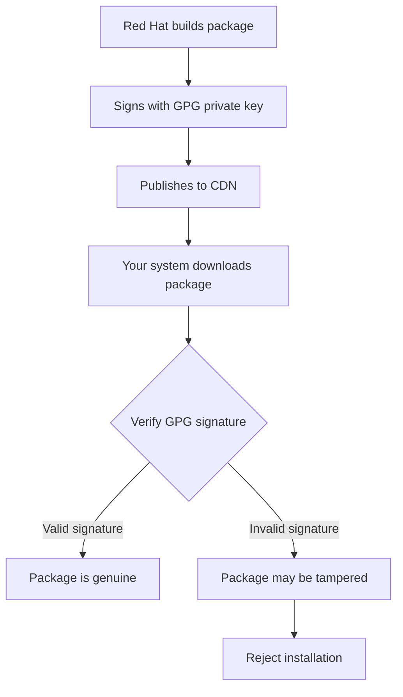

# How to Verify Red Hat Product Signing Keys on RHEL

Author: [nawazdhandala](https://www.github.com/nawazdhandala)

Tags: RHEL, GPG, Red Hat, Package Verification, Security, Linux

Description: Verify the authenticity of Red Hat product signing keys on RHEL to ensure that packages installed on your system come from genuine Red Hat sources.

---

Red Hat signs all its RPM packages and repository metadata with GPG keys to guarantee their authenticity and integrity. Verifying these signing keys is an important security practice that helps you confirm you are installing genuine, untampered software. This guide explains how to find, verify, and manage Red Hat product signing keys on RHEL.

## Why Verify Signing Keys?



If an attacker manages to insert a malicious package into a mirror or intercept your download, the GPG signature verification will fail and the package will be rejected.

## Red Hat Signing Key Locations

Red Hat's GPG signing keys are stored on RHEL in these locations:

```bash
# List Red Hat GPG keys in the standard location
ls -la /etc/pki/rpm-gpg/

# Typical keys on RHEL:
# RPM-GPG-KEY-redhat-release   - Main product signing key
# RPM-GPG-KEY-redhat-beta      - Beta product signing key
```

## Viewing Installed GPG Keys

```bash
# List all GPG keys imported into RPM
rpm -qa gpg-pubkey* --qf '%{NAME}-%{VERSION}-%{RELEASE}\t%{SUMMARY}\n'

# View detailed information about a specific imported key
rpm -qi gpg-pubkey-fd431d51-4ae0493b

# Show the full key details including fingerprint
rpm -qa gpg-pubkey* --qf '%{NAME}-%{VERSION}-%{RELEASE}\n' | while read key; do
    echo "=== $key ==="
    rpm -qi "$key" | grep -E "Summary|Packager|Description"
    echo ""
done
```

## Verifying the Red Hat Release Key

### Check the Key Fingerprint

The most reliable way to verify a signing key is to compare its fingerprint with the officially published fingerprint:

```bash
# View the fingerprint of the Red Hat release key
gpg --with-fingerprint /etc/pki/rpm-gpg/RPM-GPG-KEY-redhat-release
```

Compare the fingerprint with what Red Hat publishes on their security page. The RHEL signing key fingerprint should match the officially documented value.

```bash
# Import the key into your personal GPG keyring for inspection
gpg --import /etc/pki/rpm-gpg/RPM-GPG-KEY-redhat-release

# View detailed information
gpg --list-keys --fingerprint "Red Hat"
```

### Verify the Key is Imported into RPM

```bash
# Check if the release key is imported
rpm -qa gpg-pubkey* --qf '%{SUMMARY}\n' | grep -i "red hat"

# If not imported, import it
sudo rpm --import /etc/pki/rpm-gpg/RPM-GPG-KEY-redhat-release
```

## Verifying Package Signatures

### Verify a Single Package

```bash
# Check the signature of a specific package
rpm --checksig kernel-5.14.0-362.el9.x86_64.rpm

# Verbose verification
rpm -K --verbose kernel-5.14.0-362.el9.x86_64.rpm
```

Good output looks like:

```bash
kernel-5.14.0-362.el9.x86_64.rpm: digests signatures OK
```

Bad output (unsigned or bad signature):

```bash
kernel-5.14.0-362.el9.x86_64.rpm: DIGESTS SIGNATURES NOT OK
```

### Verify All Installed Packages

```bash
# Check signatures of all installed packages
rpm -qa --qf '%{NAME}-%{VERSION}-%{RELEASE}.%{ARCH} %{SIGPGP:pgpsig}\n' | head -30

# Find packages without valid signatures
rpm -qa --qf '%{NAME}-%{VERSION}-%{RELEASE}.%{ARCH} %{SIGPGP:pgpsig}\n' | grep -v "Key ID"
```

### Verify Packages During Installation

DNF verifies signatures automatically when `gpgcheck=1` is set in the repository configuration:

```bash
# Check if gpgcheck is enabled for all repos
grep gpgcheck /etc/yum.repos.d/*.repo

# Verify the main Red Hat repo configuration
cat /etc/yum.repos.d/redhat.repo | grep -A5 "\[rhel-"
```

## Verifying Repository Metadata Signatures

Red Hat also signs repository metadata (repodata) to prevent metadata manipulation:

```bash
# Check if repo_gpgcheck is enabled
grep repo_gpgcheck /etc/yum.repos.d/*.repo

# Enable repo metadata verification if not already set
sudo dnf config-manager --setopt=repo_gpgcheck=1 --save
```

## Handling Key Rotation

Red Hat periodically releases new signing keys. When this happens:

```bash
# Check for updated keys in the redhat-release package
rpm -ql redhat-release | grep GPG

# Import any new keys
for key in /etc/pki/rpm-gpg/RPM-GPG-KEY-redhat-*; do
    sudo rpm --import "$key"
done

# Verify the import
rpm -qa gpg-pubkey* --qf '%{NAME}-%{VERSION}-%{RELEASE}\t%{SUMMARY}\n'
```

## Verifying Third-Party Repository Keys

When adding third-party repositories, always verify their signing keys:

```bash
# Example: Verifying the EPEL key
# First, download and inspect the key
curl -O https://dl.fedoraproject.org/pub/epel/RPM-GPG-KEY-EPEL-9

# View the key details
gpg --with-fingerprint RPM-GPG-KEY-EPEL-9

# Compare with the officially published fingerprint
# Then import if verified
sudo rpm --import RPM-GPG-KEY-EPEL-9
```

## Creating a Key Verification Script

```bash
#!/bin/bash
# /usr/local/bin/verify-rpm-keys.sh
# Verify all RPM signing keys and package signatures

echo "=== Installed GPG Keys ==="
rpm -qa gpg-pubkey* --qf '%{NAME}-%{VERSION}-%{RELEASE}\t%{SUMMARY}\n'

echo ""
echo "=== Key Fingerprints ==="
for key_file in /etc/pki/rpm-gpg/RPM-GPG-KEY-*; do
    echo "--- $key_file ---"
    gpg --with-fingerprint "$key_file" 2>/dev/null | grep -E "pub|uid|fingerprint"
    echo ""
done

echo ""
echo "=== Repository GPG Check Status ==="
for repo_file in /etc/yum.repos.d/*.repo; do
    echo "--- $repo_file ---"
    grep -E "^\[|gpgcheck|gpgkey" "$repo_file" | head -15
    echo ""
done

echo ""
echo "=== Packages Without Valid Signatures ==="
UNSIGNED=$(rpm -qa --qf '%{NAME}-%{VERSION}-%{RELEASE}.%{ARCH} %{SIGPGP:pgpsig}\n' 2>/dev/null | grep -v "Key ID" | head -20)
if [ -n "$UNSIGNED" ]; then
    echo "$UNSIGNED"
else
    echo "All packages have valid signatures."
fi
```

## Removing Untrusted Keys

If you need to remove a GPG key that should not be trusted:

```bash
# Find the key to remove
rpm -qa gpg-pubkey* --qf '%{NAME}-%{VERSION}-%{RELEASE}\t%{SUMMARY}\n'

# Remove a specific key
sudo rpm -e gpg-pubkey-KEY_VERSION-KEY_RELEASE
```

## Summary

Verifying Red Hat product signing keys on RHEL is a fundamental security practice. Check key fingerprints against officially published values, ensure `gpgcheck=1` is set for all repositories, verify package signatures with `rpm --checksig`, and regularly audit your installed keys. This ensures that every package on your system comes from a verified and trusted source.
