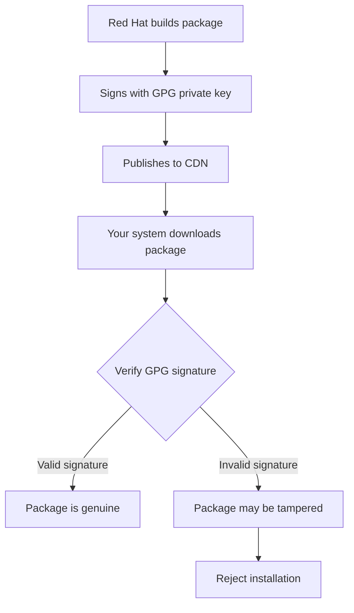

# How to Verify Red Hat Product Signing Keys on RHEL

Author: [nawazdhandala](https://www.github.com/nawazdhandala)

Tags: RHEL, GPG, Red Hat, Package Verification, Security, Linux

Description: Verify the authenticity of Red Hat product signing keys on RHEL to ensure that packages installed on your system come from genuine Red Hat sources.

---

Red Hat signs its RPM packages with GPG keys to guarantee their authenticity and integrity. Verifying these signing keys is an important security practice that helps you confirm you are installing genuine, untampered software. This guide explains how to find, verify, and manage Red Hat product signing keys on RHEL.

## Why Verify Signing Keys?


```mermaid
flowchart TD
    A[Red Hat builds package] --> B[Signs with GPG private key]
    B --> C[Publishes to CDN]
    C --> D[Your system downloads package]
    D --> E{Verify GPG signature}
    E -->|Valid signature| F[Package is genuine]
    E -->|Invalid signature| G[Package may be tampered]
    G --> H[Reject installation]
```

If an attacker manages to insert a malicious package into a mirror or intercept your download, the GPG signature verification will fail and the package will be rejected.

## Red Hat Signing Key Locations

Red Hat's GPG signing keys are stored on RHEL in these locations:

```bash
# List Red Hat GPG keys in the standard location

ls -la /etc/pki/rpm-gpg/

# Typical keys on RHEL:
# RPM-GPG-KEY-redhat-release   - Main product signing key
# RPM-GPG-KEY-redhat-beta      - Beta product signing key
# RPM-GPG-KEY-PQC-redhat-release - Post-quantum release key on newer RHEL 9 systems
```

## Viewing Installed GPG Keys

```bash
# List all GPG keys imported into RPM
rpm -qa gpg-pubkey* --qf '%{NAME}-%{VERSION}-%{RELEASE}\t%{SUMMARY}\n'

# View detailed information about a specific imported key
rpm -qi gpg-pubkey-fd431d51-4ae0493b

# Show the imported key details
rpm -qa gpg-pubkey* --qf '%{NAME}-%{VERSION}-%{RELEASE}\n' | while read key; do
    echo "=== $key ==="
    rpm -qi "$key" | grep -E "Summary|Packager|Description"
    echo ""
done
```

## Verifying the Red Hat Release Key

### Check the Key Fingerprint

The most reliable way to verify a signing key is to compare its fingerprint with the officially published fingerprint:

```bash
# View the fingerprint of the Red Hat release key
gpg --show-keys --with-fingerprint /etc/pki/rpm-gpg/RPM-GPG-KEY-redhat-release
```

Compare the fingerprint with what Red Hat publishes on their security page. For Red Hat release key 2, which is used for RHEL 9 packages, the fingerprint should match the officially documented value `567E 347A D004 4ADE 55BA 8A5F 199E 2F91 FD43 1D51`. On RHEL 9.7 and later, Red Hat also documents release key 4 for newer RPM signing, with fingerprint `FCD355B305707A62DA143AB6E422397E50FE8467A2A95343D246D6276AFEDF8F`, so always compare every key present on your system with Red Hat's current product signing key page.

```bash
# Import the key into your personal GPG keyring for inspection
gpg --import /etc/pki/rpm-gpg/RPM-GPG-KEY-redhat-release

# View detailed information
gpg --list-keys --fingerprint "Red Hat"
```

### Verify the Key is Imported into RPM

```bash
# Check if the release key is imported
rpm -qa gpg-pubkey* --qf '%{SUMMARY}\n' | grep -i "red hat"

# If not imported, import it
sudo rpm --import /etc/pki/rpm-gpg/RPM-GPG-KEY-redhat-release
```

## Verifying Package Signatures

### Verify a Single Package

```bash
# Check the signature of a specific package
rpm --checksig kernel-5.14.0-362.el9.x86_64.rpm

# Verbose verification
rpm -K --verbose kernel-5.14.0-362.el9.x86_64.rpm
```

Good output looks like:

```bash
kernel-5.14.0-362.el9.x86_64.rpm: digests signatures OK
```

Bad output (bad or untrusted signature):

```bash
kernel-5.14.0-362.el9.x86_64.rpm: DIGESTS SIGNATURES NOT OK
```

### Inspect Installed Package Signature Metadata

```bash
# Show recorded signature metadata for installed packages
rpm -qa --qf '%{NAME}-%{VERSION}-%{RELEASE}.%{ARCH} %{SIGPGP:pgpsig}\n' | head -30

# Find packages without recorded PGP signature metadata
rpm -qa --qf '%{NAME}-%{VERSION}-%{RELEASE}.%{ARCH} %{SIGPGP:pgpsig}\n' | awk '$NF == "(none)"'
```

### Verify Packages During Installation

DNF verifies signatures automatically when `gpgcheck=1` is set in the repository configuration:

```bash
# Check if gpgcheck is enabled for all repos
grep gpgcheck /etc/yum.repos.d/*.repo

# Verify the main Red Hat repo configuration
cat /etc/yum.repos.d/redhat.repo | grep -A5 "\[rhel-"
```

## Verifying Repository Metadata Signatures

DNF can verify repository metadata when a repository publishes a signed `repomd.xml.asc` file. Red Hat CDN, RHUI, and Satellite repositories do not currently support `repo_gpgcheck`, so leave it disabled for Red Hat-managed repositories unless Red Hat documents support for your specific repository. For custom repositories that you sign yourself:

```bash
# Check if repo_gpgcheck is enabled
grep repo_gpgcheck /etc/yum.repos.d/*.repo

# Enable repo metadata verification for a specific custom repo
sudo dnf config-manager --save --setopt=custom-repo.repo_gpgcheck=1 custom-repo
```

## Handling Key Rotation

Red Hat periodically releases new signing keys. When this happens:

```bash
# Check for updated keys in the redhat-release package
rpm -ql redhat-release | grep GPG

# Import any new keys
for key in /etc/pki/rpm-gpg/RPM-GPG-KEY-redhat-*; do
    sudo rpm --import "$key"
done

# Verify the import
rpm -qa gpg-pubkey* --qf '%{NAME}-%{VERSION}-%{RELEASE}\t%{SUMMARY}\n'
```

## Verifying Third-Party Repository Keys

When adding third-party repositories, always verify their signing keys:

```bash
# Example: Verifying the EPEL key
# First, download and inspect the key
curl -O https://dl.fedoraproject.org/pub/epel/RPM-GPG-KEY-EPEL-9

# View the key details
gpg --show-keys --with-fingerprint RPM-GPG-KEY-EPEL-9

# Compare with the officially published fingerprint
# Then import if verified
sudo rpm --import RPM-GPG-KEY-EPEL-9
```

## Creating a Key Verification Script

```bash
#!/bin/bash
# /usr/local/bin/verify-rpm-keys.sh
# Audit RPM signing keys and recorded package signature metadata

echo "=== Installed GPG Keys ==="
rpm -qa gpg-pubkey* --qf '%{NAME}-%{VERSION}-%{RELEASE}\t%{SUMMARY}\n'

echo ""
echo "=== Key Fingerprints ==="
for key_file in /etc/pki/rpm-gpg/RPM-GPG-KEY-*; do
    echo "--- $key_file ---"
    gpg --show-keys --with-fingerprint "$key_file" 2>/dev/null
    echo ""
done

echo ""
echo "=== Repository GPG Check Status ==="
for repo_file in /etc/yum.repos.d/*.repo; do
    echo "--- $repo_file ---"
    grep -E "^\[|gpgcheck|gpgkey" "$repo_file" | head -15
    echo ""
done

echo ""
echo "=== Packages Without Recorded PGP Signature Metadata ==="
UNSIGNED=$(rpm -qa --qf '%{NAME}-%{VERSION}-%{RELEASE}.%{ARCH} %{SIGPGP:pgpsig}\n' 2>/dev/null | awk '$NF == "(none)"' | head -20)
if [ -n "$UNSIGNED" ]; then
    echo "$UNSIGNED"
else
    echo "All packages have recorded PGP signature metadata."
fi
```

## Removing Untrusted Keys

If you need to remove a GPG key that should not be trusted:

```bash
# Find the key to remove
rpm -qa gpg-pubkey* --qf '%{NAME}-%{VERSION}-%{RELEASE}\t%{SUMMARY}\n'

# Remove a specific key
sudo rpm -e gpg-pubkey-KEY_VERSION-KEY_RELEASE
```

## Summary

Verifying Red Hat product signing keys on RHEL is a fundamental security practice. Check key fingerprints against officially published values, ensure `gpgcheck=1` is set for all repositories, verify package signatures with `rpm --checksig`, and regularly audit your installed keys. This helps ensure that packages installed from Red Hat repositories come from a verified and trusted source.
