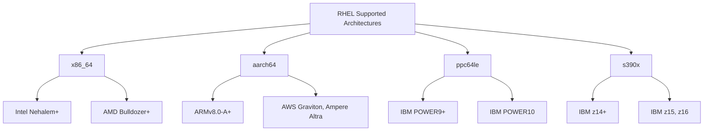

# How to Verify System Requirements Before Installing RHEL

Author: [nawazdhandala](https://www.github.com/nawazdhandala)

Tags: RHEL, System Requirements, Hardware, Linux, Installation

Description: A practical guide to checking whether your hardware meets RHEL system requirements, understanding supported CPU architectures, and verifying compatibility before you start the installation.

---

Nothing kills a weekend faster than getting halfway through a RHEL install only to find out your hardware is not supported. Maybe the CPU is too old, the disk is too small, or the NIC needs a driver that is not in the kernel. I have been burned by all of these at one point or another. This guide covers how to verify that your hardware will work with RHEL before you commit to the installation.

## Minimum Hardware Requirements

Red Hat publishes official minimum requirements for RHEL, and they are higher than previous versions because RHEL is based on Fedora 34 and ships with kernel 5.14+. Here is what you actually need.

### CPU Requirements

RHEL requires a 64-bit processor. The days of 32-bit RHEL are over. More specifically:

- **x86_64**: Requires x86-64-v2 microarchitecture level or later. This means your CPU needs SSE4.2, POPCNT, and related instruction sets. In practical terms, Intel Nehalem (2008) or AMD Bulldozer (2011) and newer are supported. Older Core 2 Duo or Opteron chips will not work.
- **aarch64 (ARM 64-bit)**: ARMv8.0-A and later.
- **ppc64le (IBM POWER)**: POWER9 and later processors.
- **s390x (IBM Z)**: z14 and later mainframes.

To check your CPU architecture and capabilities on a running Linux system (even an older RHEL or any live Linux):

```bash
# Show CPU architecture
uname -m

# Show detailed CPU info including flags
lscpu

# Check for x86-64-v2 required flags on x86_64
grep -o 'sse4_2\|popcnt\|ssse3\|cx16' /proc/cpuinfo | sort -u
```

You need all four flags (cx16, popcnt, sse4_2, ssse3) present for x86-64-v2 compliance. If any are missing, RHEL will refuse to boot.

### RAM Requirements

| Installation Type | Minimum RAM | Recommended RAM |
|---|---|---|
| Minimal install (text mode) | 1.5 GB | 2 GB |
| Graphical installer (Anaconda) | 1.5 GB | 4 GB |
| Production server workloads | 2 GB | 8 GB+ |

To check available RAM from an existing system or live environment:

```bash
# Show total memory in human-readable format
free -h

# Alternative using /proc
grep MemTotal /proc/meminfo
```

Keep in mind that IPMI/BMC and firmware can reserve memory. If your server has 2 GB of physical RAM, the OS might only see 1.8 GB.

### Disk Requirements

| Scenario | Minimum Disk Space | Recommended |
|---|---|---|
| Minimal install | 10 GB | 20 GB |
| Server with GUI | 20 GB | 40 GB |
| Production (with /var, /home, logs) | 20 GB | 50 GB+ |

To list available disks and their sizes:

```bash
# Show all block devices with sizes
lsblk -d -o NAME,SIZE,TYPE,MODEL

# More detailed disk information
fdisk -l 2>/dev/null | grep "Disk /dev/"
```

## Supported Architectures in Detail

RHEL supports four CPU architectures. Here is a breakdown of what that means in practice.



### x86_64

This is what most people run. Every major server vendor (Dell, HPE, Lenovo, Supermicro) ships x86_64 machines. The x86-64-v2 requirement is the biggest gotcha here. If you are repurposing older hardware from around 2007 or earlier, it probably will not meet the requirement.

### aarch64 (ARM 64-bit)

ARM servers are becoming common, especially with AWS Graviton instances and Ampere Altra processors. If you are deploying RHEL on ARM, make sure you download the aarch64 ISO, not the x86_64 one.

### ppc64le (POWER Little Endian)

This is for IBM POWER systems. If you are running POWER8, you are out of luck with RHEL as it requires POWER9 or later. RHEL 8 is your last option for POWER8.

### s390x (IBM Z Mainframe)

For IBM Z and LinuxONE mainframes running z14 or newer. These are typically managed by dedicated IBM Z teams, but the architecture support is there if you need it.

## Checking Hardware Compatibility

### Network Interface Cards

Network drivers are usually the first thing to cause problems. Check your NIC model and see if the driver is in the RHEL kernel:

```bash
# List all network interfaces with driver information
lspci | grep -i ethernet

# Check the driver currently in use
ethtool -i eno1

# List all loaded network drivers
lspci -k | grep -A 3 "Ethernet"
```

Red Hat maintains a hardware certification catalog. Before deploying on new hardware, check the catalog at [Red Hat Ecosystem Catalog](https://catalog.redhat.com/hardware) to see if your server model and components are certified.

### Storage Controllers

RAID controllers and HBA cards can also be problematic. Verify yours:

```bash
# List storage controllers
lspci | grep -i -E "raid|storage|sas|sata|nvme|scsi"

# Check if your disks are visible through the controller
lsblk
```

### GPU and Graphics (If Applicable)

If you are installing with a GUI or need GPU compute, verify the graphics hardware:

```bash
# List graphics adapters
lspci | grep -i vga
```

RHEL dropped support for some older GPU drivers. If you rely on specific NVIDIA or AMD drivers, check Red Hat's release notes for RHEL to confirm your card is still supported by the included kernel modules.

## Firmware Considerations

### UEFI vs Legacy BIOS

RHEL supports both UEFI and Legacy BIOS boot on x86_64. However, UEFI is strongly recommended, and Secure Boot is supported out of the box.

```bash
# Check if the current system booted via UEFI
ls /sys/firmware/efi
# If this directory exists, you booted via UEFI
# If it gives "No such file or directory," you are in Legacy BIOS mode
```

### Firmware Updates

Before installing RHEL on bare metal, update your server's firmware (BIOS/UEFI, BMC/IPMI, storage controller firmware). Firmware bugs cause the most mysterious installation failures, and vendors regularly patch compatibility issues.

On Dell servers, use the Dell System Update (DSU). On HPE, use the Service Pack for ProLiant (SPP). Lenovo has its UpdateXpress tool.

## Quick Pre-Installation Checklist

Here is a practical checklist you can run through before starting the installer. Boot from any Linux live USB (or an existing installation) and run these checks:

```bash
# 1. Verify 64-bit architecture
uname -m
# Expected output: x86_64, aarch64, ppc64le, or s390x

# 2. Check CPU meets x86-64-v2 (x86_64 only)
grep -c -o 'sse4_2\|popcnt\|ssse3\|cx16' /proc/cpuinfo | head -1
# Expected: 4 (one for each required flag)

# 3. Verify minimum RAM (should be >= 1.5 GB)
awk '/MemTotal/ {printf "%.1f GB\n", $2/1024/1024}' /proc/meminfo

# 4. Check available disk space (need at least 10 GB)
lsblk -d -o NAME,SIZE,TYPE | grep disk

# 5. Verify network interfaces are detected
ip link show

# 6. Check boot mode
[ -d /sys/firmware/efi ] && echo "UEFI" || echo "Legacy BIOS"
```

## Virtual Machine Considerations

If you are installing RHEL as a virtual machine, the hypervisor handles most hardware abstraction, but you still need to ensure:

- **KVM/libvirt**: Use the `q35` machine type for UEFI support. Allocate at least 2 GB RAM and 20 GB disk.
- **VMware**: ESXi 7.0 U2 or later is recommended for RHEL. Use the `vmxnet3` NIC driver and `pvscsi` storage controller for best performance.
- **Hyper-V**: Windows Server 2019 or later, with Generation 2 VMs for UEFI.

```bash
# Check if you are running inside a virtual machine
systemd-detect-virt
# Output will be "kvm", "vmware", "microsoft", or "none" for bare metal
```

## What Happens If Requirements Are Not Met

If your CPU does not meet the x86-64-v2 requirement, the RHEL installer will not boot at all. You will get a kernel panic or the boot process will simply hang early. There is no workaround for this since the kernel itself is compiled with x86-64-v2 as the baseline.

If you have insufficient RAM, the graphical installer might crash or behave erratically. You can still attempt a text-mode or Kickstart installation with lower memory, but expect issues below 1.5 GB.

If your disk is too small, the Anaconda installer will warn you during the partitioning step and refuse to proceed until you free up space or use a larger disk.

## Wrapping Up

Spending ten minutes checking hardware compatibility saves hours of troubleshooting failed installations. The most common issue I see is people trying to run RHEL on hardware that does not meet the x86-64-v2 CPU requirement, especially on older lab machines and refurbished servers. When in doubt, check the Red Hat Ecosystem Catalog for your specific hardware model and always test with a live environment before committing to a full install.
