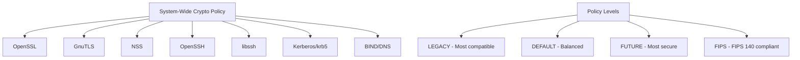

# How to View and Change System-Wide Crypto Policies on RHEL 9

Author: [nawazdhandala](https://www.github.com/nawazdhandala)

Tags: RHEL, Crypto Policies, TLS, Encryption, Security, Linux

Description: Manage system-wide cryptographic policies on RHEL 9 to control which ciphers, key sizes, and protocols are allowed across all applications.

---

RHEL 9 provides a centralized system-wide crypto policy mechanism that controls which cryptographic algorithms, ciphers, key sizes, and protocols are allowed. Instead of configuring each application individually, you can set a single policy that applies to OpenSSL, GnuTLS, NSS, OpenSSH, and other crypto libraries. This guide explains how to view and change these policies.

## How Crypto Policies Work



When you set a crypto policy, it automatically configures all these libraries to use only the allowed algorithms. This eliminates the need to manually edit TLS settings in each application.

## Viewing the Current Policy

```bash
# Show the current active policy
update-crypto-policies --show
# Output: DEFAULT

# Show the currently applied policy with details
update-crypto-policies --show --is-applied
```

## Available Built-in Policies

RHEL 9 ships with four built-in policies:

| Policy | Description |
|--------|-------------|
| `DEFAULT` | Balanced security. Suitable for most deployments. TLS 1.2+, RSA 2048+, SHA-256+. |
| `LEGACY` | Maximum backward compatibility. Allows older protocols and algorithms. |
| `FUTURE` | Forward-looking security. Requires TLS 1.3+ for most protocols, 256-bit ciphers, SHA-384+. |
| `FIPS` | Compliant with FIPS 140-2/140-3. Only FIPS-validated algorithms allowed. |

## Viewing Policy Details

```bash
# Show what a policy allows
cat /etc/crypto-policies/back-ends/opensslcnf.config

# View the SSH-specific policy
cat /etc/crypto-policies/back-ends/openssh.config

# View the full policy definition
cat /usr/share/crypto-policies/policies/DEFAULT.pol
```

## Changing the Crypto Policy

### Switch to a Different Policy

```bash
# Switch to the FUTURE policy (stricter security)
sudo update-crypto-policies --set FUTURE

# Switch to LEGACY policy (more compatible)
sudo update-crypto-policies --set LEGACY

# Switch to FIPS policy
sudo update-crypto-policies --set FIPS

# Return to DEFAULT
sudo update-crypto-policies --set DEFAULT
```

After changing the policy, most services need to be restarted:

```bash
# The easiest way is to reboot
sudo systemctl reboot

# Or restart individual services
sudo systemctl restart sshd
sudo systemctl restart httpd
sudo systemctl restart nginx
```

## Comparing Policy Restrictions

### DEFAULT Policy Highlights

```bash
- TLS versions: 1.2, 1.3
- Minimum RSA key: 2048 bits
- Minimum DH parameter: 2048 bits
- Allowed hashes: SHA-256, SHA-384, SHA-512
- Allowed symmetric ciphers: AES-128, AES-256, ChaCha20-Poly1305
- SSH: RSA (2048+), ECDSA, Ed25519
```

### FUTURE Policy Highlights

```bash
- TLS versions: 1.2 (only with strong ciphers), 1.3
- Minimum RSA key: 3072 bits
- Minimum DH parameter: 3072 bits
- Allowed hashes: SHA-384, SHA-512
- Allowed symmetric ciphers: AES-256, ChaCha20-Poly1305
- SSH: ECDSA (P-384+), Ed25519 (no RSA)
```

### LEGACY Policy Highlights

```bash
- TLS versions: 1.0, 1.1, 1.2, 1.3
- Minimum RSA key: 1024 bits
- Minimum DH parameter: 1024 bits
- Allowed hashes: SHA-1, SHA-256, SHA-384, SHA-512
- Allowed symmetric ciphers: 3DES, AES-128, AES-256, RC4 (limited)
- SSH: RSA (1024+), DSA, ECDSA, Ed25519
```

## Checking What the Policy Controls

```bash
# List all back-end configuration files
ls /etc/crypto-policies/back-ends/

# Each file controls a specific library:
# gnutls.config     - GnuTLS library
# java.config       - Java security settings
# krb5.config       - Kerberos
# libreswan.config  - IPsec/VPN
# libssh.config     - libssh
# nss.config        - NSS library
# openssh.config    - OpenSSH client and server
# opensslcnf.config - OpenSSL
```

## Testing Policy Effects

### Test TLS Configuration

```bash
# Check what TLS versions and ciphers are available
openssl ciphers -v | head -20

# Test a connection to see which protocol and cipher are negotiated
openssl s_client -connect example.com:443 < /dev/null 2>/dev/null | \
    grep -E "Protocol|Cipher"
```

### Test SSH Configuration

```bash
# Check what SSH algorithms are available
ssh -Q cipher
ssh -Q mac
ssh -Q kex
ssh -Q key

# Test an SSH connection with verbose output
ssh -vvv user@server 2>&1 | grep -i "kex\|cipher\|mac"
```

## Using Policy Sub-policies (Modifiers)

You can apply modifiers on top of a base policy:

```bash
# Set DEFAULT policy but disable SHA-1
sudo update-crypto-policies --set DEFAULT:NO-SHA1

# Set DEFAULT but allow only TLS 1.3 for SSH
sudo update-crypto-policies --set DEFAULT:NO-CBC

# Multiple modifiers
sudo update-crypto-policies --set DEFAULT:NO-SHA1:NO-CBC
```

Available sub-policies can be listed:

```bash
# List available sub-policies
ls /usr/share/crypto-policies/policies/modules/
```

## Verifying the Policy is Applied

```bash
# Check that the policy is consistent
update-crypto-policies --check

# Verify specific back-ends
# OpenSSL
openssl version -a | grep -i policy

# SSH - check the effective configuration
sshd -T | grep -E "^ciphers|^macs|^kexalgorithms|^hostkeyalgorithms"
```

## Summary

System-wide crypto policies on RHEL 9 provide a centralized way to manage cryptographic settings across all applications. Use `update-crypto-policies --show` to view the current policy and `update-crypto-policies --set POLICY` to change it. Choose DEFAULT for balanced security, FUTURE for maximum security, LEGACY for backward compatibility, or FIPS for compliance. Sub-policies let you fine-tune restrictions on top of a base policy.
