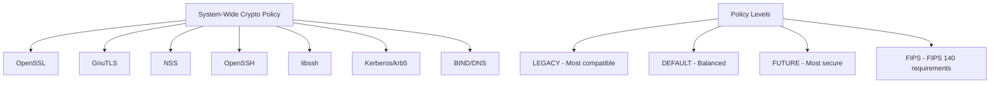

# How to View and Change System-Wide Crypto Policies on RHEL 9

Author: [nawazdhandala](https://www.github.com/nawazdhandala)

Tags: RHEL, Crypto Policies, TLS, Encryption, Security, Linux

Description: Manage system-wide cryptographic policies on RHEL 9 to control which ciphers, key sizes, and protocols are allowed across all applications.

---

RHEL 9 provides a centralized system-wide crypto policy mechanism that controls which cryptographic algorithms, ciphers, key sizes, and protocols are allowed by default. Instead of configuring each application individually, you can set a single policy that applies to OpenSSL, GnuTLS, NSS, OpenSSH, and other crypto libraries when applications use the system-provided configuration. This guide explains how to view and change these policies.

## How Crypto Policies Work


```mermaid
flowchart TD
    A[System-Wide Crypto Policy] --> B[OpenSSL]
    A --> C[GnuTLS]
    A --> D[NSS]
    A --> E[OpenSSH]
    A --> F[libssh]
    A --> G[Kerberos/krb5]
    A --> H[BIND/DNS]

    I[Policy Levels] --> J[LEGACY - Most compatible]
    I --> K[DEFAULT - Balanced]
    I --> L[FUTURE - Most secure]
    I --> M[FIPS - FIPS 140 requirements]
```

When you set a crypto policy, it automatically generates configuration for supported back ends so applications reject algorithms outside the selected policy by default. Applications can still override the system policy if they are explicitly configured to do so.

## Viewing the Current Policy

```bash
# Show the current active policy

update-crypto-policies --show
# Output: DEFAULT

# Check whether the configured policy has been applied
update-crypto-policies --is-applied
```

## Available Built-in Policies

RHEL 9 ships with four built-in policies:

| Policy | Description |
|--------|-------------|
| `DEFAULT` | Balanced security. Suitable for most deployments. Allows TLS 1.2 and TLS 1.3, IKEv2, SSH2, and RSA/DH keys of at least 2048 bits. |
| `LEGACY` | Maximum backward compatibility for RHEL 6-era systems. Less secure, allows SHA-1 for signatures and CBC-mode ciphers in SSH, but still requires TLS 1.2+ and RSA/DH keys of at least 2048 bits on RHEL 9. |
| `FUTURE` | Forward-looking security. Allows TLS 1.2 and TLS 1.3, requires RSA/DH keys of at least 3072 bits, disables 128-bit symmetric ciphers, and rejects SHA-1 in additional uses. |
| `FIPS` | Conforms with FIPS 140 requirements and is used internally by `fips-mode-setup`. Setting this policy alone does not make the system FIPS compliant. |

## Viewing Policy Details

```bash
# Show what a policy allows
cat /etc/crypto-policies/back-ends/opensslcnf.config

# View the SSH-specific policy
cat /etc/crypto-policies/back-ends/openssh.config
cat /etc/crypto-policies/back-ends/opensshserver.config

# View the full policy definition
cat /usr/share/crypto-policies/policies/DEFAULT.pol
```

## Changing the Crypto Policy

### Switch to a Different Policy

```bash
# Switch to the FUTURE policy (stricter security)
sudo update-crypto-policies --set FUTURE

# Switch to LEGACY policy (more compatible)
sudo update-crypto-policies --set LEGACY

# Switch to FIPS policy. This is not the same as enabling full FIPS mode.
sudo update-crypto-policies --set FIPS

# Return to DEFAULT
sudo update-crypto-policies --set DEFAULT
```

After changing the policy, most services need to be restarted:

```bash
# The easiest way is to reboot
sudo systemctl reboot

# Or restart individual services
sudo systemctl restart sshd
sudo systemctl restart httpd
sudo systemctl restart nginx
```

## Comparing Policy Restrictions

### DEFAULT Policy Highlights

```bash
- TLS versions: 1.2, 1.3
- Minimum RSA key: 2048 bits
- Minimum DH parameter: 2048 bits
- SHA-1 digital signatures and certificates: disabled
- Allowed symmetric ciphers: AES-128, AES-256, ChaCha20-Poly1305
- SSH: RSA (2048+), ECDSA, Ed25519
```

### FUTURE Policy Highlights

```bash
- TLS versions: 1.2 (only with strong ciphers), 1.3
- Minimum RSA key: 3072 bits
- Minimum DH parameter: 3072 bits
- SHA-1 in DNSSEC and HMAC: disabled
- Allowed symmetric ciphers: 256-bit ciphers such as AES-256 and ChaCha20-Poly1305
- SSH: RSA (3072+), ECDSA, Ed25519
```

### LEGACY Policy Highlights

```bash
- TLS versions: 1.2, 1.3
- Minimum RSA key: 2048 bits
- Minimum DH parameter: 2048 bits
- SHA-1 digital signatures and certificates: enabled
- Allowed symmetric ciphers: AES-128, AES-256, and other policy-supported ciphers, but not RC4 or 3DES
- SSH: RSA (2048+), ECDSA, Ed25519; CBC-mode ciphers are allowed
```

## Checking What the Policy Controls

```bash
# List all back-end configuration files
ls /etc/crypto-policies/back-ends/

# Each file controls a specific library:
# gnutls.config     - GnuTLS library
# java.config       - Java security settings
# krb5.config       - Kerberos
# libreswan.config  - IPsec/VPN
# libssh.config     - libssh
# nss.config        - NSS library
# openssh.config    - OpenSSH client
# opensshserver.config - OpenSSH server
# opensslcnf.config - OpenSSL
```

## Testing Policy Effects

### Test TLS Configuration

```bash
# Check what TLS versions and ciphers are available
openssl ciphers -v | head -20

# Test a connection to see which protocol and cipher are negotiated
openssl s_client -connect example.com:443 < /dev/null 2>/dev/null | \
    grep -E "Protocol|Cipher"
```

### Test SSH Configuration

```bash
# Check what SSH algorithms are available
ssh -Q cipher
ssh -Q mac
ssh -Q kex
ssh -Q key

# Test an SSH connection with verbose output
ssh -vvv user@server 2>&1 | grep -i "kex\|cipher\|mac"
```

## Using Policy Sub-policies (Modifiers)

You can apply modifiers on top of a base policy:

```bash
# Set DEFAULT policy but disable SHA-1
sudo update-crypto-policies --set DEFAULT:NO-SHA1

# Set DEFAULT but enforce ECDHE-based key exchange
sudo update-crypto-policies --set DEFAULT:ECDHE-ONLY

# Multiple modifiers
sudo update-crypto-policies --set DEFAULT:NO-SHA1:ECDHE-ONLY
```

Available sub-policies can be listed:

```bash
# List available sub-policies
ls /usr/share/crypto-policies/policies/modules/
```

## Verifying the Policy is Applied

```bash
# Check that the policy is consistent
update-crypto-policies --check

# Verify specific back-ends
# OpenSSL
cat /etc/crypto-policies/back-ends/opensslcnf.config

# SSH - check the effective configuration
sshd -T | grep -E "^ciphers|^macs|^kexalgorithms|^hostkeyalgorithms"
```

## Summary

System-wide crypto policies on RHEL 9 provide a centralized way to manage cryptographic settings for supported applications. Use `update-crypto-policies --show` to view the current policy and `update-crypto-policies --set POLICY` to change it. Choose DEFAULT for balanced security, FUTURE for stricter forward-looking settings, LEGACY for backward compatibility, or FIPS when configuring a system for FIPS mode. Sub-policies let you fine-tune restrictions on top of a base policy.
