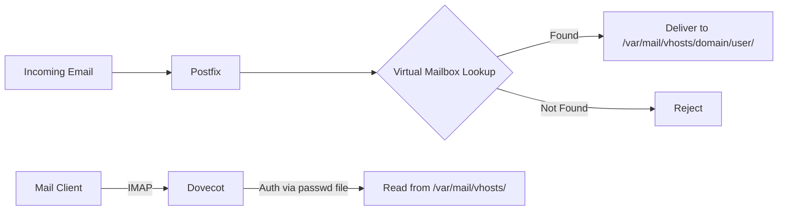

# How to Set Up Virtual Mailboxes with Postfix and Dovecot on RHEL

Author: [nawazdhandala](https://www.github.com/nawazdhandala)

Tags: RHEL, Postfix, Dovecot, Virtual Mailboxes, Linux

Description: Configure Postfix and Dovecot to serve virtual mailboxes on RHEL, allowing you to host email accounts without creating system users.

---

## Why Virtual Mailboxes?

When you host email for multiple domains and dozens (or hundreds) of users, creating a Linux system account for each one is not practical. Virtual mailboxes decouple email accounts from system users. Mail is stored in directories on disk, owned by a single system user, and Dovecot handles authentication against a separate user database. No shell accounts, no home directories, no `/etc/passwd` pollution.

## Architecture



## Prerequisites

- RHEL with Postfix and Dovecot installed
- TLS certificate for your mail server
- DNS MX records pointing to your server

## Step 1: Create the Virtual Mail User

All virtual mailboxes will be owned by a single system user:

```bash
# Create the vmail group and user
sudo groupadd -g 5000 vmail
sudo useradd -u 5000 -g vmail -s /sbin/nologin -d /var/mail/vhosts -m vmail
```

## Step 2: Create Mail Directories

```bash
# Create directories for each domain
sudo mkdir -p /var/mail/vhosts/example.com
sudo mkdir -p /var/mail/vhosts/example.org
sudo chown -R vmail:vmail /var/mail/vhosts
```

## Step 3: Configure Postfix for Virtual Delivery

Edit `/etc/postfix/main.cf`:

```
# Virtual mailbox domain settings
virtual_mailbox_domains = hash:/etc/postfix/virtual_domains
virtual_mailbox_base = /var/mail/vhosts
virtual_mailbox_maps = hash:/etc/postfix/vmailbox
virtual_alias_maps = hash:/etc/postfix/virtual_aliases
virtual_minimum_uid = 100
virtual_uid_maps = static:5000
virtual_gid_maps = static:5000
```

### Create the Domains File

Edit `/etc/postfix/virtual_domains`:

```
example.com     OK
example.org     OK
```

```bash
sudo postmap /etc/postfix/virtual_domains
```

### Create the Mailbox Map

Edit `/etc/postfix/vmailbox`:

```
# Format: email_address    relative/path/to/maildir/
john@example.com        example.com/john/
jane@example.com        example.com/jane/
admin@example.com       example.com/admin/
info@example.org        example.org/info/
support@example.org     example.org/support/
```

The trailing slash is important - it tells Postfix to use Maildir format.

```bash
sudo postmap /etc/postfix/vmailbox
```

### Create Virtual Aliases

Edit `/etc/postfix/virtual_aliases`:

```
# Aliases for virtual domains
postmaster@example.com   admin@example.com
abuse@example.com        admin@example.com
webmaster@example.org    info@example.org
```

```bash
sudo postmap /etc/postfix/virtual_aliases
```

## Step 4: Configure Dovecot

### Authentication

Edit `/etc/dovecot/conf.d/10-auth.conf`:

```
# Disable plaintext auth without TLS
disable_plaintext_auth = yes
auth_mechanisms = plain login

# Use a password file instead of system accounts
# Comment out the system auth include
#!include auth-system.conf.ext

# Enable password file authentication
!include auth-passwdfile.conf.ext
```

Create `/etc/dovecot/conf.d/auth-passwdfile.conf.ext`:

```
passdb {
  driver = passwd-file
  args = scheme=BLF-CRYPT username_format=%u /etc/dovecot/users
}

userdb {
  driver = static
  args = uid=5000 gid=5000 home=/var/mail/vhosts/%d/%n
}
```

### Create the Password File

Generate passwords and add users to `/etc/dovecot/users`:

```bash
# Generate a password hash for a user
sudo doveadm pw -s BLF-CRYPT
```

Enter the password when prompted. Then add the entry to `/etc/dovecot/users`:

```
john@example.com:{BLF-CRYPT}$2y$05$abc123hashedpasswordhere
jane@example.com:{BLF-CRYPT}$2y$05$def456hashedpasswordhere
admin@example.com:{BLF-CRYPT}$2y$05$ghi789hashedpasswordhere
info@example.org:{BLF-CRYPT}$2y$05$jkl012hashedpasswordhere
support@example.org:{BLF-CRYPT}$2y$05$mno345hashedpasswordhere
```

Secure the file:

```bash
sudo chown root:dovecot /etc/dovecot/users
sudo chmod 640 /etc/dovecot/users
```

### Mail Location

Edit `/etc/dovecot/conf.d/10-mail.conf`:

```
# Virtual mailbox location
mail_location = maildir:/var/mail/vhosts/%d/%n
mail_privileged_group = vmail

# Allow Dovecot to create mailbox directories
namespace inbox {
  inbox = yes
  separator = /
}
```

### TLS Settings

Edit `/etc/dovecot/conf.d/10-ssl.conf`:

```
ssl = required
ssl_cert = </etc/letsencrypt/live/mail.example.com/fullchain.pem
ssl_key = </etc/letsencrypt/live/mail.example.com/privkey.pem
ssl_min_protocol = TLSv1.2
```

### Master Process Configuration

Edit `/etc/dovecot/conf.d/10-master.conf`:

```
service auth {
  unix_listener /var/spool/postfix/private/auth {
    mode = 0660
    user = postfix
    group = postfix
  }
}
```

## Step 5: Start Everything

```bash
# Reload Postfix
sudo postfix reload

# Restart Dovecot
sudo systemctl restart dovecot

# Check both services
sudo systemctl status postfix dovecot
```

## Step 6: Test the Setup

### Test Postfix Delivery

```bash
# Send a test email
echo "Virtual mailbox test" | mail -s "Test" john@example.com

# Check if mail was delivered
sudo ls -la /var/mail/vhosts/example.com/john/new/
```

### Test Dovecot Authentication

```bash
# Test user authentication
sudo doveadm auth test john@example.com
```

### Test IMAP Access

```bash
# Connect via IMAPS
openssl s_client -connect mail.example.com:993
```

```
a1 LOGIN john@example.com password
a2 LIST "" "*"
a3 SELECT INBOX
a4 LOGOUT
```

## Adding New Users

The process for adding a new virtual mailbox user:

```bash
# 1. Add to Postfix mailbox map
echo "newuser@example.com    example.com/newuser/" | sudo tee -a /etc/postfix/vmailbox
sudo postmap /etc/postfix/vmailbox

# 2. Generate password hash
sudo doveadm pw -s BLF-CRYPT

# 3. Add to Dovecot users file
echo "newuser@example.com:{BLF-CRYPT}HASH_HERE" | sudo tee -a /etc/dovecot/users

# 4. No restart needed - Dovecot reads the file on each auth attempt
# But reload Postfix for the mailbox map change
sudo postfix reload
```

## Changing Passwords

```bash
# Generate new hash
sudo doveadm pw -s BLF-CRYPT

# Update the users file with the new hash
# Replace the old hash for the user in /etc/dovecot/users
```

## Quota Support

Add quota support in `/etc/dovecot/conf.d/90-quota.conf`:

```
plugin {
  quota = maildir:User quota
  quota_rule = *:storage=1G
  quota_rule2 = Trash:storage=+100M
}

protocol imap {
  mail_plugins = $mail_plugins quota imap_quota
}
```

## Wrapping Up

Virtual mailboxes are the way to go for any multi-user, multi-domain mail setup. The combination of Postfix for SMTP and Dovecot for IMAP with a password file gives you a clean, manageable system. For larger deployments, consider moving the user database to a MySQL or LDAP backend instead of a flat file. But for small to medium setups, the password file approach is simple and effective.
