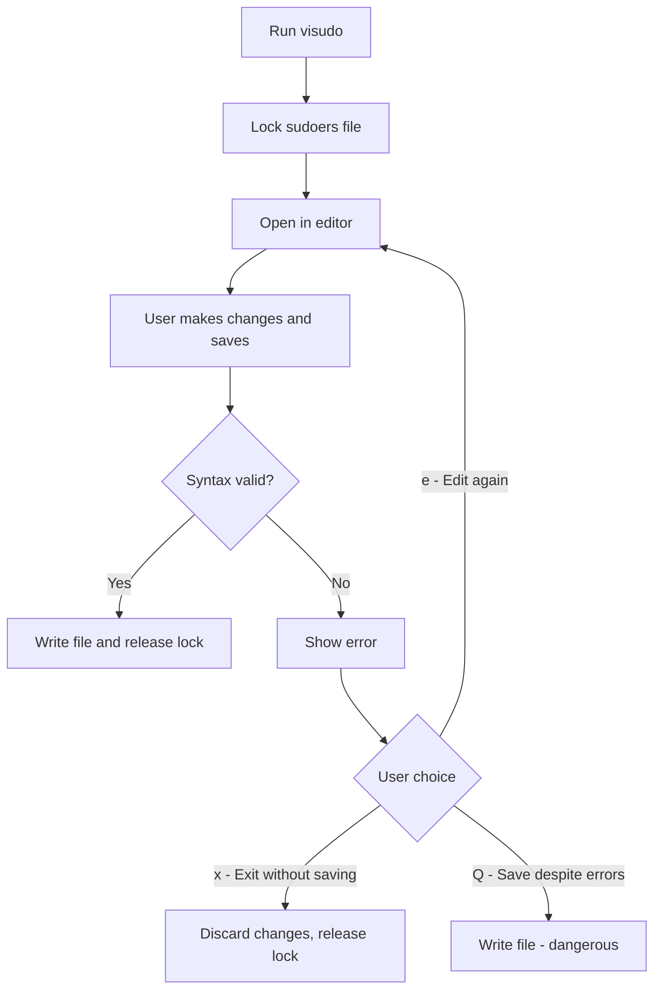

# How to Use visudo Safely to Edit Sudoers Configuration on RHEL

Author: [nawazdhandala](https://www.github.com/nawazdhandala)

Tags: RHEL, Visudo, Sudo, Security, Linux

Description: Learn the correct way to edit sudoers files on RHEL using visudo, with safety checks, syntax validation, and recovery procedures for when things go wrong.

---

A single typo in `/etc/sudoers` can lock every admin out of sudo. I have seen it happen more than once, and it is never fun. The `visudo` command exists specifically to prevent this by validating syntax before saving. If you edit sudoers files any other way, you are asking for trouble.

## Why visudo Matters

When you run `visudo`, it:

1. Opens the file in an editor (vi by default).
2. Locks the file to prevent concurrent edits.
3. Validates the syntax after you save.
4. Refuses to write the file if there are errors.
5. Gives you the option to re-edit, discard, or save anyway.



## Basic Usage

### Edit the main sudoers file

```bash
sudo visudo
```

This opens `/etc/sudoers` for editing.

### Edit a drop-in file

```bash
sudo visudo -f /etc/sudoers.d/webadmins
```

Always use `visudo -f` for files in `/etc/sudoers.d/`. It applies the same syntax validation.

### Validate without editing

```bash
# Check syntax of all sudoers files
sudo visudo -c
```

Output for a valid configuration:

```bash
/etc/sudoers: parsed OK
/etc/sudoers.d/webadmins: parsed OK
```

### Check a specific file

```bash
sudo visudo -c -f /etc/sudoers.d/webadmins
```

## Changing the Default Editor

By default, visudo uses vi. If you prefer a different editor:

```bash
# Use nano for this session
sudo EDITOR=nano visudo

# Or set it permanently for your user
echo 'export EDITOR=nano' >> ~/.bashrc
```

You can also configure it system-wide in `/etc/sudoers`:

```bash
Defaults editor=/usr/bin/nano
```

## Handling Syntax Errors

If you introduce a syntax error and try to save, visudo shows:

```bash
>>> /etc/sudoers: syntax error near line 25 <<<
What now?
Options are:
  (e)dit sudoers file again
  e(x)it without saving changes to sudoers file
  (Q)uit and save changes to sudoers file (DANGER!)
```

**Always choose `e` or `x`.** Never choose `Q` unless you are absolutely sure the "error" is a false positive (which is rare).

### What a syntax error looks like

Common mistakes:

```bash
# Missing colon separator - WRONG
%webadmins ALL=(root) /usr/bin/systemctl

# Trailing whitespace after backslash continuation - WRONG
%webadmins ALL=(root) /usr/bin/systemctl start httpd, \
                       /usr/bin/systemctl stop httpd

# Misspelled keyword - WRONG
%webadmins ALL=(root) NOPASSWRD: /usr/bin/systemctl
```

## Writing Proper Sudoers Rules

### Basic rule structure

```bash
# User-based rule
jsmith  ALL=(root) /usr/bin/systemctl restart httpd

# Group-based rule (note the % prefix)
%webadmins  ALL=(root) /usr/bin/systemctl restart httpd

# Multiple commands with line continuation
%webadmins  ALL=(root) /usr/bin/systemctl start httpd, \
                        /usr/bin/systemctl stop httpd, \
                        /usr/bin/systemctl restart httpd
```

### Using aliases

```bash
# Host aliases
Host_Alias WEBSERVERS = web01, web02, web03

# User aliases
User_Alias WEBADMINS = jsmith, jdoe, akim

# Command aliases
Cmnd_Alias WEB_CMDS = /usr/bin/systemctl restart httpd, \
                       /usr/bin/systemctl reload httpd

# Put it together
WEBADMINS WEBSERVERS=(root) WEB_CMDS
```

### Default settings

```bash
# Set defaults for all users
Defaults    env_reset
Defaults    secure_path="/usr/local/sbin:/usr/local/bin:/usr/sbin:/usr/bin:/sbin:/bin"

# Set defaults for a specific user
Defaults:jsmith    !requiretty

# Set defaults for a group
Defaults:%webadmins    timestamp_timeout=10
```

## Recovering from a Broken sudoers File

If someone edited sudoers without visudo and introduced a syntax error, sudo will refuse to work:

```bash
>>> /etc/sudoers: syntax error near line 25 <<<
sudo: parse error in /etc/sudoers near line 25
sudo: no valid sudoers sources found, quitting
```

### Recovery Method 1: Use pkexec

```bash
# pkexec uses polkit instead of sudo
pkexec visudo
```

### Recovery Method 2: Boot into single-user mode

1. Reboot the system.
2. At the GRUB menu, edit the kernel line and add `single` or `init=/bin/bash`.
3. Mount the root filesystem as read-write: `mount -o remount,rw /`
4. Fix the sudoers file: `visudo`
5. Reboot.

### Recovery Method 3: Use the root password

If you have the root password and `su` is not restricted:

```bash
su -
visudo
```

### Prevention: Always use visudo

The best recovery is prevention. Never edit sudoers with `vi`, `nano`, `sed`, or any tool other than `visudo`.

## Using visudo with Automation

When managing sudoers with configuration management tools (Ansible, Puppet, etc.), you cannot use visudo interactively. Instead:

### Validate before deploying

```bash
# Write the file to a temp location
cat > /tmp/new-sudoers-rule << 'EOF'
%webadmins ALL=(root) /usr/bin/systemctl restart httpd
EOF

# Validate it
visudo -c -f /tmp/new-sudoers-rule

# If valid, move it into place
if [ $? -eq 0 ]; then
    cp /tmp/new-sudoers-rule /etc/sudoers.d/webadmins
    chmod 0440 /etc/sudoers.d/webadmins
    chown root:root /etc/sudoers.d/webadmins
fi

rm -f /tmp/new-sudoers-rule
```

## Common visudo Options

| Flag | Description |
|---|---|
| `-c` | Check syntax only, do not edit |
| `-f file` | Edit a specific file instead of /etc/sudoers |
| `-s` | Strict checking mode |
| `-q` | Quiet mode for -c (only show errors) |

## Wrapping Up

visudo is not optional. It is the only safe way to edit sudoers files on RHEL. Use `visudo -f` for drop-in files in `/etc/sudoers.d/`, run `visudo -c` after any automated changes, and never choose `Q` when visudo reports an error. Keep the root password available as a recovery mechanism, and consider using `pkexec` as an alternative path to root when sudo is broken.
