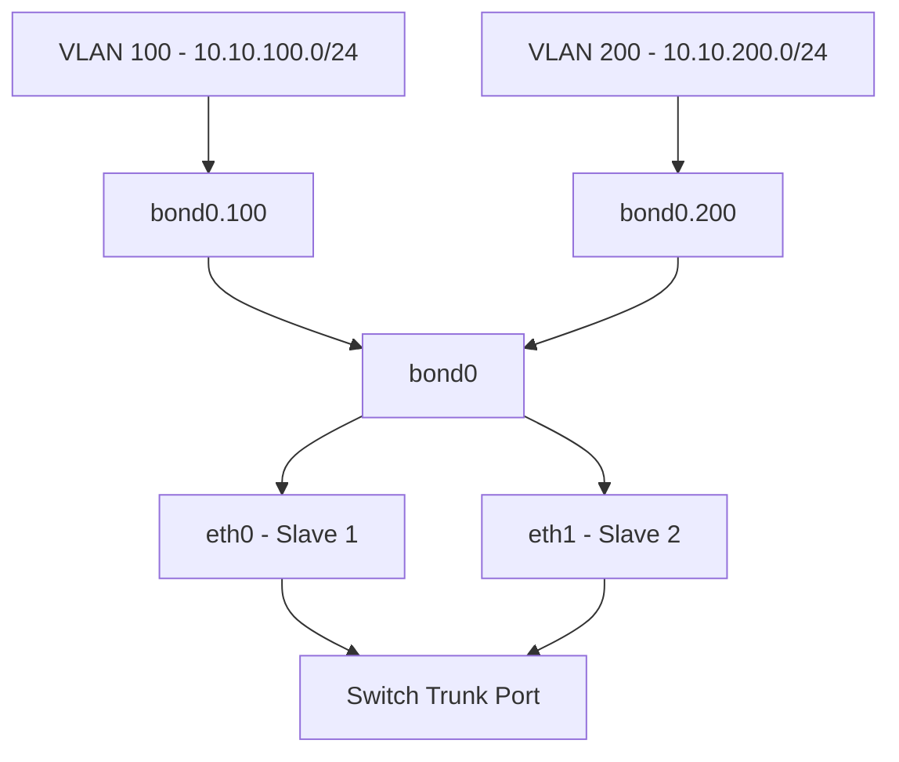

# How to Set Up VLAN Tagging Over a Bonded Interface on RHEL 9

Author: [nawazdhandala](https://www.github.com/nawazdhandala)

Tags: RHEL, VLAN, Network Bonding, Networking, Linux

Description: Learn how to stack VLAN tagging on top of a bonded interface in RHEL 9, giving you both link redundancy and network segmentation in one setup.

---

Running VLANs over bonded interfaces is a common pattern in data centers. You get the redundancy and bandwidth of bonding combined with the network segmentation of VLANs. On RHEL 9, this is all managed through nmcli and works reliably once you layer things correctly.

## The Architecture

Here is how the stack looks when you combine bonding with VLANs:



The physical interfaces feed into a bond, and VLANs sit on top of that bond. The switch ports connected to your NICs need to be configured as trunk ports carrying the relevant VLAN IDs.

## Prerequisites

- RHEL 9 with at least two network interfaces
- A network switch configured with trunk ports carrying your VLANs
- Root or sudo access
- An existing bond interface (or we will create one)

## Step 1: Create the Bond

If you do not already have a bond set up, create one:

```bash
# Create a bond with 802.3ad (LACP) mode for maximum throughput
nmcli connection add type bond con-name bond0 ifname bond0 bond.options "mode=802.3ad,miimon=100,lacp_rate=fast"

# Add slave interfaces
nmcli connection add type ethernet con-name bond0-slave1 ifname eth0 master bond0
nmcli connection add type ethernet con-name bond0-slave2 ifname eth1 master bond0
```

Do not assign an IP directly to bond0 if you only want traffic on the VLANs. You can leave it without an address:

```bash
# Disable IPv4 on the base bond if not needed
nmcli connection modify bond0 ipv4.method disabled
nmcli connection modify bond0 ipv6.method disabled
```

## Step 2: Create VLAN Interfaces

Now add VLAN interfaces on top of the bond. Here we create VLAN 100 and VLAN 200:

```bash
# Create VLAN 100 on top of bond0
nmcli connection add type vlan con-name bond0.100 ifname bond0.100 vlan.parent bond0 vlan.id 100

# Create VLAN 200 on top of bond0
nmcli connection add type vlan con-name bond0.200 ifname bond0.200 vlan.parent bond0 vlan.id 200
```

## Step 3: Assign IP Addresses to VLANs

Each VLAN interface gets its own IP configuration:

```bash
# Configure VLAN 100 with a static IP
nmcli connection modify bond0.100 ipv4.addresses 10.10.100.10/24
nmcli connection modify bond0.100 ipv4.gateway 10.10.100.1
nmcli connection modify bond0.100 ipv4.dns "10.10.100.1"
nmcli connection modify bond0.100 ipv4.method manual

# Configure VLAN 200 with a static IP
nmcli connection modify bond0.200 ipv4.addresses 10.10.200.10/24
nmcli connection modify bond0.200 ipv4.method manual
```

Only set a default gateway on one VLAN, or use policy-based routing if you need traffic to route through different gateways per VLAN.

## Step 4: Bring Everything Up

Activate the bond first, then the VLANs:

```bash
# Bring up the bond
nmcli connection up bond0

# Bring up the VLAN interfaces
nmcli connection up bond0.100
nmcli connection up bond0.200
```

## Step 5: Verify the Setup

Check the VLAN interfaces are up and have correct IPs:

```bash
# Show IP addresses on all interfaces
ip addr show bond0.100
ip addr show bond0.200

# Verify VLAN configuration
cat /proc/net/vlan/bond0.100
cat /proc/net/vlan/bond0.200
```

Confirm the bond itself is healthy:

```bash
# Check bond status
cat /proc/net/bonding/bond0
```

Test connectivity on each VLAN:

```bash
# Ping through VLAN 100
ping -c 4 10.10.100.1

# Ping through VLAN 200
ping -c 4 10.10.200.1
```

## Switch-Side Configuration

Your switch must be configured to trunk the VLANs to the ports where your bonded NICs connect. The exact commands depend on your switch vendor, but conceptually you need:

- Ports configured as trunk ports
- VLANs 100 and 200 allowed on the trunk
- If using LACP (802.3ad bonding), the switch ports should be in an LACP port-channel group

## Troubleshooting

**VLAN traffic not reaching the server**: Verify the switch trunk configuration. Use tcpdump to check if tagged frames arrive:

```bash
# Capture VLAN-tagged traffic on the bond
tcpdump -i bond0 -e -nn vlan
```

**8021q module not loaded**: The VLAN kernel module should load automatically, but check:

```bash
# Verify the 8021q module is loaded
lsmod | grep 8021q

# Load it manually if needed
modprobe 8021q
```

**MTU issues**: If you use jumbo frames, set the MTU on the bond and all VLANs:

```bash
# Set MTU on the bond
nmcli connection modify bond0 802-3-ethernet.mtu 9000

# Set MTU on each VLAN (must be <= bond MTU)
nmcli connection modify bond0.100 802-3-ethernet.mtu 9000
nmcli connection modify bond0.200 802-3-ethernet.mtu 9000

# Restart to apply
nmcli connection down bond0 && nmcli connection up bond0
nmcli connection up bond0.100
nmcli connection up bond0.200
```

## Adding More VLANs Later

The process is the same. Just add another VLAN connection:

```bash
# Add VLAN 300
nmcli connection add type vlan con-name bond0.300 ifname bond0.300 vlan.parent bond0 vlan.id 300
nmcli connection modify bond0.300 ipv4.addresses 10.10.300.10/24
nmcli connection modify bond0.300 ipv4.method manual
nmcli connection up bond0.300
```

## Summary

Layering VLANs on top of a bond gives you the best of both worlds: link-level redundancy from bonding and logical network separation from VLANs. The key things to remember are: create the bond first, disable IP on the base bond if needed, create VLAN interfaces referencing the bond as parent, and make sure your switch is trunking the right VLANs. Test from both ends before going live.
