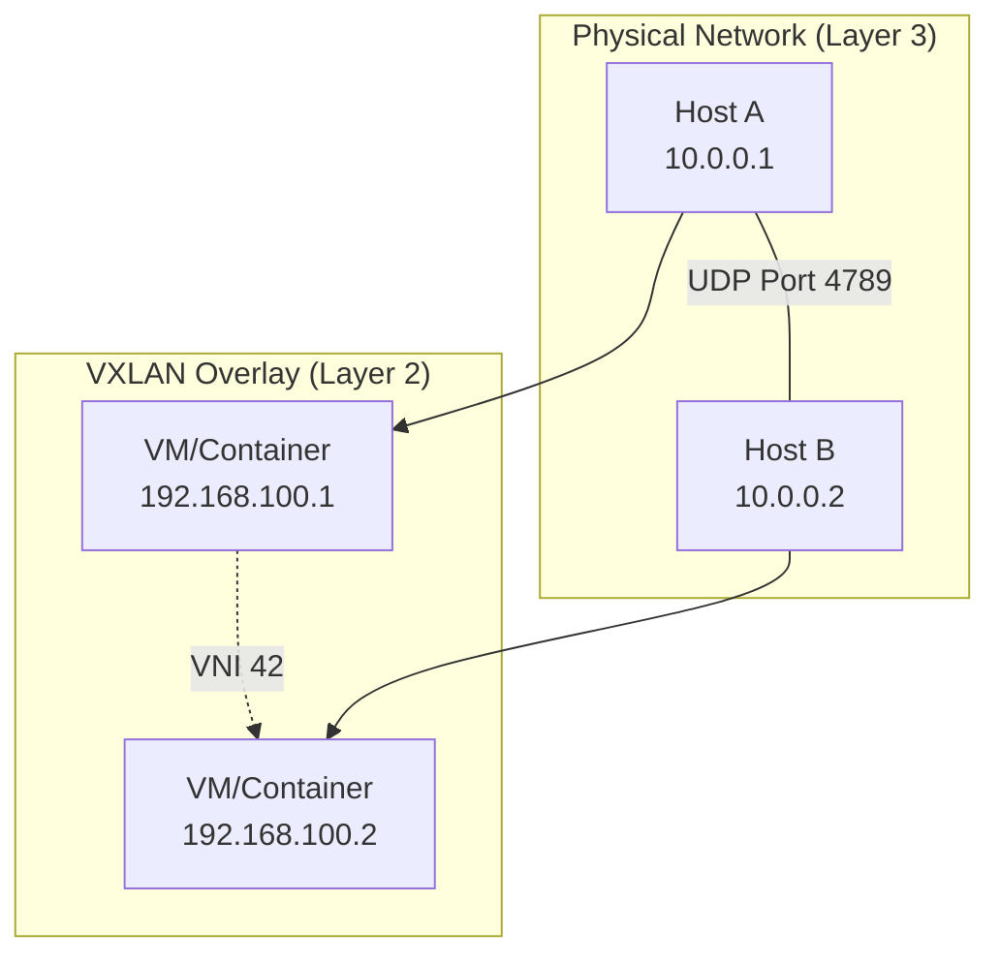

# How to Set Up VXLAN Overlay Networks on RHEL 9

Author: [nawazdhandala](https://www.github.com/nawazdhandala)

Tags: RHEL, VXLAN, Networking, Overlay Networks, Linux

Description: Learn how to create VXLAN overlay networks on RHEL 9 for extending Layer 2 segments across Layer 3 boundaries, enabling flexible network architectures.

---

VXLAN (Virtual Extensible LAN) is an overlay network technology that encapsulates Layer 2 Ethernet frames within UDP packets. This lets you stretch a Layer 2 network across different physical networks, which is especially useful in cloud environments, container networking, and multi-site deployments.

## How VXLAN Works



## Prerequisites

- Two or more RHEL 9 hosts with IP connectivity between them
- Root or sudo access on all hosts

## Step 1: Create a VXLAN Interface on Host A

```bash
# Create a VXLAN interface with VNI (VXLAN Network Identifier) 42
# The remote IP is the underlay address of Host B
# dstport 4789 is the standard VXLAN UDP port
sudo ip link add vxlan42 type vxlan \
    id 42 \
    remote 10.0.0.2 \
    dstport 4789 \
    dev ens3

# Assign an overlay IP address to the VXLAN interface
sudo ip addr add 192.168.100.1/24 dev vxlan42

# Bring the VXLAN interface up
sudo ip link set vxlan42 up

# Verify the interface was created
ip addr show vxlan42
```

## Step 2: Create a VXLAN Interface on Host B

```bash
# Create the matching VXLAN interface on Host B
# The remote IP points back to Host A
sudo ip link add vxlan42 type vxlan \
    id 42 \
    remote 10.0.0.1 \
    dstport 4789 \
    dev ens3

# Assign the overlay IP address
sudo ip addr add 192.168.100.2/24 dev vxlan42

# Bring the interface up
sudo ip link set vxlan42 up
```

## Step 3: Test Connectivity

```bash
# From Host A, ping Host B through the VXLAN overlay
ping -c 4 192.168.100.2

# Check the VXLAN forwarding database
bridge fdb show dev vxlan42
```

## Step 4: Set Up VXLAN with Multicast

For environments with more than two hosts, use multicast instead of specifying individual remote addresses.

```bash
# On all participating hosts, create the VXLAN interface with a multicast group
sudo ip link add vxlan42 type vxlan \
    id 42 \
    group 239.1.1.1 \
    dstport 4789 \
    dev ens3 \
    ttl 10

# Assign unique overlay IPs on each host
# Host A:
sudo ip addr add 192.168.100.1/24 dev vxlan42
# Host B:
sudo ip addr add 192.168.100.2/24 dev vxlan42
# Host C:
sudo ip addr add 192.168.100.3/24 dev vxlan42

# Bring the interface up on all hosts
sudo ip link set vxlan42 up
```

## Step 5: Make Configuration Persistent with nmcli

```bash
# Create a persistent VXLAN connection using NetworkManager
sudo nmcli connection add type vxlan \
    con-name vxlan42 \
    ifname vxlan42 \
    vxlan.id 42 \
    vxlan.remote 10.0.0.2 \
    vxlan.destination-port 4789 \
    vxlan.parent ens3 \
    ipv4.addresses 192.168.100.1/24 \
    ipv4.method manual \
    connection.autoconnect yes

# Verify the connection
nmcli connection show vxlan42
```

## Step 6: Bridge VXLAN with Local VMs

To connect local virtual machines to the VXLAN overlay, create a bridge:

```bash
# Create a Linux bridge
sudo ip link add br-vxlan type bridge

# Add the VXLAN interface to the bridge
sudo ip link set vxlan42 master br-vxlan

# Assign an IP to the bridge (optional, for host access)
sudo ip addr add 192.168.100.1/24 dev br-vxlan

# Bring everything up
sudo ip link set br-vxlan up
sudo ip link set vxlan42 up

# Now connect VM tap interfaces to br-vxlan
# VMs on this bridge will be on the same Layer 2 as remote VXLAN hosts
```

## Troubleshooting

```bash
# Check that UDP port 4789 is open in the firewall
sudo firewall-cmd --add-port=4789/udp --permanent
sudo firewall-cmd --reload

# Capture VXLAN traffic for debugging
sudo tcpdump -i ens3 -n udp port 4789

# Verify VXLAN interface details
ip -d link show vxlan42

# Check the MAC address forwarding database
bridge fdb show dev vxlan42
```

## Summary

You have set up VXLAN overlay networks on RHEL 9, connecting hosts across Layer 3 boundaries with a virtual Layer 2 segment. You created point-to-point and multicast VXLAN tunnels, made them persistent with NetworkManager, and bridged them with local virtual machines. VXLAN is a foundational technology for software-defined networking and container orchestration platforms.
