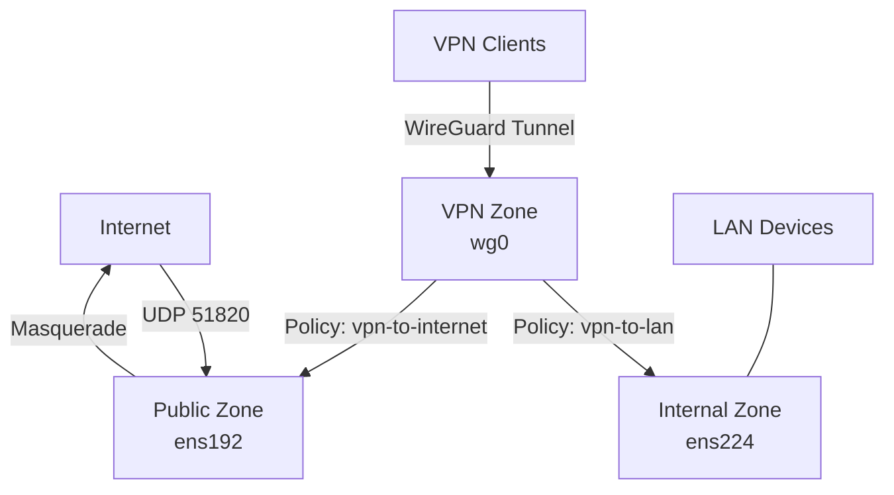

# How to Configure WireGuard Firewall Rules with firewalld on RHEL

Author: [nawazdhandala](https://www.github.com/nawazdhandala)

Tags: RHEL, WireGuard, Firewalld, VPN, Linux

Description: Learn how to properly configure firewalld rules for WireGuard VPN on RHEL, including port openings, zone assignments, masquerading, and forwarding policies.

---

Getting WireGuard running is only half the job. The firewall configuration determines who can connect to your VPN, what traffic flows through it, and how it interacts with your other network interfaces. On RHEL, firewalld gives you the tools to do this cleanly with zones and policies.

## Basic WireGuard Port Access

The minimum requirement is opening the UDP port that WireGuard listens on.

```bash
# Allow WireGuard's default port
sudo firewall-cmd --permanent --add-port=51820/udp

# If you use a custom port
sudo firewall-cmd --permanent --add-port=41194/udp

# Reload to apply
sudo firewall-cmd --reload

# Verify
sudo firewall-cmd --list-ports
```

## Zone Strategy for WireGuard

The best practice is to assign the WireGuard interface to its own zone. This lets you control what traffic is allowed through the tunnel independently from your physical interfaces.

```bash
# Put the WireGuard interface in the trusted zone (allow everything)
sudo firewall-cmd --permanent --zone=trusted --add-interface=wg0

# Or create a custom zone with specific rules
sudo firewall-cmd --permanent --new-zone=vpn
sudo firewall-cmd --permanent --zone=vpn --add-interface=wg0
sudo firewall-cmd --permanent --zone=vpn --add-service=ssh
sudo firewall-cmd --permanent --zone=vpn --add-service=http
sudo firewall-cmd --permanent --zone=vpn --add-service=https

# Reload
sudo firewall-cmd --reload

# Verify zone assignments
sudo firewall-cmd --get-active-zones
```

## Configuring Masquerading for Client VPN

When WireGuard clients need internet access through the server, you need masquerading (NAT).

```bash
# Enable masquerading on the public zone
sudo firewall-cmd --permanent --zone=public --add-masquerade

# Verify masquerading is active
sudo firewall-cmd --zone=public --query-masquerade

# Reload
sudo firewall-cmd --reload
```

## Forwarding Between Zones

For site-to-site VPNs or when you need controlled forwarding between the VPN and your LAN, use firewalld policies.

```bash
# Create a policy for VPN-to-LAN forwarding
sudo firewall-cmd --permanent --new-policy=vpn-to-lan

# Define the direction: from vpn zone to internal zone
sudo firewall-cmd --permanent --policy=vpn-to-lan --add-ingress-zone=vpn
sudo firewall-cmd --permanent --policy=vpn-to-lan --add-egress-zone=internal

# Allow specific services through the policy
sudo firewall-cmd --permanent --policy=vpn-to-lan --add-service=ssh
sudo firewall-cmd --permanent --policy=vpn-to-lan --add-service=http

# Or allow everything
sudo firewall-cmd --permanent --policy=vpn-to-lan --set-target=ACCEPT

# Reload
sudo firewall-cmd --reload
```

## Restricting VPN Access by Source IP

If your WireGuard server should only accept connections from known IP addresses:

```bash
# Create a rich rule to allow WireGuard only from specific IPs
sudo firewall-cmd --permanent --add-rich-rule='rule family="ipv4" source address="203.0.113.50" port port="51820" protocol="udp" accept'

# Remove the general port opening
sudo firewall-cmd --permanent --remove-port=51820/udp

# Reload
sudo firewall-cmd --reload
```

## Limiting What VPN Clients Can Access

Using the custom vpn zone, you can restrict VPN clients to specific services:

```bash
# Reset the vpn zone to only allow what you specify
sudo firewall-cmd --permanent --zone=vpn --set-target=DROP

# Allow only specific services
sudo firewall-cmd --permanent --zone=vpn --add-service=ssh
sudo firewall-cmd --permanent --zone=vpn --add-service=dns

# Allow access to a specific internal server
sudo firewall-cmd --permanent --zone=vpn --add-rich-rule='rule family="ipv4" destination address="192.168.1.100" port port="5432" protocol="tcp" accept'

# Reload
sudo firewall-cmd --reload
```

## Firewall Architecture Diagram



## Logging VPN Traffic

For auditing purposes, you can log VPN-related traffic:

```bash
# Log new connections through the VPN
sudo firewall-cmd --permanent --zone=vpn --add-rich-rule='rule family="ipv4" service name="ssh" log prefix="VPN-SSH: " level="info" accept'

# Log dropped traffic from VPN
sudo firewall-cmd --permanent --zone=vpn --add-rich-rule='rule family="ipv4" log prefix="VPN-DROP: " level="warning" drop'

# Reload
sudo firewall-cmd --reload

# View the logs
journalctl -k | grep "VPN-"
```

## Handling WireGuard with PostUp/PostDown vs firewalld

You might see WireGuard configs that use PostUp and PostDown to manage firewall rules. Here's the tradeoff:

**PostUp/PostDown approach** (in wg0.conf):
```ini
PostUp = firewall-cmd --add-port=51820/udp; firewall-cmd --add-masquerade
PostDown = firewall-cmd --remove-port=51820/udp; firewall-cmd --remove-masquerade
```

**Permanent firewalld rules** (recommended):
```bash
sudo firewall-cmd --permanent --add-port=51820/udp
sudo firewall-cmd --permanent --add-masquerade
```

I prefer permanent rules because they survive firewalld reloads and are easier to audit. PostUp/PostDown adds rules to the runtime config only, so a `firewall-cmd --reload` from another process would wipe them out.

## Verifying Everything Works Together

```bash
# Check all active zones and their rules
sudo firewall-cmd --list-all-zones | grep -A 20 "vpn\|public\|trusted"

# Verify masquerading
sudo iptables -t nat -L POSTROUTING -n -v 2>/dev/null || sudo nft list table ip firewalld

# Check forwarding policies
sudo firewall-cmd --get-policies
sudo firewall-cmd --info-policy=vpn-to-lan

# Test from a VPN client
ping -c 4 10.0.0.1
curl -s http://internal-server.example.com
```

## Wrapping Up

A properly configured firewall around your WireGuard VPN on RHEL is what separates a functional VPN from a secure one. Use zones to isolate VPN traffic, policies to control forwarding, and rich rules for fine-grained access control. Permanent rules are better than PostUp/PostDown scripts for reliability. And always verify your rules from both sides of the tunnel.
