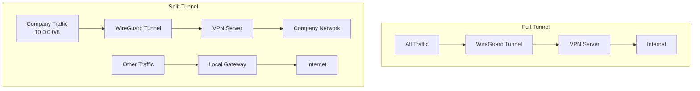

# How to Set Up WireGuard with Split Tunneling on RHEL 9

Author: [nawazdhandala](https://www.github.com/nawazdhandala)

Tags: RHEL, WireGuard, Split Tunneling, VPN, Linux

Description: Learn how to configure WireGuard with split tunneling on RHEL 9 so that only specific traffic goes through the VPN while the rest uses your regular internet connection.

---

Full tunnel VPN (routing all traffic through the tunnel) is the safe default, but it's not always what you want. Split tunneling lets you send only specific traffic through the VPN, like internal company resources, while everything else goes out your local internet connection. This saves bandwidth, reduces latency for non-VPN traffic, and avoids bottlenecking through the VPN server.

## Full Tunnel vs Split Tunnel



## How AllowedIPs Controls Routing

In WireGuard, the `AllowedIPs` field does double duty. It defines which source IPs are accepted from a peer, and it determines which destination IPs are routed to that peer. This is the mechanism that makes split tunneling work.

- `AllowedIPs = 0.0.0.0/0` - Full tunnel. All traffic goes through the VPN.
- `AllowedIPs = 10.0.0.0/8, 172.16.0.0/12` - Split tunnel. Only traffic to those subnets goes through the VPN.

## Basic Split Tunnel Configuration

Here's a client config that only routes internal company traffic through the VPN:

```bash
# Client config with split tunneling
sudo tee /etc/wireguard/wg0.conf > /dev/null << 'EOF'
[Interface]
PrivateKey = CLIENT_PRIVATE_KEY_HERE
Address = 10.0.0.2/24

[Peer]
PublicKey = SERVER_PUBLIC_KEY_HERE
Endpoint = vpn.example.com:51820
# Only route these subnets through the VPN
AllowedIPs = 10.0.0.0/24, 192.168.100.0/24
PersistentKeepalive = 25
EOF
```

With this configuration, traffic to `10.0.0.0/24` and `192.168.100.0/24` goes through WireGuard. Everything else uses the default gateway on your local network.

## Split Tunnel with DNS

One challenge with split tunneling is DNS. You probably want internal DNS names to resolve through the VPN, but everything else should use your local DNS.

```bash
# Don't set DNS in the WireGuard config
# Instead, configure split DNS via resolvectl after the tunnel is up

# In wg0.conf, use PostUp to configure DNS
sudo tee /etc/wireguard/wg0.conf > /dev/null << 'EOF'
[Interface]
PrivateKey = CLIENT_PRIVATE_KEY_HERE
Address = 10.0.0.2/24
PostUp = resolvectl dns wg0 10.0.0.1; resolvectl domain wg0 ~internal.company.com
PostDown = resolvectl revert wg0

[Peer]
PublicKey = SERVER_PUBLIC_KEY_HERE
Endpoint = vpn.example.com:51820
AllowedIPs = 10.0.0.0/24, 192.168.100.0/24
PersistentKeepalive = 25
EOF
```

The `~` prefix on the domain tells systemd-resolved to use this DNS server only for queries matching that domain. Regular DNS queries go to your normal resolver.

## Split Tunnel with NetworkManager

If you're using nmcli to manage WireGuard, configure split routing through the connection properties:

```bash
# Create the WireGuard connection
sudo nmcli connection add type wireguard con-name "wg-split" ifname wg0

# Set the tunnel address
sudo nmcli connection modify "wg-split" ipv4.method manual ipv4.addresses "10.0.0.2/24"

# Don't set the default route through the VPN
sudo nmcli connection modify "wg-split" ipv4.never-default yes

# Add specific routes through the VPN
sudo nmcli connection modify "wg-split" +ipv4.routes "192.168.100.0/24"
sudo nmcli connection modify "wg-split" +ipv4.routes "10.10.0.0/16"

# Set split DNS
sudo nmcli connection modify "wg-split" ipv4.dns "10.0.0.1"
sudo nmcli connection modify "wg-split" ipv4.dns-search "internal.company.com"
sudo nmcli connection modify "wg-split" ipv4.dns-priority -50
```

## Adding Multiple Subnets

For complex internal networks, just list all the subnets in AllowedIPs:

```ini
[Peer]
PublicKey = SERVER_PUBLIC_KEY_HERE
Endpoint = vpn.example.com:51820
# Multiple internal subnets
AllowedIPs = 10.0.0.0/8, 172.16.0.0/12, 192.168.0.0/16
PersistentKeepalive = 25
```

## Excluding Specific Subnets from Full Tunnel

Sometimes you want full tunneling except for specific destinations. WireGuard doesn't have an "exclude" option, but you can work around it with more specific routes.

```bash
# Start with full tunnel
# AllowedIPs = 0.0.0.0/0

# Then add PostUp rules to exclude specific subnets
sudo tee /etc/wireguard/wg0.conf > /dev/null << 'EOF'
[Interface]
PrivateKey = CLIENT_PRIVATE_KEY_HERE
Address = 10.0.0.2/24
DNS = 1.1.1.1

# Add more specific routes that bypass the tunnel
PostUp = ip route add 192.168.1.0/24 via LOCAL_GATEWAY_IP dev ens192
PostDown = ip route del 192.168.1.0/24 via LOCAL_GATEWAY_IP dev ens192

[Peer]
PublicKey = SERVER_PUBLIC_KEY_HERE
Endpoint = vpn.example.com:51820
AllowedIPs = 0.0.0.0/0
PersistentKeepalive = 25
EOF
```

## Verifying Split Tunnel Routing

```bash
# Bring up the tunnel
sudo wg-quick up wg0

# Check the routing table
ip route show

# You should see specific routes going through wg0
# and the default route still pointing to your local gateway

# Test that VPN traffic goes through the tunnel
traceroute 10.0.0.1

# Test that other traffic goes through local gateway
traceroute 8.8.8.8

# Verify your public IP hasn't changed (it shouldn't with split tunnel)
curl ifconfig.me
```

## Server-Side Configuration for Split Tunnel Clients

On the server side, the configuration is the same whether clients use full or split tunneling. The server just needs the client's tunnel IP in AllowedIPs:

```ini
[Peer]
# Split tunnel client
PublicKey = CLIENT_PUBLIC_KEY_HERE
AllowedIPs = 10.0.0.2/32
```

If the server is also the gateway for the internal network, no additional routing is needed. If the internal resources are on a different server, make sure that server has a route back to `10.0.0.0/24` through the WireGuard server.

## Troubleshooting Split Tunnel

**Some internal resources unreachable:**

```bash
# Check if the subnet is in AllowedIPs
sudo wg show wg0 allowed-ips

# Check routing
ip route get 192.168.100.50

# Should show "dev wg0", not your physical interface
```

**DNS leaks:**

```bash
# Check which DNS servers are being used
resolvectl status

# Internal domains should resolve through the VPN DNS
dig internal.company.com

# External domains should resolve through your local DNS
dig example.com
```

## Wrapping Up

Split tunneling with WireGuard on RHEL 9 is all about getting AllowedIPs right. List only the subnets you want to route through the tunnel, pair it with proper split DNS configuration, and verify with routing checks. The result is efficient VPN usage where only the traffic that needs the tunnel actually uses it.
