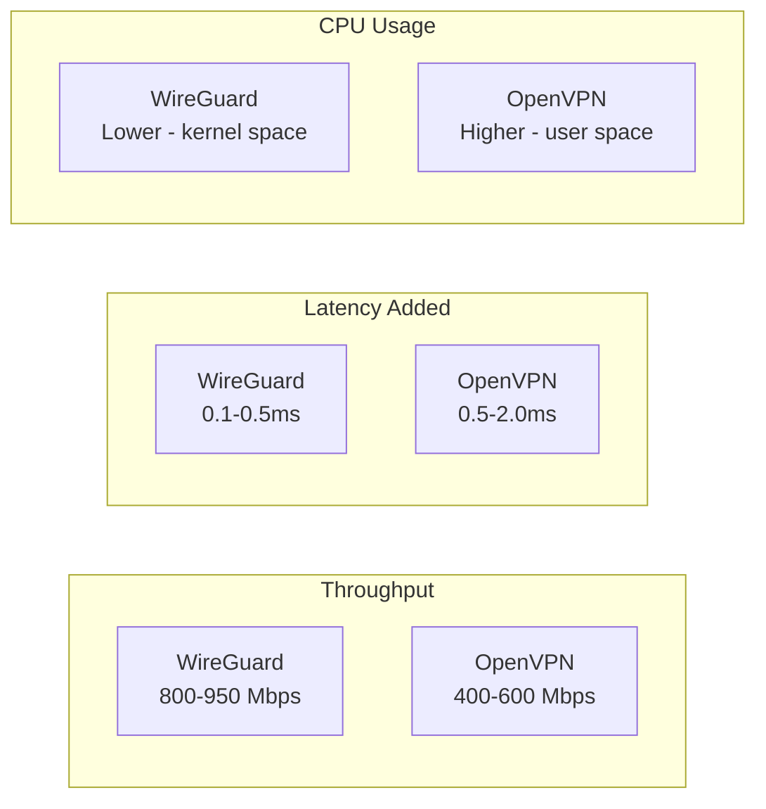

# How to Compare WireGuard vs OpenVPN Performance on RHEL

Author: [nawazdhandala](https://www.github.com/nawazdhandala)

Tags: RHEL, WireGuard, OpenVPN, Performance, VPN, Linux

Description: A practical comparison of WireGuard and OpenVPN performance on RHEL, including throughput benchmarks, latency testing, CPU usage analysis, and guidance on choosing the right VPN for your use case.

---

The "WireGuard vs OpenVPN" debate comes up constantly, and most of the comparisons online are either outdated or synthetic benchmarks that don't reflect real workloads. Instead of theoretical arguments, let's set up both on RHEL and measure them. Then we'll talk about when each makes more sense.

## Test Setup

For a fair comparison, you need identical conditions. Two RHEL machines connected over the same network, with both VPNs configured using their recommended defaults.

```bash
# Install both VPN solutions
sudo dnf install -y epel-release
sudo dnf install -y wireguard-tools openvpn easy-rsa

# Install benchmarking tools
sudo dnf install -y iperf3
```

## WireGuard Configuration for Benchmarking

Set up a basic WireGuard tunnel:

```bash
# On the server
sudo tee /etc/wireguard/wg0.conf > /dev/null << 'EOF'
[Interface]
PrivateKey = SERVER_PRIVATE_KEY
Address = 10.0.0.1/24
ListenPort = 51820

[Peer]
PublicKey = CLIENT_PUBLIC_KEY
AllowedIPs = 10.0.0.2/32
EOF

# Set the MTU explicitly for consistent testing
sudo ip link set wg0 mtu 1420
```

## OpenVPN Configuration for Benchmarking

Use OpenVPN with UDP and AES-256-GCM (the recommended cipher):

```bash
# In /etc/openvpn/server/server.conf
port 1194
proto udp
dev tun
cipher AES-256-GCM
auth SHA256
# ... (standard cert and key config)
```

## Running Throughput Benchmarks

Use iperf3 to measure raw throughput through each tunnel.

```bash
# On the server side, start iperf3
iperf3 -s -p 5201

# On the client side, test through WireGuard
iperf3 -c 10.0.0.1 -p 5201 -t 30 -P 4

# Record the results, then test through OpenVPN
iperf3 -c 10.8.0.1 -p 5201 -t 30 -P 4
```

The `-P 4` flag runs 4 parallel streams, which gives a more realistic picture of throughput under load.

## Measuring Latency

```bash
# Measure latency through WireGuard (1000 pings)
ping -c 1000 -i 0.1 10.0.0.1 | tail -1

# Measure latency through OpenVPN
ping -c 1000 -i 0.1 10.8.0.1 | tail -1
```

Record the avg, min, max, and standard deviation values.

## Measuring CPU Usage

VPN encryption consumes CPU. Measure it during throughput tests.

```bash
# Monitor CPU usage during a benchmark
# In one terminal, run the iperf3 test
# In another terminal, capture CPU usage
pidstat -u 1 30 -p $(pgrep -f "wireguard") > /tmp/wg_cpu.log 2>/dev/null

# For OpenVPN (runs as a process, easier to track)
pidstat -u 1 30 -p $(pgrep openvpn) > /tmp/ovpn_cpu.log
```

Since WireGuard runs in the kernel, you won't see a WireGuard process. Instead, measure overall system CPU:

```bash
# Capture system-wide CPU during WireGuard test
sar -u 1 30 > /tmp/wg_system_cpu.log

# Then during OpenVPN test
sar -u 1 30 > /tmp/ovpn_system_cpu.log
```

## Typical Results

Based on common benchmarks on comparable hardware, here's what you can generally expect:



Your actual numbers will vary depending on hardware, network conditions, and configuration.

## Why WireGuard Is Faster

1. **Kernel-space processing** - WireGuard runs inside the Linux kernel, avoiding the overhead of copying packets between kernel and user space
2. **Simpler protocol** - Less overhead per packet
3. **Modern cryptography** - ChaCha20 and Poly1305 are fast, especially on hardware without AES-NI
4. **Smaller codebase** - Less code means fewer cache misses and more efficient execution

## Where OpenVPN Still Wins

Performance isn't everything. OpenVPN has advantages in other areas:

| Feature | WireGuard | OpenVPN |
|---------|-----------|---------|
| TCP transport | No | Yes |
| Works on port 443 | No (UDP only) | Yes (can blend with HTTPS) |
| LDAP/RADIUS auth | No | Yes |
| Per-client config | AllowedIPs only | Full push/pull config |
| Client platforms | Good | Excellent (every OS) |
| Restrictive firewalls | May be blocked | Can tunnel through HTTPS |
| Dynamic IP assignment | Manual | Built-in DHCP |
| Logging/audit | Minimal | Comprehensive |

## Choosing the Right VPN

**Choose WireGuard when:**
- Performance is a priority
- You need a site-to-site tunnel
- You're building a modern infrastructure
- You want simple configuration
- Your clients all support WireGuard

**Choose OpenVPN when:**
- You need TCP transport (restrictive firewalls)
- LDAP/AD authentication is required
- You need detailed connection logging
- You have diverse client platforms
- You need per-client route pushing
- Compliance requires traditional PKI

## Running Your Own Benchmark

Here's a complete script to run both tests:

```bash
#!/bin/bash
# VPN performance comparison script
# Run on the client side with both tunnels configured

RESULTS="/tmp/vpn_benchmark_results.txt"
echo "VPN Performance Comparison - $(date)" > $RESULTS

echo "=== WireGuard Throughput ===" >> $RESULTS
iperf3 -c 10.0.0.1 -t 30 -P 4 >> $RESULTS 2>&1

echo "" >> $RESULTS
echo "=== WireGuard Latency ===" >> $RESULTS
ping -c 100 -i 0.1 10.0.0.1 2>&1 | tail -2 >> $RESULTS

echo "" >> $RESULTS
echo "=== OpenVPN Throughput ===" >> $RESULTS
iperf3 -c 10.8.0.1 -t 30 -P 4 >> $RESULTS 2>&1

echo "" >> $RESULTS
echo "=== OpenVPN Latency ===" >> $RESULTS
ping -c 100 -i 0.1 10.8.0.1 2>&1 | tail -2 >> $RESULTS

cat $RESULTS
```

## Connection Establishment Time

This is often overlooked. WireGuard establishes a connection almost instantly because there's no multi-round handshake. OpenVPN's TLS negotiation takes several round trips.

```bash
# Time WireGuard connection
time sudo wg-quick up wg0

# Time OpenVPN connection
time sudo openvpn --config /etc/openvpn/client.ovpn --connect-timeout 30
```

WireGuard typically connects in under a second. OpenVPN can take 5-15 seconds.

## Wrapping Up

WireGuard is faster than OpenVPN in almost every measurable metric on RHEL. That's not surprising given its kernel-space design and modern protocol. But speed isn't the only consideration. OpenVPN's flexibility with authentication, TCP transport, and per-client configuration makes it the better choice in some environments. Run your own benchmarks on your hardware, and choose based on what matters most for your specific use case.
