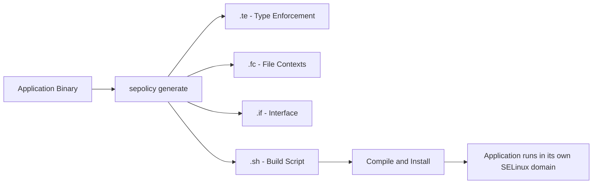

# How to Write a Custom SELinux Policy with sepolicy generate on RHEL

Author: [nawazdhandala](https://www.github.com/nawazdhandala)

Tags: RHEL, SELinux, Sepolicy, Custom Policy, Linux

Description: Use sepolicy generate on RHEL to create a custom SELinux policy module for confining applications that do not have a default policy.

---

## When to Use sepolicy generate

While `audit2allow` patches an existing policy based on denials, `sepolicy generate` creates a complete, new policy module from scratch for an unconfined application. If you have installed third-party software, a custom-built application, or a service that runs as `unconfined_t`, `sepolicy generate` gives it a proper SELinux domain with sensible default rules.

This is the right approach when you want to properly confine an application rather than just allowing specific denials.

## Prerequisites

```bash
# Install required tools
sudo dnf install -y policycoreutils-devel rpm-build
```

## How sepolicy generate Works



`sepolicy generate` examines your application and creates template policy files that you can customize before compiling and installing.

## Step 1: Identify Your Application

Determine how the application runs:

```bash
# Check the process context
ps -eZ | grep myapp

# Check the binary location
which myapp
ls -Z /usr/local/bin/myapp
```

If the process shows `unconfined_t`, it is running without SELinux confinement.

## Step 2: Generate the Policy Template

For a standard daemon/service:

```bash
# Generate policy for a daemon
sepolicy generate --init /usr/local/bin/myapp
```

For different application types:

```bash
# For a CGI script
sepolicy generate --cgi /var/www/cgi-bin/myscript.cgi

# For a user application
sepolicy generate --application /usr/local/bin/myapp

# For a confined user role
sepolicy generate --confined_admin myapp_admin

# For an inetd service
sepolicy generate --inetd /usr/local/bin/myapp

# For a D-Bus service
sepolicy generate --dbus /usr/local/bin/myapp
```

The `--init` flag is for standard systemd services, which is the most common case.

## Step 3: Understand the Generated Files

After running `sepolicy generate`, you get several files in the current directory:

| File | Purpose |
|---|---|
| `myapp.te` | Type Enforcement rules (the main policy) |
| `myapp.fc` | File context definitions |
| `myapp.if` | Interface definitions for other modules |
| `myapp.sh` | Build and install script |
| `myapp_selinux.8` | Man page for the policy |

### The Type Enforcement File (myapp.te)

```bash
policy_module(myapp, 1.0.0)

########################################
#
# Declarations
#

type myapp_t;
type myapp_exec_t;
init_daemon_domain(myapp_t, myapp_exec_t)

type myapp_log_t;
logging_log_file(myapp_log_t)

type myapp_var_run_t;
files_pid_file(myapp_var_run_t)

########################################
#
# myapp local policy
#

allow myapp_t self:process { fork signal_perms };
allow myapp_t self:fifo_file rw_fifo_file_perms;
allow myapp_t self:unix_stream_socket create_stream_socket_perms;

manage_dirs_pattern(myapp_t, myapp_log_t, myapp_log_t)
manage_files_pattern(myapp_t, myapp_log_t, myapp_log_t)
logging_log_filetrans(myapp_t, myapp_log_t, { dir file })

manage_dirs_pattern(myapp_t, myapp_var_run_t, myapp_var_run_t)
manage_files_pattern(myapp_t, myapp_var_run_t, myapp_var_run_t)
files_pid_filetrans(myapp_t, myapp_var_run_t, { dir file })

sysnet_dns_name_resolve(myapp_t)
corenet_tcp_sendrecv_generic_if(myapp_t)
```

### The File Context File (myapp.fc)

```bash
/usr/local/bin/myapp    --  gen_context(system_u:object_r:myapp_exec_t,s0)
```

## Step 4: Customize the Policy

Edit `myapp.te` to add rules your application needs.

### Allow Network Access

```bash
# Allow binding to a specific port
allow myapp_t myapp_port_t:tcp_socket name_bind;

# Or use existing port types
corenet_tcp_bind_http_port(myapp_t)
corenet_tcp_connect_http_port(myapp_t)
```

### Allow File Access

```bash
# Allow reading configuration files
read_files_pattern(myapp_t, etc_t, etc_t)

# Allow writing to a specific directory
manage_files_pattern(myapp_t, myapp_data_t, myapp_data_t)
```

### Allow Database Connections

```bash
# Allow connecting to MySQL
corenet_tcp_connect_mysqld_port(myapp_t)

# Allow connecting to PostgreSQL
corenet_tcp_connect_postgresql_port(myapp_t)
```

### Add File Contexts

Edit `myapp.fc` to label all files your application uses:

```bash
/usr/local/bin/myapp            --  gen_context(system_u:object_r:myapp_exec_t,s0)
/etc/myapp(/.*)?                    gen_context(system_u:object_r:myapp_etc_t,s0)
/var/log/myapp(/.*)?                gen_context(system_u:object_r:myapp_log_t,s0)
/var/run/myapp(/.*)?                gen_context(system_u:object_r:myapp_var_run_t,s0)
/var/lib/myapp(/.*)?                gen_context(system_u:object_r:myapp_var_lib_t,s0)
```

## Step 5: Build and Install

Use the generated build script:

```bash
# Run the build script
sudo ./myapp.sh
```

Or build manually:

```bash
# Compile the module
make -f /usr/share/selinux/devel/Makefile myapp.pp

# Install the module
sudo semodule -i myapp.pp

# Apply file contexts
sudo restorecon -Rv /usr/local/bin/myapp
sudo restorecon -Rv /etc/myapp/
sudo restorecon -Rv /var/log/myapp/
```

## Step 6: Test and Iterate

```bash
# Restart the service
sudo systemctl restart myapp

# Check for denials
sudo ausearch -m avc -c myapp -ts recent

# If there are denials, add rules to myapp.te and rebuild
```

The iterative process:

1. Start the service
2. Exercise its functionality
3. Check for AVC denials
4. Add rules to the `.te` file
5. Rebuild and reinstall
6. Repeat until no denials remain

## Using sepolicy with Existing Services

You can also use `sepolicy` to analyze existing confined services:

```bash
# Show what network ports a domain can use
sepolicy network -d httpd_t

# Show communication between domains
sepolicy communicate -s httpd_t -t mysqld_t

# Generate a man page for an existing domain
sepolicy manpage -d httpd_t
```

## Managing the Custom Module

```bash
# Check if the module is loaded
sudo semodule -l | grep myapp

# Update the module (increment version in .te, rebuild, reinstall)
sudo semodule -i myapp.pp

# Remove the module
sudo semodule -r myapp
```

## Wrapping Up

`sepolicy generate` is the proper way to confine custom applications under SELinux. While it requires more upfront effort than `audit2allow`, the result is a clean, maintainable policy module that properly defines your application's security domain. Start with the generated template, customize it for your application's needs, and iterate until the service runs cleanly in enforcing mode. Keep the `.te` and `.fc` files in version control alongside your application code.
