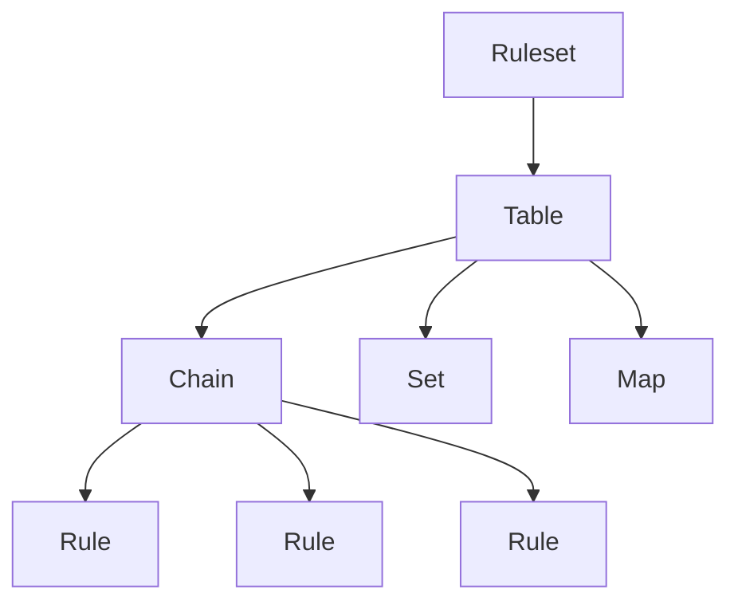

# How to Write nftables Rules from Scratch on RHEL

Author: [nawazdhandala](https://www.github.com/nawazdhandala)

Tags: RHEL, nftables, Firewall, Security, Linux

Description: A hands-on guide to writing nftables firewall rules from scratch on RHEL, covering tables, chains, rules, and common filtering patterns.

---

If you're starting fresh with nftables on RHEL rather than migrating from iptables, you're in a good position. The nftables syntax is cleaner, more consistent, and you don't have to unlearn old habits. This guide walks through building a complete firewall ruleset from zero.

## Understanding the nftables Hierarchy

Before writing any rules, you need to understand how nftables organizes things:



- **Tables** are containers that hold chains and sets. You name them whatever you want.
- **Chains** hold rules. Base chains attach to netfilter hooks (input, output, forward). Regular chains are for organizing rules with jump/goto.
- **Rules** are the actual match-and-action statements.

## Installing and Enabling nftables

Make sure nftables is installed and running:

```bash
dnf install nftables -y
systemctl enable --now nftables
```

Check the current ruleset (should be mostly empty on a fresh install):

```bash
nft list ruleset
```

## Creating Your First Table

Create a table using the inet family, which handles both IPv4 and IPv6:

```bash
nft add table inet firewall
```

The `inet` family is usually what you want. Other options are `ip` (IPv4 only), `ip6` (IPv6 only), `arp`, and `bridge`.

## Adding Base Chains

Create the three standard base chains for filtering:

```bash
# Input chain - traffic destined for this host
nft add chain inet firewall input { type filter hook input priority 0 \; policy drop \; }

# Forward chain - traffic passing through this host
nft add chain inet firewall forward { type filter hook forward priority 0 \; policy drop \; }

# Output chain - traffic originating from this host
nft add chain inet firewall output { type filter hook output priority 0 \; policy accept \; }
```

Notice that input and forward default to drop (deny everything not explicitly allowed), while output defaults to accept.

## Writing Basic Rules

Now add rules to the input chain. Order matters, rules are evaluated top to bottom.

Allow established and related connections (this is critical):

```bash
nft add rule inet firewall input ct state established,related accept
```

Allow loopback traffic:

```bash
nft add rule inet firewall input iifname "lo" accept
```

Allow ICMP (ping) for both IPv4 and IPv6:

```bash
nft add rule inet firewall input ip protocol icmp accept
nft add rule inet firewall input ip6 nexthdr icmpv6 accept
```

Allow SSH:

```bash
nft add rule inet firewall input tcp dport 22 accept
```

Allow HTTP and HTTPS using a set:

```bash
nft add rule inet firewall input tcp dport { 80, 443 } accept
```

## Using a Ruleset File

Writing rules interactively is fine for testing, but for production you should use a file. This lets you version control your firewall and apply changes atomically.

Create a complete ruleset file:

```bash
cat > /etc/nftables/server.nft << 'EOF'
#!/usr/sbin/nft -f

# Clear existing rules
flush ruleset

table inet firewall {
    # Set of allowed TCP ports
    set allowed_tcp_ports {
        type inet_service
        elements = { 22, 80, 443 }
    }

    # Set of trusted management IPs
    set trusted_mgmt {
        type ipv4_addr
        elements = { 10.0.0.0/8, 192.168.1.0/24 }
    }

    chain input {
        type filter hook input priority 0; policy drop;

        # Allow established and related traffic
        ct state established,related accept

        # Drop invalid packets
        ct state invalid drop

        # Allow loopback
        iifname "lo" accept

        # Allow ICMP
        ip protocol icmp accept
        ip6 nexthdr icmpv6 accept

        # Allow services from allowed ports set
        tcp dport @allowed_tcp_ports accept

        # Log dropped packets (rate limited)
        limit rate 5/minute log prefix "nftables-drop: " level info
    }

    chain forward {
        type filter hook forward priority 0; policy drop;
    }

    chain output {
        type filter hook output priority 0; policy accept;
    }
}
EOF
```

Apply the ruleset:

```bash
nft -f /etc/nftables/server.nft
```

## Rule Matching Syntax

Here are the most common matching patterns you'll use:

Match by source IP:

```bash
nft add rule inet firewall input ip saddr 192.168.1.100 accept
```

Match by destination port and protocol:

```bash
nft add rule inet firewall input tcp dport 3306 accept
```

Match by interface:

```bash
nft add rule inet firewall input iifname "eth0" tcp dport 80 accept
```

Match by connection state:

```bash
nft add rule inet firewall input ct state new tcp dport 22 accept
```

Combine multiple matches:

```bash
nft add rule inet firewall input ip saddr 10.0.0.0/8 tcp dport { 5432, 3306 } accept
```

## Rate Limiting

Protect against brute force attacks with rate limiting:

```bash
nft add rule inet firewall input tcp dport 22 ct state new limit rate 3/minute accept
```

## Logging

Log packets before dropping or accepting them:

```bash
nft add rule inet firewall input tcp dport 22 log prefix "SSH-attempt: " accept
```

Rate-limited logging to avoid filling your logs:

```bash
nft add rule inet firewall input limit rate 10/minute log prefix "dropped: "
```

## Inserting and Deleting Rules

Insert a rule at a specific position (by handle number):

```bash
# First, list rules with handles
nft -a list chain inet firewall input

# Insert before a specific handle
nft insert rule inet firewall input position 15 tcp dport 8080 accept
```

Delete a rule by handle:

```bash
nft delete rule inet firewall input handle 15
```

## Saving Your Rules

Make your current ruleset persistent:

```bash
nft list ruleset > /etc/nftables/server.nft
```

Configure the nftables service to load your file:

```bash
echo 'include "/etc/nftables/server.nft"' > /etc/sysconfig/nftables.conf
```

## Testing

Always validate your rules with a dry run before applying:

```bash
nft -c -f /etc/nftables/server.nft
```

And test from another machine after applying:

```bash
# From a remote host
ssh user@your-server
curl http://your-server
```

Writing nftables rules from scratch gives you a clean, well-organized firewall that takes full advantage of the features iptables never had. The syntax takes a day or two to get comfortable with, but after that it's hard to go back.
