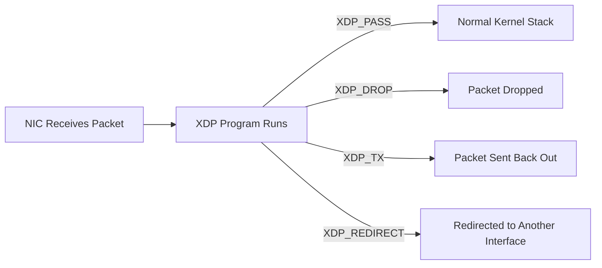

# How to Write and Load XDP Programs for Fast Packet Filtering on RHEL 9

Author: [nawazdhandala](https://www.github.com/nawazdhandala)

Tags: RHEL, XDP, eBPF, Networking, Packet Filtering, Linux

Description: Learn how to write, compile, and load XDP (eXpress Data Path) programs on RHEL 9 for ultra-fast packet filtering at the network driver level.

---

XDP (eXpress Data Path) lets you run eBPF programs directly inside the network driver, processing packets before they even reach the kernel network stack. This makes XDP one of the fastest packet filtering technologies available on Linux.

In this guide, you will write a simple XDP program, compile it, and load it onto a network interface on RHEL 9.

## How XDP Works



## Prerequisites

- RHEL 9 with kernel 5.14 or later
- Root or sudo access
- A network interface that supports XDP native mode

## Step 1: Install Development Tools

```bash
# Install clang, llvm, and BPF development headers
sudo dnf install -y clang llvm bpftool libbpf-devel kernel-headers gcc

# Install iproute2 for loading XDP programs
sudo dnf install -y iproute
```

## Step 2: Write an XDP Program

Create a simple XDP program that drops all ICMP (ping) packets and passes everything else.

```c
/* xdp_drop_icmp.c - Drop all ICMP packets */
#include <linux/bpf.h>
#include <linux/if_ether.h>
#include <linux/ip.h>
#include <bpf/bpf_helpers.h>

/* XDP program entry point */
SEC("xdp")
int xdp_drop_icmp_func(struct xdp_md *ctx) {
    /* Pointers to the start and end of packet data */
    void *data = (void *)(long)ctx->data;
    void *data_end = (void *)(long)ctx->data_end;

    /* Parse the Ethernet header */
    struct ethhdr *eth = data;
    if ((void *)(eth + 1) > data_end)
        return XDP_PASS;  /* Packet too short, let it through */

    /* Only process IPv4 packets */
    if (eth->h_proto != __constant_htons(ETH_P_IP))
        return XDP_PASS;

    /* Parse the IP header */
    struct iphdr *ip = (void *)(eth + 1);
    if ((void *)(ip + 1) > data_end)
        return XDP_PASS;

    /* Drop ICMP packets (protocol number 1) */
    if (ip->protocol == 1) {
        return XDP_DROP;
    }

    /* Pass all other packets to the kernel stack */
    return XDP_PASS;
}

/* Required license declaration for eBPF programs */
char _license[] SEC("license") = "GPL";
```

## Step 3: Compile the XDP Program

```bash
# Compile the C source into BPF bytecode
# -O2 is required for the BPF verifier to accept the program
# -target bpf tells clang to output BPF object code
clang -O2 -target bpf -c xdp_drop_icmp.c -o xdp_drop_icmp.o

# Verify the compiled object file contains the XDP section
llvm-objdump -h xdp_drop_icmp.o
```

## Step 4: Load the XDP Program

```bash
# Load the XDP program onto interface ens3 using ip link
# "xdpgeneric" works on all interfaces but is slower
# "xdp" attempts native mode first (fastest)
sudo ip link set dev ens3 xdpgeneric obj xdp_drop_icmp.o sec xdp

# Verify the program is attached
ip link show ens3
# Look for "xdp" in the output

# Alternatively, use bpftool to see loaded programs
sudo bpftool prog list
```

## Step 5: Test the XDP Filter

```bash
# From another machine, try pinging the RHEL 9 host
ping 192.168.1.100
# You should see 100% packet loss because ICMP is dropped

# Test that other traffic still works (SSH, HTTP, etc.)
ssh user@192.168.1.100
# SSH should work normally
```

## Step 6: Monitor XDP Statistics

```bash
# View XDP statistics for the interface
sudo bpftool net show

# Check per-CPU packet counts
ethtool -S ens3 | grep xdp

# Watch real-time XDP drop counts
watch -n 1 'ethtool -S ens3 | grep xdp'
```

## Step 7: Remove the XDP Program

```bash
# Detach the XDP program from the interface
sudo ip link set dev ens3 xdpgeneric off

# Verify it was removed
ip link show ens3
```

## Writing an XDP Program with Packet Counting

Here is a more advanced example that uses a BPF map to count dropped packets:

```c
/* xdp_counter.c - Count and drop ICMP packets */
#include <linux/bpf.h>
#include <linux/if_ether.h>
#include <linux/ip.h>
#include <bpf/bpf_helpers.h>

/* BPF map to store packet counters */
struct {
    __uint(type, BPF_MAP_TYPE_ARRAY);
    __uint(max_entries, 2);
    __type(key, __u32);
    __type(value, __u64);
} pkt_count SEC(".maps");

SEC("xdp")
int xdp_counter_func(struct xdp_md *ctx) {
    void *data = (void *)(long)ctx->data;
    void *data_end = (void *)(long)ctx->data_end;
    __u32 key;
    __u64 *count;

    struct ethhdr *eth = data;
    if ((void *)(eth + 1) > data_end)
        return XDP_PASS;

    if (eth->h_proto != __constant_htons(ETH_P_IP))
        return XDP_PASS;

    struct iphdr *ip = (void *)(eth + 1);
    if ((void *)(ip + 1) > data_end)
        return XDP_PASS;

    if (ip->protocol == 1) {
        /* Increment the drop counter (key 0) */
        key = 0;
        count = bpf_map_lookup_elem(&pkt_count, &key);
        if (count)
            __sync_fetch_and_add(count, 1);
        return XDP_DROP;
    }

    /* Increment the pass counter (key 1) */
    key = 1;
    count = bpf_map_lookup_elem(&pkt_count, &key);
    if (count)
        __sync_fetch_and_add(count, 1);

    return XDP_PASS;
}

char _license[] SEC("license") = "GPL";
```

Read the counters from user space:

```bash
# After loading the program, read map values with bpftool
sudo bpftool map dump name pkt_count
```

## Summary

You have written and loaded XDP programs on RHEL 9 for ultra-fast packet filtering. XDP processes packets at the earliest possible point in the network stack, making it ideal for DDoS mitigation, load balancing, and high-speed firewalling. For production use, consider using libbpf for program loading and BPF maps for dynamic configuration.
