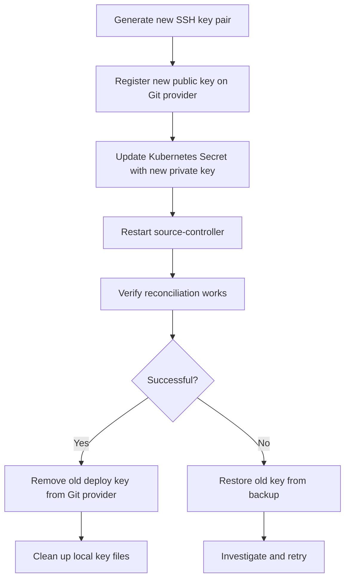

# How to Bootstrap Flux CD with Deploy Key Rotation

Author: [nawazdhandala](https://github.com/nawazdhandala)

Tags: Flux CD, GitOps, Kubernetes, Deploy Keys, SSH, Security, Key Rotation

Description: A complete guide to bootstrapping Flux CD with SSH deploy keys and implementing regular key rotation for improved security.

---

When Flux CD is bootstrapped with a Git repository over SSH, it creates a deploy key to authenticate with the Git provider. Like any credential, deploy keys should be rotated periodically to maintain security hygiene. This guide covers how Flux CD manages deploy keys, how to rotate them manually, and how to set up an automated key rotation process.

## How Flux CD Deploy Keys Work

When you bootstrap Flux CD using SSH, the bootstrap process generates an Ed25519 SSH key pair. The private key is stored as a Kubernetes Secret in the `flux-system` namespace. The public key is registered as a deploy key on the Git repository.

```bash
# Bootstrap Flux with SSH (default behavior for GitHub)
flux bootstrap github \
  --owner=your-org \
  --repository=fleet-infra \
  --branch=main \
  --path=clusters/my-cluster \
  --personal
```

After bootstrap, you can inspect the deploy key secret:

```bash
# View the deploy key secret
kubectl get secret flux-system -n flux-system -o yaml

# Extract and view the public key
kubectl get secret flux-system -n flux-system \
  -o jsonpath='{.data.identity\.pub}' | base64 -d
```

## Why Rotate Deploy Keys

Deploy key rotation is a security best practice for several reasons:

- Limits the blast radius if a key is compromised
- Meets compliance requirements that mandate periodic credential rotation
- Reduces the risk of unauthorized access from leaked or forgotten keys
- Aligns with zero-trust security principles

## Method 1: Manual Key Rotation Using the Flux CLI

The simplest way to rotate a deploy key is to re-run the bootstrap command. Flux generates a new key pair and replaces the old one.

```bash
# Re-bootstrap to generate a new deploy key
flux bootstrap github \
  --owner=your-org \
  --repository=fleet-infra \
  --branch=main \
  --path=clusters/my-cluster \
  --personal
```

The bootstrap command is idempotent. When re-run, it:

1. Generates a new SSH key pair
2. Updates the Kubernetes Secret with the new private key
3. Registers the new public key as a deploy key on the Git repository
4. Removes the old deploy key from the Git repository

After re-bootstrapping, verify that the new key is working:

```bash
# Trigger a reconciliation to test the new key
flux reconcile source git flux-system

# Check the source status
flux get sources git flux-system
```

## Method 2: Manual Key Rotation Using kubectl

For more control over the rotation process, you can generate and apply keys manually.

Generate a new SSH key pair:

```bash
# Generate a new Ed25519 SSH key pair
ssh-keygen -t ed25519 -C "flux-deploy-key" -f flux-deploy-key -N ""

# Display the public key to register on the Git provider
cat flux-deploy-key.pub
```

Register the new public key on your Git provider before updating the secret in the cluster. This prevents any downtime during the rotation.

For GitHub, add the deploy key via the API:

```bash
# Add the new deploy key to the GitHub repository
gh repo deploy-key add flux-deploy-key.pub \
  --repo your-org/fleet-infra \
  --title "flux-system-$(date +%Y%m%d)"
```

Update the Kubernetes Secret with the new private key:

```bash
# Create a YAML file with the updated secret data
kubectl create secret generic flux-system \
  --namespace=flux-system \
  --from-file=identity=flux-deploy-key \
  --from-file=identity.pub=flux-deploy-key.pub \
  --from-file=known_hosts=<(ssh-keyscan github.com 2>/dev/null) \
  --dry-run=client -o yaml | kubectl apply -f -

# Restart the source-controller to pick up the new key
kubectl rollout restart deployment/source-controller -n flux-system
```

Verify the new key works:

```bash
# Check that the source-controller can fetch the repository
flux reconcile source git flux-system

# Verify the status shows Ready
flux get sources git flux-system
```

Once the new key is confirmed working, remove the old deploy key from the Git provider:

```bash
# List deploy keys on the repository
gh repo deploy-key list --repo your-org/fleet-infra

# Delete the old deploy key by its ID
gh repo deploy-key delete OLD_KEY_ID --repo your-org/fleet-infra
```

Clean up the local key files:

```bash
# Securely remove the local key files
rm -f flux-deploy-key flux-deploy-key.pub
```

## Method 3: Automated Key Rotation with a CronJob

For organizations that require regular key rotation, you can automate the process using a Kubernetes CronJob.

First, create a ServiceAccount with the necessary permissions:

```yaml
# key-rotation/rbac.yaml
apiVersion: v1
kind: ServiceAccount
metadata:
  name: flux-key-rotator
  namespace: flux-system
---
apiVersion: rbac.authorization.k8s.io/v1
kind: Role
metadata:
  name: flux-key-rotator
  namespace: flux-system
rules:
  - apiGroups: [""]
    resources: ["secrets"]
    resourceNames: ["flux-system"]
    verbs: ["get", "update", "patch"]
---
apiVersion: rbac.authorization.k8s.io/v1
kind: RoleBinding
metadata:
  name: flux-key-rotator
  namespace: flux-system
subjects:
  - kind: ServiceAccount
    name: flux-key-rotator
    namespace: flux-system
roleRef:
  kind: Role
  name: flux-key-rotator
  apiGroup: rbac.authorization.k8s.io
```

Create a Secret containing the GitHub token for deploy key management:

```bash
# Create a secret with the GitHub token (requires admin:repo_hook and repo permissions)
kubectl create secret generic github-token \
  --namespace=flux-system \
  --from-literal=token=ghp_your_github_token
```

Create the CronJob that rotates the key:

```yaml
# key-rotation/cronjob.yaml
apiVersion: batch/v1
kind: CronJob
metadata:
  name: flux-key-rotation
  namespace: flux-system
spec:
  # Run on the first day of every month at 2:00 AM
  schedule: "0 2 1 * *"
  jobTemplate:
    spec:
      template:
        spec:
          serviceAccountName: flux-key-rotator
          containers:
            - name: key-rotator
              image: bitnami/kubectl:latest
              command:
                - /bin/bash
                - -c
                - |
                  set -euo pipefail

                  # Generate new SSH key pair
                  ssh-keygen -t ed25519 -C "flux-deploy-key-$(date +%Y%m%d)" \
                    -f /tmp/flux-key -N ""

                  # Update the Kubernetes secret with the new key
                  kubectl create secret generic flux-system \
                    --namespace=flux-system \
                    --from-file=identity=/tmp/flux-key \
                    --from-file=identity.pub=/tmp/flux-key.pub \
                    --from-file=known_hosts=<(ssh-keyscan github.com 2>/dev/null) \
                    --dry-run=client -o yaml | kubectl apply -f -

                  # Restart source-controller to load the new key
                  kubectl rollout restart deployment/source-controller -n flux-system
                  kubectl rollout status deployment/source-controller -n flux-system --timeout=60s

                  echo "Key rotation complete. Remember to update the deploy key on GitHub."

                  # Clean up temporary files
                  rm -f /tmp/flux-key /tmp/flux-key.pub
              env:
                - name: GITHUB_TOKEN
                  valueFrom:
                    secretKeyRef:
                      name: github-token
                      key: token
          restartPolicy: OnFailure
```

Note: This CronJob handles the Kubernetes side of the rotation. To fully automate the process including updating the deploy key on the Git provider, you would need to add API calls to your Git provider within the script, or use a tool like External Secrets Operator with a secrets manager.

## Monitoring Key Rotation

Set up alerts to know when key rotation occurs or fails.

```yaml
# key-rotation/alert.yaml
apiVersion: notification.toolkit.fluxcd.io/v1
kind: Alert
metadata:
  name: key-rotation-alert
  namespace: flux-system
spec:
  providerRef:
    name: slack
  eventSeverity: info
  eventSources:
    - kind: GitRepository
      name: flux-system
  eventMetadata:
    summary: "Flux deploy key rotation event"
```

## Key Rotation Workflow



## Best Practices

- **Rotate keys at least quarterly.** Monthly rotation is recommended for production environments.
- **Always register the new key before removing the old one.** This ensures zero downtime during rotation.
- **Keep a backup of the current key.** Before rotation, export the current secret so you can roll back if needed.
- **Audit deploy key access.** Regularly check which deploy keys have access to your repositories.
- **Use read-only deploy keys when possible.** Unless you use image automation (which requires write access), configure deploy keys as read-only.

```bash
# Bootstrap with a read-only deploy key
flux bootstrap github \
  --owner=your-org \
  --repository=fleet-infra \
  --branch=main \
  --path=clusters/my-cluster \
  --read-write-key=false \
  --personal
```

## Summary

Deploy key rotation is a critical security practice for Flux CD deployments. The simplest approach is to re-run `flux bootstrap`, which handles key generation and registration automatically. For manual control, generate new keys with `ssh-keygen`, update the Kubernetes Secret, and register the new public key with your Git provider. For automated rotation, use a Kubernetes CronJob that handles the Kubernetes side and integrate with your Git provider's API to complete the process. Regardless of the method, always verify that reconciliation works with the new key before removing the old one.
