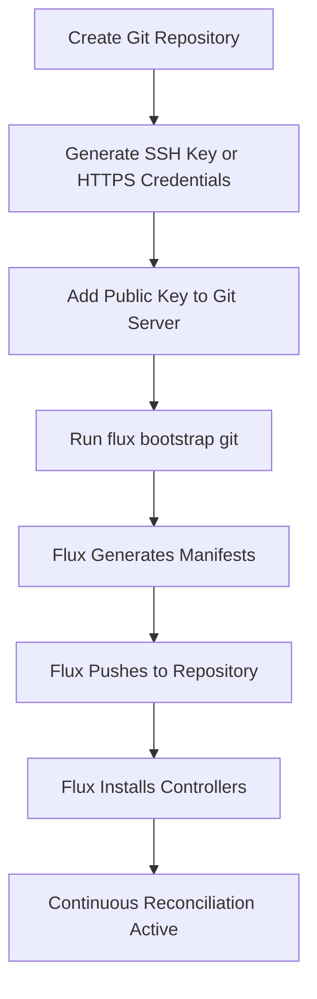

# How to Bootstrap Flux CD with a Generic Git Server

Author: [nawazdhandala](https://github.com/nawazdhandala)

Tags: Flux CD, GitOps, Kubernetes, Git, Self-Hosted, CI/CD, SSH

Description: Learn how to bootstrap Flux CD with any Git server using the generic bootstrap method, supporting SSH and HTTPS authentication for maximum flexibility.

---

Not every organization uses GitHub, GitLab, or another major Git hosting platform. Some teams run bare Git servers, use lesser-known hosting solutions, or operate behind strict network policies that limit which services they can use. Flux CD handles this scenario through the `flux bootstrap git` command, which works with any Git server that supports SSH or HTTPS. This guide covers the complete setup process for bootstrapping Flux CD with a generic Git server.

## Prerequisites

- A running Kubernetes cluster (v1.26 or later)
- `kubectl` configured to access your cluster
- Flux CLI installed (v2.0 or later)
- A Git repository accessible via SSH or HTTPS
- SSH keys or HTTPS credentials for the Git server

## Understanding the Generic Bootstrap

The `flux bootstrap git` command is the universal bootstrap method. Unlike provider-specific commands (`flux bootstrap github`, `flux bootstrap gitlab`), it does not create repositories or manage deploy keys automatically. You need to set up the repository and authentication separately.



## Step 1: Prepare the Git Repository

Create a repository on your Git server. This varies depending on your server setup.

For a bare Git server:

```bash
# On the Git server, create a bare repository
ssh git-server "git init --bare /srv/git/fleet-infra.git"

# Or if using gitolite, add the repo to your gitolite-admin config
# Or if using Gogs, create via the web interface
```

Ensure the repository is accessible via SSH or HTTPS and note the clone URL.

## Step 2: Set Up SSH Authentication

Generate an SSH key pair dedicated to Flux CD.

```bash
# Generate an Ed25519 SSH key pair
ssh-keygen -t ed25519 -C "flux-cd" -f ~/.ssh/flux-git -N ""

# Display the public key
cat ~/.ssh/flux-git.pub
```

Add the public key to your Git server's authorized keys or deploy key configuration. The exact method depends on your server:

- **Bare Git server**: Add to `~/.ssh/authorized_keys` on the server
- **Gogs/Forgejo**: Add as a deploy key in the repository settings
- **Gerrit**: Add to the user's SSH keys in settings

Get the server's SSH host key:

```bash
# Scan the host key of your Git server
ssh-keyscan git-server.example.com > known_hosts.txt

# Verify the host key
cat known_hosts.txt
```

## Step 3: Bootstrap with SSH

Use the `flux bootstrap git` command with SSH authentication.

```bash
# Bootstrap Flux CD with a generic Git server using SSH
flux bootstrap git \
  --url=ssh://git@git-server.example.com/srv/git/fleet-infra.git \
  --branch=main \
  --path=./clusters/production \
  --private-key-file=~/.ssh/flux-git \
  --silent
```

For Git servers running SSH on a non-standard port:

```bash
# Bootstrap with a custom SSH port
flux bootstrap git \
  --url=ssh://git@git-server.example.com:2222/srv/git/fleet-infra.git \
  --branch=main \
  --path=./clusters/production \
  --private-key-file=~/.ssh/flux-git
```

The bootstrap command will:

1. Connect to the Git server using the provided SSH key
2. Clone the repository
3. Generate Flux component manifests
4. Push the manifests to the specified path
5. Install Flux controllers on your cluster
6. Create a Kubernetes secret with the SSH credentials
7. Configure continuous reconciliation

## Step 4: Bootstrap with HTTPS

If SSH is not available, use HTTPS with username and password (or token) authentication.

```bash
# Bootstrap Flux CD with HTTPS authentication
flux bootstrap git \
  --url=https://git-server.example.com/fleet-infra.git \
  --branch=main \
  --path=./clusters/production \
  --username=flux-user \
  --password=<your-password-or-token> \
  --token-auth
```

The `--token-auth` flag tells Flux to store and use the HTTPS credentials for Git operations instead of SSH keys.

## Step 5: Handle Custom CA Certificates

For Git servers with self-signed or internal CA certificates, provide the CA file.

```bash
# Bootstrap with a custom CA certificate
flux bootstrap git \
  --url=https://git-server.example.com/fleet-infra.git \
  --branch=main \
  --path=./clusters/production \
  --username=flux-user \
  --password=<your-password-or-token> \
  --token-auth \
  --ca-file=./internal-ca.crt
```

Alternatively, create the CA secret manually:

```bash
# Create a secret with the CA certificate
kubectl create secret generic flux-system-ca \
  --from-file=ca.crt=./internal-ca.crt \
  -n flux-system
```

## Step 6: Verify the Bootstrap

After bootstrapping, confirm that everything is working.

```bash
# Run the full health check
flux check

# View Git sources
flux get sources git

# View kustomizations
flux get kustomizations

# List all Flux pods
kubectl get pods -n flux-system

# Check that reconciliation is succeeding
flux events
```

## Step 7: Configure the Repository Structure

Set up a multi-environment repository structure for managing different clusters.

```yaml
# clusters/production/infrastructure.yaml
# Kustomization for infrastructure components
apiVersion: kustomize.toolkit.fluxcd.io/v1
kind: Kustomization
metadata:
  name: infrastructure
  namespace: flux-system
spec:
  interval: 10m0s
  path: ./infrastructure/production
  prune: true
  sourceRef:
    kind: GitRepository
    name: flux-system
  wait: true
  timeout: 5m0s
```

```yaml
# clusters/production/apps.yaml
# Kustomization for applications, depends on infrastructure
apiVersion: kustomize.toolkit.fluxcd.io/v1
kind: Kustomization
metadata:
  name: apps
  namespace: flux-system
spec:
  interval: 10m0s
  path: ./apps/production
  prune: true
  sourceRef:
    kind: GitRepository
    name: flux-system
  dependsOn:
    - name: infrastructure
  wait: true
```

The recommended directory layout:

```bash
# Repository structure
fleet-infra/
  clusters/
    production/
      flux-system/           # Flux component manifests (auto-generated)
      infrastructure.yaml    # Points to infrastructure path
      apps.yaml              # Points to apps path
    staging/
      flux-system/
      infrastructure.yaml
      apps.yaml
  infrastructure/
    production/              # Shared infrastructure (ingress, cert-manager, etc.)
    staging/
  apps/
    production/              # Application manifests for production
    staging/                 # Application manifests for staging
```

## Step 8: Deploy a Sample Workload

Test the setup by deploying a simple application.

```yaml
# apps/production/kustomization.yaml
apiVersion: kustomize.config.k8s.io/v1beta1
kind: Kustomization
resources:
  - nginx-deployment.yaml
```

```yaml
# apps/production/nginx-deployment.yaml
# Simple nginx deployment to verify GitOps workflow
apiVersion: apps/v1
kind: Deployment
metadata:
  name: nginx-web
  namespace: default
  labels:
    app: nginx-web
spec:
  replicas: 2
  selector:
    matchLabels:
      app: nginx-web
  template:
    metadata:
      labels:
        app: nginx-web
    spec:
      containers:
        - name: nginx
          image: nginx:1.25-alpine
          ports:
            - containerPort: 80
          readinessProbe:
            httpGet:
              path: /
              port: 80
            initialDelaySeconds: 5
            periodSeconds: 10
---
apiVersion: v1
kind: Service
metadata:
  name: nginx-web
  namespace: default
spec:
  selector:
    app: nginx-web
  ports:
    - port: 80
      targetPort: 80
  type: ClusterIP
```

Commit and push these files, then force reconciliation:

```bash
# Trigger immediate reconciliation
flux reconcile source git flux-system
flux reconcile kustomization apps

# Verify the deployment
kubectl get deployments nginx-web
kubectl get pods -l app=nginx-web
```

## Step 9: Rotate SSH Keys

Periodically rotate the SSH keys used by Flux for security.

```bash
# Generate a new SSH key pair
ssh-keygen -t ed25519 -C "flux-cd-rotated" -f ~/.ssh/flux-git-new -N ""

# Add the new public key to your Git server
# Then update the Flux secret
flux create secret git flux-system \
  --url=ssh://git@git-server.example.com/srv/git/fleet-infra.git \
  --private-key-file=~/.ssh/flux-git-new \
  --namespace=flux-system

# Force reconciliation to test the new key
flux reconcile source git flux-system

# Remove the old public key from the Git server after confirming
```

## Troubleshooting

Common issues with generic Git server bootstrapping:

```bash
# SSH permission denied - verify the key is authorized on the server
ssh -i ~/.ssh/flux-git git@git-server.example.com

# Host key verification failed - ensure known_hosts is correct
ssh-keyscan git-server.example.com

# Check source-controller logs for detailed errors
kubectl logs -n flux-system deploy/source-controller --tail=50

# HTTPS certificate errors - provide the correct CA
flux bootstrap git \
  --url=https://git-server.example.com/fleet-infra.git \
  --branch=main \
  --path=./clusters/production \
  --ca-file=./ca.crt \
  --token-auth \
  --username=user \
  --password=token

# Re-run bootstrap to recover from issues (idempotent)
flux bootstrap git \
  --url=ssh://git@git-server.example.com/srv/git/fleet-infra.git \
  --branch=main \
  --path=./clusters/production \
  --private-key-file=~/.ssh/flux-git
```

## Summary

The `flux bootstrap git` command provides maximum flexibility for connecting Flux CD to any Git server. Whether you run a bare Git server, Gogs, Forgejo, Gerrit, or any other Git-compatible service, the generic bootstrap method supports both SSH and HTTPS authentication. The process is idempotent, so you can re-run it to update Flux components or recover from drift. This makes Flux CD a truly vendor-neutral GitOps solution that works with your existing Git infrastructure, regardless of which platform you use.
