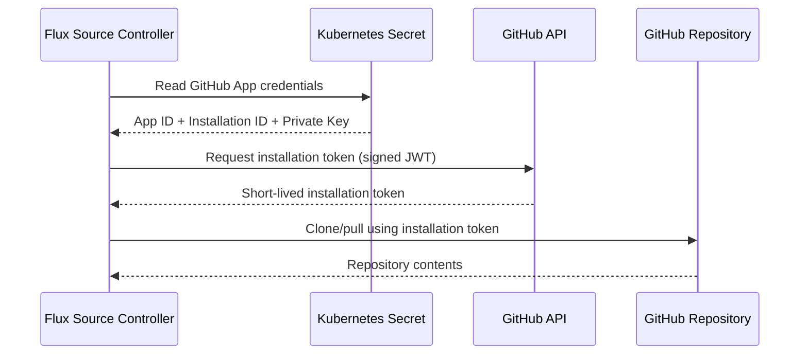

# How to Bootstrap Flux CD with GitHub App Authentication

Author: [nawazdhandala](https://github.com/nawazdhandala)

Tags: Flux CD, GitOps, Kubernetes, GitHub, Authentication, Security

Description: Learn how to bootstrap Flux CD using a GitHub App for authentication instead of personal access tokens, providing better security and granular permissions.

---

## Why Use GitHub App Authentication for Flux CD?

When bootstrapping Flux CD, the default approach uses a GitHub personal access token (PAT). While this works, PATs are tied to individual user accounts, have broad scopes, and can be difficult to manage at scale. GitHub Apps offer several advantages:

- **Granular permissions**: Limit access to specific repositories and actions.
- **Organization-level management**: Apps are owned by the organization, not a user.
- **Higher rate limits**: GitHub Apps get higher API rate limits than PATs.
- **Automatic token rotation**: Installation tokens expire after one hour.

This guide walks through creating a GitHub App, configuring it for Flux CD, and bootstrapping your cluster with app-based authentication.

## Prerequisites

Before you begin, ensure you have:

- A Kubernetes cluster (v1.20+)
- `flux` CLI installed (v2.0+)
- `kubectl` configured to access your cluster
- Admin access to your GitHub organization
- `openssl` for key generation

## Step 1: Create a GitHub App

Navigate to your GitHub organization settings and create a new GitHub App. You need the following permissions:

- **Repository permissions**:
  - Contents: Read and write (to push Flux manifests)
  - Metadata: Read-only

- **Organization permissions**: None required for basic setup

Set the following configuration:

- **Homepage URL**: Any valid URL (e.g., your organization's website)
- **Webhook**: Deactivate (Flux polls, it does not need webhooks)

After creating the app, note down the **App ID** and **Installation ID**. Install the app on the repository you intend to use for Flux CD.

## Step 2: Generate and Download the Private Key

In the GitHub App settings, generate a private key. GitHub will download a PEM file. Store this securely.

Verify the key file is valid:

```bash
# Check the private key format
openssl rsa -in your-app-name.2026-03-05.private-key.pem -check -noout
```

## Step 3: Create a Kubernetes Secret for the GitHub App

Flux needs the GitHub App credentials stored as a Kubernetes secret. First, create the flux-system namespace if it does not exist:

```bash
# Create the flux-system namespace
kubectl create namespace flux-system --dry-run=client -o yaml | kubectl apply -f -
```

Now create the secret containing the GitHub App private key:

```bash
# Create the secret with the GitHub App private key
# Replace the values with your actual App ID, Installation ID, and key path
export GITHUB_APP_ID="123456"
export GITHUB_APP_INSTALLATION_ID="789012"
export GITHUB_APP_PRIVATE_KEY_PATH="./your-app-name.2026-03-05.private-key.pem"

kubectl create secret generic flux-github-app \
  --namespace=flux-system \
  --from-literal=githubAppID="${GITHUB_APP_ID}" \
  --from-literal=githubAppInstallationID="${GITHUB_APP_INSTALLATION_ID}" \
  --from-file=githubAppPrivateKey="${GITHUB_APP_PRIVATE_KEY_PATH}"
```

## Step 4: Bootstrap Flux CD with the GitHub App

Use the `flux bootstrap github` command with the GitHub App flags:

```bash
# Bootstrap Flux CD using GitHub App authentication
# Replace <org> and <repo> with your organization and repository names
flux bootstrap github \
  --owner=<org> \
  --repository=<repo> \
  --branch=main \
  --path=clusters/my-cluster \
  --personal=false \
  --github-app-id="${GITHUB_APP_ID}" \
  --github-app-installation-id="${GITHUB_APP_INSTALLATION_ID}" \
  --github-app-private-key-path="${GITHUB_APP_PRIVATE_KEY_PATH}"
```

Flux will use the GitHub App credentials to authenticate, create the repository (if it does not exist), push the Flux manifests, and configure the GitRepository source to use the app for ongoing reconciliation.

## Step 5: Verify the Bootstrap

After bootstrap completes, verify that all Flux components are running:

```bash
# Check Flux component status
flux check

# Verify the GitRepository source is reconciling
flux get sources git

# Check all Flux kustomizations
flux get kustomizations
```

You should see the `flux-system` GitRepository source successfully reconciling with your GitHub repository.

## Step 6: Verify the Git Authentication Secret

Flux creates a `flux-system` secret in the `flux-system` namespace for Git authentication. Confirm it exists and references the GitHub App:

```bash
# Check the secret created by Flux for Git authentication
kubectl get secret flux-system -n flux-system -o yaml
```

## How Flux Uses the GitHub App Internally

Here is a diagram showing the authentication flow:



The source-controller uses the private key to generate a JWT, exchanges it for an installation token via the GitHub API, and uses that token to interact with the repository. The installation token automatically expires after one hour, and Flux renews it as needed.

## Configuring Additional Repositories with the Same GitHub App

If you want Flux to manage additional GitRepository sources using the same GitHub App, create a secret and reference it in each GitRepository:

```yaml
# GitRepository using GitHub App authentication for an additional repo
apiVersion: source.toolkit.fluxcd.io/v1
kind: GitRepository
metadata:
  name: app-repo
  namespace: flux-system
spec:
  interval: 5m
  url: https://github.com/<org>/<app-repo>
  ref:
    branch: main
  secretRef:
    # This references the secret created during bootstrap
    name: flux-system
```

If the additional repository is under the same GitHub App installation, the existing secret will work. If it is a different installation, create a new secret with the appropriate credentials.

## Rotating the GitHub App Private Key

To rotate the private key without downtime:

1. Generate a new private key in the GitHub App settings (GitHub allows two active keys).
2. Update the Kubernetes secret with the new key.
3. Delete the old key from GitHub App settings.

```bash
# Update the secret with a new private key
kubectl create secret generic flux-system \
  --namespace=flux-system \
  --from-file=githubAppPrivateKey=./new-private-key.pem \
  --dry-run=client -o yaml | kubectl apply -f -

# Trigger a reconciliation to verify the new key works
flux reconcile source git flux-system
```

## Troubleshooting

If bootstrap fails with authentication errors, check:

- **App ID and Installation ID**: Ensure they match your GitHub App configuration.
- **Private key format**: The key must be in PEM format and not passphrase-protected.
- **Repository permissions**: The app must have Contents read/write access on the target repository.
- **Installation scope**: The app must be installed on the specific repository or organization.

Check the source-controller logs for detailed error messages:

```bash
# View source-controller logs for authentication errors
kubectl logs -n flux-system deployment/source-controller | grep -i "auth\|error\|github"
```

## Summary

Using GitHub App authentication with Flux CD provides a more secure and manageable approach compared to personal access tokens. The key benefits are scoped permissions, organization-level ownership, and automatic token rotation. Once configured, Flux handles the token lifecycle transparently, and you can use the same GitHub App across multiple repositories and clusters.
