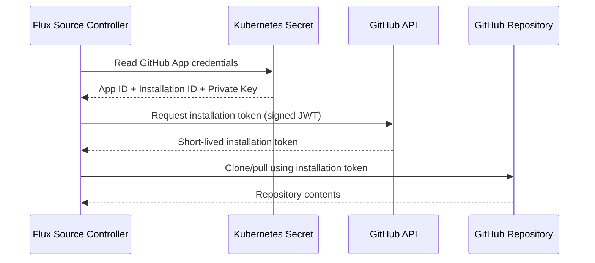

# How to Bootstrap Flux CD with GitHub App Authentication

Author: [nawazdhandala](https://github.com/nawazdhandala)

Tags: Flux CD, GitOps, Kubernetes, GitHub, Authentication, Security

Description: Learn how to bootstrap Flux CD using a GitHub App for authentication instead of personal access tokens, providing better security and granular permissions.

---

## Why Use GitHub App Authentication for Flux CD?

When bootstrapping Flux CD with the GitHub-specific bootstrap command, the default approach uses a GitHub personal access token (PAT) to create or configure the repository and deploy key. While this works, PATs are tied to individual user accounts, can have broad scopes, and can be difficult to manage at scale. GitHub Apps offer several advantages for the ongoing GitRepository authentication used by Flux:

- **Granular permissions**: Limit access to specific repositories and actions.
- **Organization-level management**: Apps are owned by the organization, not a user.
- **Scalable rate limits**: GitHub App installation rate limits can scale with the installation and organization context.
- **Short-lived tokens**: Installation tokens expire after one hour.

This guide walks through creating a GitHub App, configuring it for Flux CD, and bootstrapping your cluster so Flux uses app-based authentication for ongoing reconciliation.

## Prerequisites

Before you begin, ensure you have:

- A Kubernetes cluster supported by your Flux version
- `flux` CLI installed (v2.5+ for GitHub App authentication)
- `kubectl` configured to access your cluster
- Admin access to your GitHub organization
- `openssl` for key generation

## Step 1: Create a GitHub App

Navigate to your GitHub organization settings and create a new GitHub App. You need the following permissions:

- **Repository permissions**:
  - Contents: Read-only for standard Flux reconciliation, or read and write if Flux image automation will push commits
  - Metadata: Read-only

- **Organization permissions**: None required for basic setup

Set the following configuration:

- **Homepage URL**: Any valid URL (e.g., your organization's website)
- **Webhook**: Deactivate (Flux polls, it does not need webhooks)

After creating the app, note down the **App ID** and **Installation ID**. Install the app on the repository you intend to use for Flux CD.

## Step 2: Generate and Download the Private Key

In the GitHub App settings, generate a private key. GitHub will download a PEM file. Store this securely.

Verify the key file is valid:

```bash
# Check the private key format

openssl rsa -in your-app-name.2026-03-05.private-key.pem -check -noout
```

## Step 3: Create a Kubernetes Secret for the GitHub App

Flux needs the GitHub App credentials stored as a Kubernetes secret. First, create the `flux-system` namespace if it does not exist:

```bash
# Create the flux-system namespace
kubectl create namespace flux-system --dry-run=client -o yaml | kubectl apply -f -
```

Now create the secret containing the GitHub App credentials:

```bash
# Create the secret with the GitHub App private key
# Replace the values with your actual App ID, Installation ID, and key path
export GITHUB_APP_ID="123456"
export GITHUB_APP_INSTALLATION_ID="789012"
export GITHUB_APP_PRIVATE_KEY_PATH="./your-app-name.2026-03-05.private-key.pem"

flux create secret githubapp flux-github-app \
  --namespace=flux-system \
  --app-id="${GITHUB_APP_ID}" \
  --app-installation-id="${GITHUB_APP_INSTALLATION_ID}" \
  --app-private-key="${GITHUB_APP_PRIVATE_KEY_PATH}"
```

## Step 4: Bootstrap Flux CD with the GitHub App

The `flux bootstrap github` command does not currently accept GitHub App credentials directly. Use it to create or configure the GitHub repository and install Flux, then update the generated `GitRepository` to use the GitHub App secret for ongoing reconciliation:

```bash
# Bootstrap Flux CD and create the initial GitHub repository/deploy key
# Replace <org> and <repo> with your organization and repository names.
# Export GITHUB_TOKEN with a PAT that can create or administer the repository.
flux bootstrap github \
  --owner=<org> \
  --repository=<repo> \
  --branch=main \
  --path=clusters/my-cluster
```

After bootstrap, edit and commit `clusters/my-cluster/flux-system/gotk-sync.yaml` in the repository so the `GitRepository` uses the GitHub App provider and the secret created earlier:

```yaml
apiVersion: source.toolkit.fluxcd.io/v1
kind: GitRepository
metadata:
  name: flux-system
  namespace: flux-system
spec:
  interval: 1m0s
  provider: github
  ref:
    branch: main
  secretRef:
    name: flux-github-app
  url: https://github.com/<org>/<repo>
```

Flux will use the PAT during bootstrap to create or configure the repository and push the initial manifests. After the `GitRepository` change is committed and reconciled, the source-controller uses the GitHub App credentials for ongoing Git authentication.

## Step 5: Verify the Bootstrap

After bootstrap completes, verify that all Flux components are running:

```bash
# Check Flux component status
flux check

# Verify the GitRepository source is reconciling
flux get sources git

# Check all Flux kustomizations
flux get kustomizations
```

You should see the `flux-system` GitRepository source successfully reconciling with your GitHub repository.

## Step 6: Verify the Git Authentication Secret

Flux uses the `flux-github-app` secret in the `flux-system` namespace for GitHub App authentication. Confirm it exists and contains the expected keys:

```bash
# Check the secret used by Flux for GitHub App authentication
kubectl get secret flux-github-app -n flux-system -o yaml
```

## How Flux Uses the GitHub App Internally

Here is a diagram showing the authentication flow:


```mermaid
sequenceDiagram
    participant Flux as Flux Source Controller
    participant K8s as Kubernetes Secret
    participant GH as GitHub API
    participant Repo as GitHub Repository

    Flux->>K8s: Read GitHub App credentials
    K8s-->>Flux: App ID + Installation ID + Private Key
    Flux->>GH: Request installation token (signed JWT)
    GH-->>Flux: Short-lived installation token
    Flux->>Repo: Clone/pull using installation token
    Repo-->>Flux: Repository contents
```

The source-controller uses the private key to generate a JWT, exchanges it for an installation token via the GitHub API, and uses that token to interact with the repository. The installation token automatically expires after one hour, and Flux renews it as needed.

## Configuring Additional Repositories with the Same GitHub App

If you want Flux to manage additional GitRepository sources using the same GitHub App, reference the secret in each GitRepository and set the provider to `github`:

```yaml
# GitRepository using GitHub App authentication for an additional repo
apiVersion: source.toolkit.fluxcd.io/v1
kind: GitRepository
metadata:
  name: app-repo
  namespace: flux-system
spec:
  interval: 5m
  provider: github
  url: https://github.com/<org>/<app-repo>
  ref:
    branch: main
  secretRef:
    # This references the GitHub App secret created earlier
    name: flux-github-app
```

If the additional repository is under the same GitHub App installation, the existing secret will work. If it is a different installation, create a new secret with the appropriate credentials.

## Rotating the GitHub App Private Key

To rotate the private key without downtime:

1. Generate a new private key in the GitHub App settings (GitHub supports multiple active keys).
2. Update the Kubernetes secret with the new key.
3. Delete the old key from GitHub App settings.

```bash
# Update the secret with a new private key
kubectl create secret generic flux-github-app \
  --namespace=flux-system \
  --from-literal=githubAppID="${GITHUB_APP_ID}" \
  --from-literal=githubAppInstallationID="${GITHUB_APP_INSTALLATION_ID}" \
  --from-file=githubAppPrivateKey=./new-private-key.pem \
  --dry-run=client -o yaml | kubectl apply -f -

# Trigger a reconciliation to verify the new key works
flux reconcile source git flux-system
```

## Troubleshooting

If bootstrap fails with authentication errors, check:

- **App ID and Installation ID**: Ensure they match your GitHub App configuration.
- **Private key format**: The key must be in PEM format and not passphrase-protected.
- **Repository permissions**: The app must have Contents read access on the target repository, or Contents read/write access if Flux image automation will push commits.
- **Installation scope**: The app must be installed on the specific repository or organization.

Check the source-controller logs for detailed error messages:

```bash
# View source-controller logs for authentication errors
kubectl logs -n flux-system deployment/source-controller | grep -i "auth\|error\|github"
```

## Summary

Using GitHub App authentication with Flux CD provides a more secure and manageable approach compared to personal access tokens. The key benefits are scoped permissions, organization-level ownership, and short-lived installation tokens. Once configured, Flux handles the token lifecycle transparently, and you can use the same GitHub App across multiple repositories and clusters.
