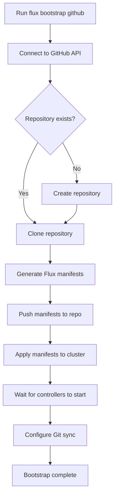

# How to Bootstrap Flux CD with GitHub

Author: [nawazdhandala](https://github.com/nawazdhandala)

Tags: Flux CD, GitOps, Kubernetes, GitHub, CI/CD, Continuous Delivery

Description: A comprehensive guide to bootstrapping Flux CD with GitHub, covering personal accounts, organizations, deploy keys, and multi-cluster setups.

---

Bootstrapping is the process of installing Flux CD on a Kubernetes cluster and connecting it to a Git repository. GitHub is the most common Git provider used with Flux CD, and the Flux CLI provides first-class support for GitHub through the `flux bootstrap github` command. This guide covers all the options available when bootstrapping with GitHub, from simple personal setups to organization-level configurations.

## Prerequisites

- A running Kubernetes cluster (v1.26 or later)
- `kubectl` configured to access your cluster
- Flux CLI installed (v2.0 or later)
- A GitHub personal access token with appropriate permissions

## Understanding the Bootstrap Process

The Flux bootstrap process is idempotent, meaning you can run it multiple times without side effects. Here is what happens when you run the bootstrap command:



## Step 1: Create a GitHub Personal Access Token

Navigate to GitHub Settings > Developer settings > Personal access tokens > Fine-grained tokens and create a token with the following permissions:

- **Repository access**: All repositories (or select specific ones)
- **Repository permissions**: Administration (Read and write), Contents (Read and write), Metadata (Read)

For classic tokens, ensure the `repo` scope is selected.

```bash
# Export the token as an environment variable
export GITHUB_TOKEN=<your-personal-access-token>
```

## Step 2: Bootstrap for a Personal Account

The simplest bootstrap scenario is for a personal GitHub account.

```bash
# Bootstrap Flux CD with a personal GitHub account
flux bootstrap github \
  --owner=<your-github-username> \
  --repository=fleet-infra \
  --branch=main \
  --path=./clusters/production \
  --personal
```

The `--personal` flag tells Flux that the owner is a user account, not an organization. The `--path` flag specifies the directory in the repository where Flux will look for Kubernetes manifests.

## Step 3: Bootstrap for a GitHub Organization

When working with teams, you typically use a GitHub organization.

```bash
# Bootstrap Flux CD with a GitHub organization
flux bootstrap github \
  --owner=<your-org-name> \
  --repository=fleet-infra \
  --branch=main \
  --path=./clusters/production \
  --team=platform-team \
  --team=sre-team
```

The `--team` flag grants the specified teams access to the repository. You can specify multiple teams. The token used must have the `admin:org` scope to manage team permissions.

## Step 4: Bootstrap with a Private Repository

By default, Flux creates a private repository. You can explicitly control this behavior.

```bash
# Bootstrap with an explicitly private repository
flux bootstrap github \
  --owner=<your-github-username> \
  --repository=fleet-infra \
  --branch=main \
  --path=./clusters/production \
  --private=true \
  --personal
```

For public repositories (useful for open-source projects):

```bash
# Bootstrap with a public repository
flux bootstrap github \
  --owner=<your-github-username> \
  --repository=fleet-infra-public \
  --branch=main \
  --path=./clusters/staging \
  --private=false \
  --personal
```

## Step 5: Customize the Flux Components

You can control which Flux components are installed and configure resource limits.

```bash
# Bootstrap with specific components and custom settings
flux bootstrap github \
  --owner=<your-github-username> \
  --repository=fleet-infra \
  --branch=main \
  --path=./clusters/production \
  --personal \
  --components=source-controller,kustomize-controller,helm-controller,notification-controller \
  --components-extra=image-reflector-controller,image-automation-controller \
  --log-level=info \
  --watch-all-namespaces=true
```

The `--components-extra` flag adds optional components. The image reflector and automation controllers enable automated image updates, which is useful for continuous deployment pipelines.

## Step 6: Multi-Cluster Configuration

A common pattern is to manage multiple clusters from a single repository. Use different paths for each cluster.

```bash
# Bootstrap the staging cluster
flux bootstrap github \
  --owner=<your-github-username> \
  --repository=fleet-infra \
  --branch=main \
  --path=./clusters/staging \
  --personal

# Switch kubectl context to the production cluster, then bootstrap
kubectl config use-context production-cluster

flux bootstrap github \
  --owner=<your-github-username> \
  --repository=fleet-infra \
  --branch=main \
  --path=./clusters/production \
  --personal
```

The resulting repository structure looks like this:

```bash
# Repository structure for multi-cluster management
fleet-infra/
  clusters/
    staging/
      flux-system/       # Flux components for staging
        gotk-components.yaml
        gotk-sync.yaml
        kustomization.yaml
    production/
      flux-system/       # Flux components for production
        gotk-components.yaml
        gotk-sync.yaml
        kustomization.yaml
```

## Step 7: Verify the Bootstrap

After bootstrapping, run these checks to confirm everything is working.

```bash
# Full system check
flux check

# View all Git sources
flux get sources git

# View all kustomizations
flux get kustomizations

# Check that all pods are running in flux-system
kubectl get pods -n flux-system

# View the deploy key added to your repository
flux get sources git flux-system -o yaml | grep -A5 secretRef
```

## Step 8: Configure Notifications

Set up GitHub commit status notifications so you can see the sync status directly on your commits.

```yaml
# clusters/production/notifications/github-provider.yaml
# Configure Flux to report status to GitHub
apiVersion: notification.toolkit.fluxcd.io/v1beta3
kind: Provider
metadata:
  name: github-status
  namespace: flux-system
spec:
  type: github
  address: https://github.com/<your-github-username>/fleet-infra
  secretRef:
    name: github-token
---
apiVersion: notification.toolkit.fluxcd.io/v1beta3
kind: Alert
metadata:
  name: github-status
  namespace: flux-system
spec:
  providerRef:
    name: github-status
  eventSources:
    - kind: Kustomization
      name: "*"
```

Create the secret for the notification provider:

```bash
# Create a secret with your GitHub token for notifications
kubectl create secret generic github-token \
  --from-literal=token=$GITHUB_TOKEN \
  -n flux-system
```

## Troubleshooting

Common issues and their solutions:

```bash
# If bootstrap fails with authentication errors, verify your token
echo $GITHUB_TOKEN | flux bootstrap github --token-auth ...

# If reconciliation stalls, check the source-controller logs
kubectl logs -n flux-system deploy/source-controller

# Force a full reconciliation
flux reconcile source git flux-system
flux reconcile kustomization flux-system

# Re-run bootstrap to fix drift (safe due to idempotency)
flux bootstrap github \
  --owner=<your-github-username> \
  --repository=fleet-infra \
  --branch=main \
  --path=./clusters/production \
  --personal
```

## Summary

Bootstrapping Flux CD with GitHub is a streamlined process thanks to the dedicated `flux bootstrap github` command. Whether you are working with a personal account or an organization, the CLI handles repository creation, deploy key configuration, and component installation. The idempotent nature of the bootstrap process means you can re-run it safely to update Flux components or recover from drift. From here, you can add Helm releases, configure image automation, or set up multi-tenancy to serve multiple teams from a single repository.
