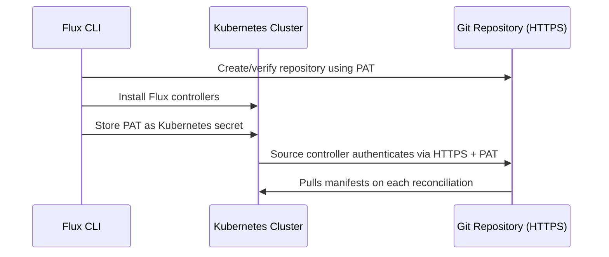

# How to Bootstrap Flux CD with Personal Access Tokens

Author: [nawazdhandala](https://github.com/nawazdhandala)

Tags: Flux CD, GitOps, Kubernetes, Authentication, PAT, GitHub, GitLab, Bootstrap

Description: Learn how to bootstrap Flux CD on a Kubernetes cluster using personal access tokens for HTTPS-based Git authentication.

---

Personal access tokens (PATs) provide a straightforward way to authenticate Flux CD with your Git repository over HTTPS. While SSH keys are another common option, PATs are often easier to set up in environments where SSH traffic is restricted or when working with Git providers that have robust token management features. This guide covers bootstrapping Flux CD with personal access tokens for GitHub, GitLab, and Bitbucket.

## Prerequisites

Before you begin, ensure you have:

- A Kubernetes cluster up and running
- `kubectl` configured to communicate with your cluster
- The Flux CLI installed (verify with `flux --version`)
- A GitHub, GitLab, or Bitbucket account

Run the pre-flight checks to verify cluster compatibility.

```bash
# Verify cluster meets Flux requirements
flux check --pre
```

## How PAT Authentication Works with Flux

When you bootstrap Flux with a personal access token, the following happens.



The token is stored as a Kubernetes secret in the `flux-system` namespace. The source controller includes it in HTTPS requests when pulling from your Git repository. Unlike SSH keys, there is no key pair management involved.

## Bootstrapping with GitHub

### Step 1: Create a Personal Access Token

Go to GitHub > Settings > Developer settings > Personal access tokens > Tokens (classic).

Create a new token with the following scopes:

- `repo` (full control of private repositories)
- `admin:public_key` (only needed if you plan to switch to SSH later)

For fine-grained tokens (recommended), select:

- **Repository access:** Select the specific repository or all repositories
- **Permissions:** Contents (read and write), Metadata (read)

Copy the token immediately as it is shown only once.

### Step 2: Export the Token

Set the token as an environment variable.

```bash
# Export your GitHub personal access token
export GITHUB_TOKEN=<your-github-personal-access-token>
```

### Step 3: Bootstrap Flux

Run the bootstrap command. Flux uses HTTPS by default when authenticating with a PAT.

```bash
# Bootstrap Flux with GitHub using a personal access token
flux bootstrap github \
  --token-auth \
  --owner=<your-github-username> \
  --repository=fleet-infra \
  --branch=main \
  --path=./clusters/production \
  --personal
```

The `--token-auth` flag tells Flux to use HTTPS token authentication instead of SSH. Flux will:

1. Create the `fleet-infra` repository if it does not exist
2. Install Flux controllers into the `flux-system` namespace
3. Store the PAT as a Kubernetes secret
4. Configure the GitRepository source to use HTTPS with the token

For organization-owned repositories, omit the `--personal` flag and specify the organization name as the owner.

```bash
# Bootstrap for a GitHub organization repository
flux bootstrap github \
  --token-auth \
  --owner=<your-organization> \
  --repository=fleet-infra \
  --branch=main \
  --path=./clusters/production
```

### Step 4: Verify the Bootstrap

Check that all Flux components are running.

```bash
# Verify Flux installation
flux check

# Check all Flux resources
flux get all

# View the GitRepository source
flux get sources git
```

## Bootstrapping with GitLab

### Step 1: Create a GitLab Access Token

Go to GitLab > User Settings > Access Tokens.

Create a token with the following scopes:

- `api` (full API access)
- `read_repository` and `write_repository`

### Step 2: Export and Bootstrap

```bash
# Export your GitLab personal access token
export GITLAB_TOKEN=<your-gitlab-personal-access-token>

# Bootstrap Flux with GitLab using a personal access token
flux bootstrap gitlab \
  --token-auth \
  --owner=<your-gitlab-username> \
  --repository=fleet-infra \
  --branch=main \
  --path=./clusters/production \
  --personal
```

For GitLab groups (subgroups are supported).

```bash
# Bootstrap for a GitLab group repository
flux bootstrap gitlab \
  --token-auth \
  --owner=<your-group>/<your-subgroup> \
  --repository=fleet-infra \
  --branch=main \
  --path=./clusters/production
```

For self-hosted GitLab instances, add the `--hostname` flag.

```bash
# Bootstrap for self-hosted GitLab
flux bootstrap gitlab \
  --token-auth \
  --hostname=gitlab.example.com \
  --owner=<your-username> \
  --repository=fleet-infra \
  --branch=main \
  --path=./clusters/production \
  --personal
```

## Bootstrapping with a Generic Git Server

For Git servers that are not GitHub or GitLab, use the `flux bootstrap git` command.

```bash
# Bootstrap with a generic Git server using HTTPS + token
flux bootstrap git \
  --token-auth \
  --url=https://git.example.com/<owner>/fleet-infra.git \
  --branch=main \
  --path=./clusters/production \
  --username=<username> \
  --password=<your-access-token>
```

## Examining the Token Secret

After bootstrap, the PAT is stored as a Kubernetes secret. You can inspect it (though the token itself is base64-encoded).

```bash
# View the secret metadata
kubectl get secret flux-system -n flux-system

# View the secret structure (do not expose in shared environments)
kubectl get secret flux-system -n flux-system -o yaml
```

The secret contains `username` and `password` fields used for HTTPS Basic authentication. The GitRepository source references this secret.

```yaml
# The GitRepository resource with HTTPS authentication
apiVersion: source.toolkit.fluxcd.io/v1
kind: GitRepository
metadata:
  name: flux-system
  namespace: flux-system
spec:
  interval: 1m
  ref:
    branch: main
  # HTTPS URL format (used with token auth)
  url: https://github.com/<owner>/fleet-infra.git
  secretRef:
    name: flux-system
```

## Rotating Personal Access Tokens

Tokens should be rotated periodically for security. Here is how to update the token without reinstalling Flux.

### Step 1: Create a New Token

Generate a new personal access token on your Git provider with the same scopes as the original.

### Step 2: Update the Kubernetes Secret

```bash
# Update the token in the Kubernetes secret
kubectl create secret generic flux-system \
  --namespace=flux-system \
  --from-literal=username=git \
  --from-literal=password=<your-new-token> \
  --dry-run=client -o yaml | kubectl apply -f -
```

### Step 3: Trigger Reconciliation

```bash
# Force Flux to use the new token immediately
flux reconcile source git flux-system
```

### Step 4: Revoke the Old Token

Once you have verified that Flux is working with the new token, revoke the old one on your Git provider.

## Using Fine-Grained Tokens (GitHub)

GitHub fine-grained tokens are more secure because they can be scoped to specific repositories and have expiration dates.

When creating a fine-grained token:

1. Set a **Token name** that identifies its purpose (e.g., "flux-production-cluster")
2. Set an **Expiration** date (e.g., 90 days)
3. Under **Repository access**, select "Only select repositories" and choose your fleet repository
4. Under **Permissions**, set:
   - **Contents:** Read and write
   - **Metadata:** Read-only

Use this token exactly as you would a classic PAT during bootstrap.

## Multiple Clusters with Different Tokens

When managing multiple clusters, each cluster should have its own token for security isolation.

```bash
# Bootstrap the staging cluster
export GITHUB_TOKEN=<staging-cluster-token>
flux bootstrap github \
  --token-auth \
  --owner=<your-username> \
  --repository=fleet-infra \
  --branch=main \
  --path=./clusters/staging \
  --personal

# Switch kubectl context to the production cluster
kubectl config use-context production

# Bootstrap the production cluster with a different token
export GITHUB_TOKEN=<production-cluster-token>
flux bootstrap github \
  --token-auth \
  --owner=<your-username> \
  --repository=fleet-infra \
  --branch=main \
  --path=./clusters/production \
  --personal
```

## Security Best Practices

1. **Use fine-grained tokens** when available. They offer repository-level scoping and mandatory expiration.
2. **Set token expiration dates.** Never create tokens that do not expire. Use 90-day rotation as a baseline.
3. **Scope tokens minimally.** Only grant the permissions Flux actually needs (repository read/write).
4. **Use separate tokens per cluster.** If one cluster is compromised, only its token needs to be revoked.
5. **Never commit tokens to Git.** Always use environment variables or secret management tools.
6. **Monitor token usage.** Check your Git provider's audit logs for unexpected token activity.
7. **Automate rotation.** Set up reminders or automation to rotate tokens before they expire.

## Troubleshooting

**"Authentication failed" error during bootstrap:** Verify your token has the correct scopes. For GitHub, the `repo` scope is required. For GitLab, the `api` scope is required.

**"Repository not found" error:** Check that the repository exists (or that your token has permission to create it) and that the owner name is correct.

**Token expired and Flux stops reconciling:** Generate a new token and update the Kubernetes secret as described in the rotation section above. Check the source controller logs for authentication errors.

```bash
# Check source controller logs for errors
flux logs --kind=GitRepository --name=flux-system
```

**Bootstrap fails behind a corporate proxy:** Set the `HTTPS_PROXY` environment variable before running the bootstrap command.

```bash
# Set proxy for HTTPS traffic
export HTTPS_PROXY=http://proxy.example.com:8080
flux bootstrap github --token-auth --owner=<user> --repository=fleet-infra --branch=main --path=./clusters/production --personal
```

## Conclusion

You have successfully bootstrapped Flux CD using personal access token authentication. PATs provide a simple HTTPS-based authentication method that works well in environments where SSH is restricted. The key to maintaining security with PATs is regular rotation, minimal scoping, and per-cluster isolation. Set up token expiration reminders and follow the rotation procedure outlined in this guide to keep your GitOps pipeline secure. For organizations with strict security requirements, consider combining PAT authentication with network policies and RBAC to further restrict access to the Flux system namespace and its secrets.
