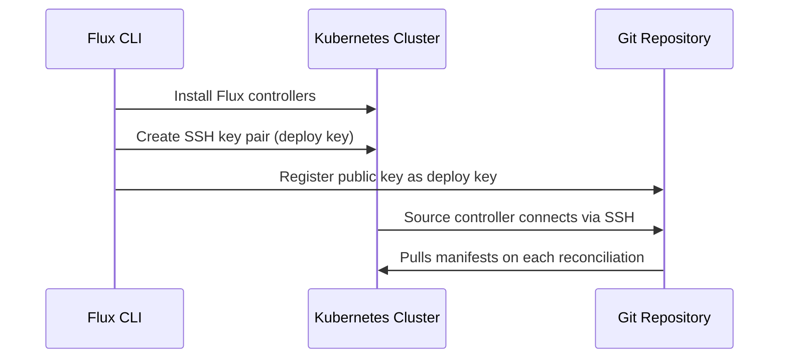

# How to Bootstrap Flux CD with SSH Key Authentication

Author: [nawazdhandala](https://github.com/nawazdhandala)

Tags: Flux CD, GitOps, Kubernetes, SSH, Authentication, Security, Bootstrap

Description: Learn how to bootstrap Flux CD on a Kubernetes cluster using SSH key authentication for secure Git repository access.

---

When bootstrapping Flux CD, you need to establish a secure connection between your Kubernetes cluster and your Git repository. SSH key authentication is one of the most secure and widely used methods for this purpose. It eliminates the need to store passwords or tokens and provides strong cryptographic authentication. This guide walks you through bootstrapping Flux CD with SSH keys on GitHub and GitLab.

## Prerequisites

Before you begin, make sure you have:

- A Kubernetes cluster up and running
- `kubectl` configured to communicate with your cluster
- The Flux CLI installed (verify with `flux --version`)
- A GitHub or GitLab account
- `ssh-keygen` available on your system

Verify your cluster is accessible.

```bash
# Check cluster connectivity
kubectl cluster-info

# Run Flux pre-flight checks
flux check --pre
```

## How SSH Authentication Works with Flux

When you bootstrap Flux with SSH, the following happens.



Flux generates an SSH key pair during bootstrap. The private key is stored as a Kubernetes secret in the `flux-system` namespace. The public key is registered as a deploy key on your Git repository. The source controller uses the private key to authenticate when pulling manifests.

## Method 1: Bootstrap with GitHub (SSH)

The simplest way to bootstrap with SSH on GitHub is to let Flux handle the key generation automatically.

### Step 1: Export Your GitHub Token

Even with SSH authentication, Flux needs a GitHub token during bootstrap to create the repository and register the deploy key. This token is only used during the bootstrap process, not for ongoing Git operations.

```bash
# Export your GitHub personal access token
export GITHUB_TOKEN=<your-github-personal-access-token>
```

The token needs the `repo` scope for private repositories or `public_repo` for public repositories, plus `admin:public_key` to register deploy keys.

### Step 2: Run the Bootstrap Command

Bootstrap Flux with SSH authentication. The `--ssh-key-algorithm` flag specifies the key type.

```bash
# Bootstrap Flux with SSH on GitHub
flux bootstrap github \
  --owner=<your-github-username> \
  --repository=fleet-infra \
  --branch=main \
  --path=./clusters/production \
  --personal \
  --ssh-key-algorithm=ed25519
```

Flux will:
1. Create the `fleet-infra` repository if it does not exist
2. Generate an Ed25519 SSH key pair
3. Register the public key as a deploy key on the repository
4. Store the private key as a Kubernetes secret
5. Install Flux controllers configured to use SSH for Git access

You can also use RSA keys if your Git server requires them.

```bash
# Bootstrap with RSA SSH key (4096-bit)
flux bootstrap github \
  --owner=<your-github-username> \
  --repository=fleet-infra \
  --branch=main \
  --path=./clusters/production \
  --personal \
  --ssh-key-algorithm=rsa \
  --ssh-rsa-bits=4096
```

### Step 3: Verify the SSH Deploy Key

After bootstrap, the public key is registered as a deploy key on your repository. You can view it in your GitHub repository settings under "Deploy keys."

Verify the key on the cluster side.

```bash
# View the SSH key secret in the flux-system namespace
kubectl get secret flux-system -n flux-system -o jsonpath='{.data.identity\.pub}' | base64 -d
```

This shows the public key that Flux is using to authenticate with GitHub.

## Method 2: Bootstrap with GitLab (SSH)

For GitLab, the process is similar but uses the `gitlab` subcommand.

```bash
# Export your GitLab token
export GITLAB_TOKEN=<your-gitlab-personal-access-token>

# Bootstrap Flux with SSH on GitLab
flux bootstrap gitlab \
  --owner=<your-gitlab-username> \
  --repository=fleet-infra \
  --branch=main \
  --path=./clusters/production \
  --personal \
  --ssh-key-algorithm=ed25519
```

## Method 3: Using an Existing SSH Key

If you want to use an existing SSH key instead of having Flux generate one, you can provide it during bootstrap.

### Step 1: Create the SSH Key Pair

Generate a dedicated SSH key pair for Flux.

```bash
# Generate an Ed25519 SSH key pair for Flux
ssh-keygen -t ed25519 -C "flux-deploy-key" -f ~/.ssh/flux-deploy-key -N ""
```

This creates two files:
- `~/.ssh/flux-deploy-key` (private key)
- `~/.ssh/flux-deploy-key.pub` (public key)

### Step 2: Register the Public Key on Your Git Provider

Copy the public key and add it as a deploy key on your repository.

```bash
# Display the public key
cat ~/.ssh/flux-deploy-key.pub
```

On GitHub, go to your repository Settings > Deploy keys > Add deploy key. Paste the public key and enable "Allow write access" if Flux needs to push changes (required for image automation).

### Step 3: Create the Kubernetes Secret

Create a secret in the `flux-system` namespace with the private key before bootstrapping.

```bash
# Create the flux-system namespace
kubectl create namespace flux-system

# Create the SSH key secret
kubectl create secret generic flux-system \
  --namespace=flux-system \
  --from-file=identity=~/.ssh/flux-deploy-key \
  --from-file=identity.pub=~/.ssh/flux-deploy-key.pub \
  --from-file=known_hosts=<(ssh-keyscan github.com 2>/dev/null)
```

### Step 4: Bootstrap with the Existing Key

Run the bootstrap command with the `--ssh-key-algorithm` flag to indicate SSH should be used.

```bash
# Bootstrap using the pre-existing secret
flux bootstrap github \
  --owner=<your-github-username> \
  --repository=fleet-infra \
  --branch=main \
  --path=./clusters/production \
  --personal
```

Flux detects the existing secret and uses it instead of generating a new key pair.

## Verifying the Bootstrap

After bootstrapping, verify that everything is working correctly.

```bash
# Check all Flux components are healthy
flux check

# View Flux system pods
kubectl get pods -n flux-system

# Check the GitRepository source status
flux get sources git

# Check kustomization status
flux get kustomizations
```

All resources should show a "Ready" status with a "True" condition.

## Inspecting the SSH Configuration

Examine the Git source to confirm it is using SSH.

```bash
# View the GitRepository resource details
flux get source git flux-system -o yaml
```

The URL should start with `ssh://` and the `secretRef` should point to the `flux-system` secret containing the SSH key.

```yaml
# Example GitRepository with SSH configuration
apiVersion: source.toolkit.fluxcd.io/v1
kind: GitRepository
metadata:
  name: flux-system
  namespace: flux-system
spec:
  interval: 1m
  ref:
    branch: main
  # SSH URL format
  url: ssh://git@github.com/<owner>/fleet-infra.git
  secretRef:
    name: flux-system
```

## Rotating SSH Keys

Periodically rotating SSH keys is a good security practice. Here is how to rotate the Flux deploy key.

```bash
# Generate a new SSH key pair
ssh-keygen -t ed25519 -C "flux-deploy-key-rotated" -f ~/.ssh/flux-deploy-key-new -N ""

# Update the Kubernetes secret with the new key
kubectl create secret generic flux-system \
  --namespace=flux-system \
  --from-file=identity=~/.ssh/flux-deploy-key-new \
  --from-file=identity.pub=~/.ssh/flux-deploy-key-new.pub \
  --from-file=known_hosts=<(ssh-keyscan github.com 2>/dev/null) \
  --dry-run=client -o yaml | kubectl apply -f -

# Update the deploy key on GitHub with the new public key
cat ~/.ssh/flux-deploy-key-new.pub

# Trigger a reconciliation to verify the new key works
flux reconcile source git flux-system
```

## Security Best Practices

1. **Use Ed25519 keys** over RSA when possible. They are smaller, faster, and equally secure.
2. **Limit deploy key permissions.** Only enable write access if Flux needs to push (for image automation). Read-only access is sufficient for standard GitOps.
3. **Rotate keys periodically.** Set a schedule to rotate deploy keys, such as every 90 days.
4. **Do not reuse keys.** Each cluster should have its own unique deploy key.
5. **Monitor key usage.** Check your Git provider's audit logs for deploy key activity.

## Troubleshooting

**"Host key verification failed" error:** The `known_hosts` file does not contain your Git server's host key. Regenerate it.

```bash
# Update known_hosts in the secret
kubectl create secret generic flux-system \
  --namespace=flux-system \
  --from-file=identity=<(kubectl get secret flux-system -n flux-system -o jsonpath='{.data.identity}' | base64 -d) \
  --from-file=identity.pub=<(kubectl get secret flux-system -n flux-system -o jsonpath='{.data.identity\.pub}' | base64 -d) \
  --from-file=known_hosts=<(ssh-keyscan github.com 2>/dev/null) \
  --dry-run=client -o yaml | kubectl apply -f -
```

**"Permission denied (publickey)" error:** The deploy key is not registered on the repository, or the wrong key is being used. Verify the public key in the Kubernetes secret matches what is registered on your Git provider.

**Bootstrap hangs:** Check network connectivity from the cluster to your Git provider on port 22. Some corporate networks block SSH traffic.

## Conclusion

You have successfully bootstrapped Flux CD with SSH key authentication. This setup provides strong, token-free authentication between your Kubernetes cluster and Git repository. The SSH key pair is managed as a Kubernetes secret, and the deploy key on your Git provider ensures that only authorized clusters can access your GitOps repository. For production environments, implement key rotation procedures and follow the principle of least privilege by using read-only deploy keys unless write access is specifically required.
