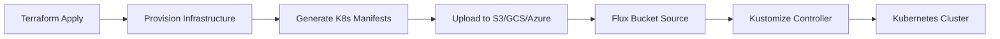
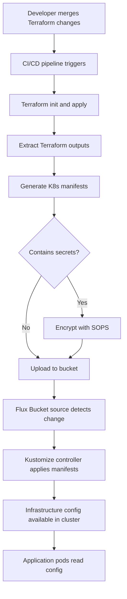

# How to Use Bucket Source for Terraform State in Flux

Author: [nawazdhandala](https://github.com/nawazdhandala)

Tags: Flux CD, GitOps, Kubernetes, Terraform, Bucket, Infrastructure as Code

Description: Learn how to use Flux CD Bucket sources to read Terraform state from object storage and use infrastructure outputs to configure Kubernetes deployments.

---

## Introduction

Terraform stores its state in backends like S3, GCS, or Azure Blob Storage. Flux CD can read from these same storage backends using its Bucket source. By combining Terraform state with Flux, you can bridge the gap between infrastructure provisioning and application deployment. For example, Terraform can provision a database and write its connection details to a ConfigMap or manifest file in an S3 bucket, which Flux then applies to the cluster.

This guide covers the patterns for integrating Terraform state and outputs with Flux CD Bucket sources.

## Prerequisites

- Flux CD v2.0 or later installed on your cluster
- Terraform configured with a remote state backend (S3, GCS, or Azure Blob Storage)
- `kubectl` access to your cluster
- A CI/CD pipeline running Terraform

## Architecture Overview

The integration works by having Terraform write generated Kubernetes manifests to an object storage bucket after applying infrastructure changes. Flux watches this bucket and applies the manifests to the cluster.



Note that Flux does not read the Terraform state file directly. Instead, Terraform generates Kubernetes manifests from its outputs and uploads them to a bucket that Flux watches.

## Pattern 1: Terraform Outputs as Kubernetes ConfigMaps

Have Terraform generate Kubernetes manifests containing infrastructure outputs and upload them to an S3 bucket.

Here is a Terraform configuration that provisions an RDS instance and generates a ConfigMap manifest.

```bash
# terraform/main.tf structure
# This file provisions infrastructure and generates K8s manifests
```

```yaml
# Example generated manifest: infrastructure-outputs/db-config.yaml
# This file is generated by Terraform and uploaded to S3
apiVersion: v1
kind: ConfigMap
metadata:
  name: db-config
  namespace: my-app
data:
  DB_HOST: "my-db-instance.abc123.us-east-1.rds.amazonaws.com"
  DB_PORT: "5432"
  DB_NAME: "myapp"
```

The Terraform configuration uses a `local_file` resource and a null_resource provisioner to generate and upload the manifest.

```bash
# In your Terraform configuration, use local_file to generate manifests
# and then upload them with a provisioner or CI/CD step

# After terraform apply, upload the generated manifests
aws s3 sync ./generated-manifests/ s3://flux-infra-outputs/ --delete
```

## Pattern 2: CI/CD Pipeline Integration

A more robust approach uses a CI/CD pipeline that runs Terraform and then uploads the generated manifests.

```yaml
# .github/workflows/terraform-flux.yaml
name: Terraform Apply and Upload
on:
  push:
    branches: [main]
    paths: ['terraform/**']

jobs:
  apply:
    runs-on: ubuntu-latest
    permissions:
      id-token: write
      contents: read
    steps:
      - uses: actions/checkout@v4

      - name: Configure AWS credentials
        uses: aws-actions/configure-aws-credentials@v4
        with:
          role-to-assume: arn:aws:iam::123456789:role/terraform-role
          aws-region: us-east-1

      - name: Setup Terraform
        uses: hashicorp/setup-terraform@v3
        with:
          terraform_version: 1.7.0
          terraform_wrapper: false

      - name: Terraform Apply
        working-directory: terraform
        run: |
          terraform init
          terraform apply -auto-approve

      - name: Generate Kubernetes manifests from Terraform outputs
        working-directory: terraform
        run: |
          mkdir -p ../generated-manifests

          # Extract outputs and generate a ConfigMap
          DB_HOST=$(terraform output -raw db_host)
          DB_PORT=$(terraform output -raw db_port)
          DB_NAME=$(terraform output -raw db_name)

          cat > ../generated-manifests/db-config.yaml <<EOF
          apiVersion: v1
          kind: ConfigMap
          metadata:
            name: db-config
            namespace: my-app
          data:
            DB_HOST: "${DB_HOST}"
            DB_PORT: "${DB_PORT}"
            DB_NAME: "${DB_NAME}"
          EOF

          # Generate a kustomization.yaml
          cat > ../generated-manifests/kustomization.yaml <<EOF
          apiVersion: kustomize.config.k8s.io/v1beta1
          kind: Kustomization
          resources:
            - db-config.yaml
          EOF

      - name: Upload manifests to S3
        run: |
          aws s3 sync ./generated-manifests/ \
            s3://flux-infra-outputs/my-app/ --delete
```

## Configuring the Flux Bucket Source

Create a Bucket source that watches the S3 bucket where Terraform uploads manifests.

```yaml
# flux-system/terraform-outputs-source.yaml
apiVersion: source.toolkit.fluxcd.io/v1beta2
kind: Bucket
metadata:
  name: terraform-outputs
  namespace: flux-system
spec:
  interval: 5m
  provider: aws
  bucketName: flux-infra-outputs
  endpoint: s3.amazonaws.com
  region: us-east-1
  # Use a prefix to scope to a specific application
  prefix: my-app/
  secretRef:
    name: aws-bucket-creds
```

Create the Kustomization to apply the Terraform-generated manifests.

```yaml
# flux-system/terraform-outputs-kustomization.yaml
apiVersion: kustomize.toolkit.fluxcd.io/v1
kind: Kustomization
metadata:
  name: terraform-outputs
  namespace: flux-system
spec:
  interval: 10m
  sourceRef:
    kind: Bucket
    name: terraform-outputs
  path: ./
  prune: true
  wait: true
  # Apply before the application Kustomization
  # so infrastructure config is available
```

## Pattern 3: Terraform with the Flux Provider

If you use the Terraform Flux provider, you can manage Flux resources directly from Terraform. However, for the Bucket source pattern, the key is to separate infrastructure outputs from Flux management.

```bash
# Use Kustomization dependencies to order deployments
# Infrastructure outputs are applied first, then the application
```

```yaml
# flux-system/my-app-kustomization.yaml
apiVersion: kustomize.toolkit.fluxcd.io/v1
kind: Kustomization
metadata:
  name: my-app
  namespace: flux-system
spec:
  interval: 10m
  sourceRef:
    kind: OCIRepository
    name: my-app
  path: ./
  prune: true
  # Wait for infrastructure outputs to be applied first
  dependsOn:
    - name: terraform-outputs
```

## Using GCS as the Backend

The same pattern works with Google Cloud Storage.

```yaml
# flux-system/terraform-outputs-gcs.yaml
apiVersion: source.toolkit.fluxcd.io/v1beta2
kind: Bucket
metadata:
  name: terraform-outputs
  namespace: flux-system
spec:
  interval: 5m
  provider: gcp
  bucketName: flux-infra-outputs
  endpoint: storage.googleapis.com
  prefix: my-app/
  secretRef:
    name: gcp-bucket-creds
```

## Using Azure Blob Storage as the Backend

And with Azure Blob Storage.

```yaml
# flux-system/terraform-outputs-azure.yaml
apiVersion: source.toolkit.fluxcd.io/v1beta2
kind: Bucket
metadata:
  name: terraform-outputs
  namespace: flux-system
spec:
  interval: 5m
  provider: azure
  bucketName: terraform-outputs
  endpoint: https://fluxmanifests.blob.core.windows.net
  prefix: my-app/
  secretRef:
    name: azure-bucket-creds
```

## Handling Secrets from Terraform

For sensitive outputs like database passwords, use Kubernetes Secrets instead of ConfigMaps. Consider encrypting them with SOPS or Sealed Secrets before uploading to the bucket.

```yaml
# .github/workflows/terraform-secrets.yaml (excerpt)
# Generate an encrypted secret from Terraform outputs
- name: Generate encrypted secret
  working-directory: terraform
  run: |
    DB_PASSWORD=$(terraform output -raw db_password)

    # Create the secret manifest
    cat > ../generated-manifests/db-secret.yaml <<EOF
    apiVersion: v1
    kind: Secret
    metadata:
      name: db-credentials
      namespace: my-app
    type: Opaque
    stringData:
      DB_PASSWORD: "${DB_PASSWORD}"
    EOF

    # Encrypt with SOPS before uploading
    sops --encrypt --in-place ../generated-manifests/db-secret.yaml
```

Configure the Kustomization to decrypt SOPS-encrypted secrets.

```yaml
# flux-system/terraform-outputs-kustomization.yaml
apiVersion: kustomize.toolkit.fluxcd.io/v1
kind: Kustomization
metadata:
  name: terraform-outputs
  namespace: flux-system
spec:
  interval: 10m
  sourceRef:
    kind: Bucket
    name: terraform-outputs
  path: ./
  prune: true
  # Enable SOPS decryption
  decryption:
    provider: sops
    secretRef:
      name: sops-age-key
```

## End-to-End Workflow



## Best Practices

1. **Never expose Terraform state directly.** Do not point Flux at the Terraform state file itself. Generate clean Kubernetes manifests from Terraform outputs instead.

2. **Encrypt sensitive outputs.** Use SOPS or Sealed Secrets for any sensitive data like passwords, API keys, or connection strings.

3. **Use Kustomization dependencies.** Ensure infrastructure configuration manifests are applied before application deployments that depend on them.

4. **Separate infrastructure and application buckets.** Use different buckets or prefixes for Terraform-generated manifests and application manifests.

5. **Version your generated manifests.** Include a revision or timestamp annotation in generated manifests to track which Terraform run produced them.

6. **Test the pipeline end-to-end.** Verify that changes to Terraform configuration flow through to the cluster correctly before relying on this pattern in production.

## Conclusion

Using Flux CD Bucket sources to consume Terraform-generated Kubernetes manifests bridges the gap between infrastructure provisioning and application deployment. By having Terraform generate manifests from its outputs, uploading them to object storage, and letting Flux reconcile them to the cluster, you create a seamless flow from infrastructure changes to cluster configuration. This pattern works with any supported Bucket provider (AWS S3, GCS, Azure Blob Storage) and integrates naturally with Flux's dependency management to ensure proper ordering of resource application.
