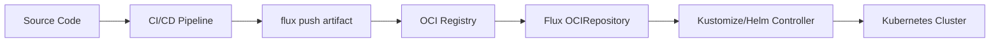

# How to Build OCI Artifacts in CI/CD Pipelines for Flux

Author: [nawazdhandala](https://github.com/nawazdhandala)

Tags: Flux CD, GitOps, Kubernetes, OCI, CI/CD, Artifacts

Description: Learn how to build and push OCI artifacts in CI/CD pipelines so Flux CD can automatically reconcile Kubernetes deployments from container registries.

---

## Introduction

Flux CD supports OCI artifacts as a source for Kubernetes manifests, Kustomize overlays, and Helm charts. Instead of pulling directly from Git repositories, Flux can watch an OCI registry for new artifact versions and reconcile automatically. This approach offers faster reconciliation, better artifact immutability, and the ability to decouple your deployment pipeline from Git.

This guide walks you through building and pushing OCI artifacts in popular CI/CD platforms, including GitHub Actions, GitLab CI, and generic pipeline setups.

## Prerequisites

- Flux CLI v2.1.0 or later
- An OCI-compatible container registry (GHCR, Docker Hub, ECR, ACR, GCR)
- A CI/CD platform with access to your registry
- Flux installed on your target cluster with an OCIRepository configured

## How OCI Artifacts Work with Flux

Flux uses the `OCIRepository` custom resource to pull artifacts from OCI registries. Your CI/CD pipeline is responsible for building and pushing these artifacts. When a new artifact version appears, Flux detects it and triggers a reconciliation.



## Structuring Your Manifests

Before building artifacts, organize your manifests in a dedicated directory. This directory becomes the content of your OCI artifact.

```bash
# Typical directory structure for an OCI artifact
manifests/
  kustomization.yaml
  deployment.yaml
  service.yaml
  configmap.yaml
```

Here is a simple Kustomization file that ties the manifests together.

```yaml
# manifests/kustomization.yaml
apiVersion: kustomize.config.k8s.io/v1beta1
kind: Kustomization
resources:
  - deployment.yaml
  - service.yaml
  - configmap.yaml
```

## Building OCI Artifacts with GitHub Actions

The following GitHub Actions workflow pushes an OCI artifact to GitHub Container Registry whenever changes are merged to the main branch.

```yaml
# .github/workflows/push-artifact.yaml
name: Push OCI Artifact
on:
  push:
    branches:
      - main
    paths:
      - 'manifests/**'

permissions:
  packages: write

jobs:
  push:
    runs-on: ubuntu-latest
    steps:
      - name: Checkout
        uses: actions/checkout@v4

      - name: Setup Flux CLI
        uses: fluxcd/flux2/action@main

      - name: Login to GHCR
        run: |
          echo "${{ secrets.GITHUB_TOKEN }}" | flux oci login ghcr.io \
            --username flux \
            --password-stdin

      - name: Push artifact
        run: |
          # Push manifests as an OCI artifact with source and revision metadata
          flux push artifact \
            oci://ghcr.io/${{ github.repository }}/manifests:$(git rev-parse --short HEAD) \
            --path ./manifests \
            --source="$(git config --get remote.origin.url)" \
            --revision="main/$(git rev-parse HEAD)"

      - name: Tag as latest
        run: |
          # Also tag the artifact as latest for convenience
          flux tag artifact \
            oci://ghcr.io/${{ github.repository }}/manifests:$(git rev-parse --short HEAD) \
            --tag latest
```

## Building OCI Artifacts with GitLab CI

The following GitLab CI configuration pushes an OCI artifact to the GitLab Container Registry.

```yaml
# .gitlab-ci.yml
push-artifact:
  stage: deploy
  image: ghcr.io/fluxcd/flux-cli:v2.3.0
  rules:
    - changes:
        - manifests/**
      if: $CI_COMMIT_BRANCH == "main"
  script:
    # Login to the GitLab container registry
    - flux oci login ${CI_REGISTRY} --username gitlab-ci-token --password ${CI_JOB_TOKEN}

    # Push the manifests as an OCI artifact
    - flux push artifact
        oci://${CI_REGISTRY_IMAGE}/manifests:${CI_COMMIT_SHORT_SHA}
        --path ./manifests
        --source="${CI_PROJECT_URL}"
        --revision="main/${CI_COMMIT_SHA}"

    # Tag the artifact as latest
    - flux tag artifact
        oci://${CI_REGISTRY_IMAGE}/manifests:${CI_COMMIT_SHORT_SHA}
        --tag latest
```

## Building OCI Artifacts for AWS ECR

When using AWS ECR, you need to authenticate using the AWS CLI or an OIDC provider before pushing.

```bash
# Authenticate to ECR using the AWS CLI
aws ecr get-login-password --region us-east-1 | \
  flux oci login 123456789.dkr.ecr.us-east-1.amazonaws.com \
    --username AWS \
    --password-stdin

# Push the artifact to ECR
flux push artifact \
  oci://123456789.dkr.ecr.us-east-1.amazonaws.com/my-app/manifests:v1.0.0 \
  --path ./manifests \
  --source="https://github.com/my-org/my-app" \
  --revision="main/abc123"
```

## Adding Diff Checks Before Pushing

To avoid pushing identical artifacts and triggering unnecessary reconciliations, always diff before pushing.

```bash
# Only push if there are actual changes
DIFF_EXIT=0
flux diff artifact \
  oci://ghcr.io/my-org/my-app/manifests:latest \
  --path ./manifests || DIFF_EXIT=$?

if [ "$DIFF_EXIT" -ne 0 ]; then
  echo "Changes detected, pushing new artifact..."
  flux push artifact \
    oci://ghcr.io/my-org/my-app/manifests:${COMMIT_SHA} \
    --path ./manifests \
    --source="${REPO_URL}" \
    --revision="main/${COMMIT_SHA}"

  flux tag artifact \
    oci://ghcr.io/my-org/my-app/manifests:${COMMIT_SHA} \
    --tag latest
else
  echo "No changes detected, skipping push."
fi
```

## Configuring Flux to Consume the Artifact

On the cluster side, configure an OCIRepository to pull from your registry.

```yaml
# flux-system/oci-source.yaml
apiVersion: source.toolkit.fluxcd.io/v1beta2
kind: OCIRepository
metadata:
  name: my-app
  namespace: flux-system
spec:
  interval: 5m
  url: oci://ghcr.io/my-org/my-app/manifests
  ref:
    tag: latest
```

Then reference it in a Kustomization resource.

```yaml
# flux-system/kustomization.yaml
apiVersion: kustomize.toolkit.fluxcd.io/v1
kind: Kustomization
metadata:
  name: my-app
  namespace: flux-system
spec:
  interval: 10m
  targetNamespace: my-app
  sourceRef:
    kind: OCIRepository
    name: my-app
  path: ./
  prune: true
```

## Tagging Strategies

Choose a tagging strategy that fits your workflow.

| Strategy | Tag Format | Use Case |
|----------|-----------|----------|
| Commit SHA | `abc1234` | Immutable, traceable to source |
| Semantic version | `v1.2.3` | Release-based workflows |
| Latest | `latest` | Always deploy newest |
| Branch-based | `main-abc1234` | Multi-branch environments |

```bash
# Push with multiple tags for flexibility
flux push artifact \
  oci://ghcr.io/my-org/manifests:v1.2.3 \
  --path ./manifests \
  --source="https://github.com/my-org/my-app" \
  --revision="main/abc123"

flux tag artifact oci://ghcr.io/my-org/manifests:v1.2.3 --tag latest
flux tag artifact oci://ghcr.io/my-org/manifests:v1.2.3 --tag main-abc123
```

## Best Practices

1. **Include source metadata.** Always pass `--source` and `--revision` to `flux push artifact` so Flux can display provenance information.

2. **Diff before push.** Use `flux diff artifact` to skip unnecessary pushes and avoid triggering reconciliation loops.

3. **Use immutable tags.** Prefer commit SHA or semver tags over mutable tags like `latest` for production environments.

4. **Scope artifact contents.** Only include the manifests that Flux needs. Do not include CI configs, tests, or documentation in the artifact.

5. **Secure registry credentials.** Store registry tokens as CI/CD secrets and rotate them regularly.

## Conclusion

Building OCI artifacts in CI/CD pipelines for Flux CD provides a clean separation between your build process and your deployment process. By pushing versioned, immutable artifacts to an OCI registry, you gain faster reconciliation, better auditability, and a simpler deployment model. Whether you use GitHub Actions, GitLab CI, or another platform, the `flux push artifact` command integrates smoothly into any pipeline.
