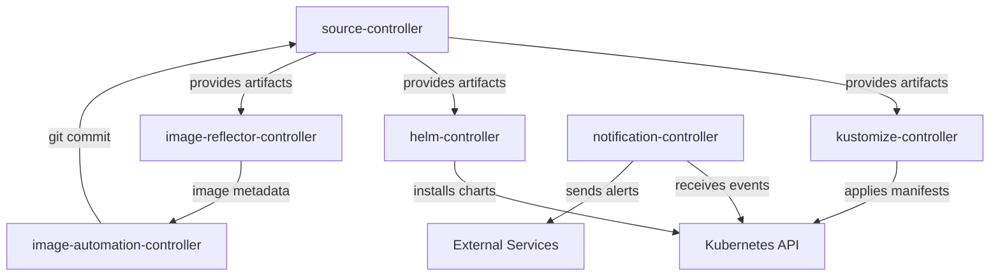

# How to Configure Flux CD Bootstrap with Custom Components

Author: [nawazdhandala](https://github.com/nawazdhandala)

Tags: Flux CD, GitOps, Kubernetes, Bootstrap, Custom Components, Image Automation, DevOps

Description: Learn how to customize your Flux CD bootstrap by selecting specific components, adding extra controllers, and configuring component-level options.

---

Flux CD is a modular GitOps toolkit composed of several independent controllers. By default, the bootstrap process installs four core controllers: source-controller, kustomize-controller, helm-controller, and notification-controller. However, you can customize which components are installed, add extra controllers like image automation, and configure component-specific options. This guide covers all the ways to customize Flux CD bootstrap components.

## Default Flux CD Components

When you run `flux bootstrap` without customization, the following controllers are installed:

| Component | Purpose |
|-----------|---------|
| source-controller | Manages Git repositories, Helm repositories, OCI repositories, and S3 buckets as artifact sources |
| kustomize-controller | Reconciles Kustomization resources, applying manifests from sources to the cluster |
| helm-controller | Manages HelmRelease resources, installing and upgrading Helm charts |
| notification-controller | Handles alerts, event forwarding, and webhook receivers |

## Extra Components Available

Flux CD offers additional controllers that are not installed by default:

| Component | Purpose |
|-----------|---------|
| image-reflector-controller | Scans container registries for new image tags |
| image-automation-controller | Updates Git repositories with new image tags automatically |

These are needed for automated image update workflows where Flux detects new container images and commits updated tags back to Git.

## Installing Extra Components During Bootstrap

Use the `--components-extra` flag to include additional controllers during bootstrap.

```bash
# Bootstrap Flux CD with image automation controllers
export GITHUB_TOKEN=<your-token>
export GITHUB_USER=<your-username>

flux bootstrap github \
  --owner=$GITHUB_USER \
  --repository=fleet-infra \
  --branch=main \
  --path=./clusters/production \
  --personal \
  --components-extra=image-reflector-controller,image-automation-controller
```

This installs all four default controllers plus the two image automation controllers.

After bootstrap, verify all six controllers are running.

```bash
# Verify all controllers are running
kubectl get deployments -n flux-system
```

Expected output:

```text
NAME                          READY   UP-TO-DATE   AVAILABLE
helm-controller               1/1     1            1
image-automation-controller   1/1     1            1
image-reflector-controller    1/1     1            1
kustomize-controller          1/1     1            1
notification-controller       1/1     1            1
source-controller             1/1     1            1
```

## Installing Only Specific Components

If you do not need all default controllers, use the `--components` flag to specify exactly which ones to install. This is useful for minimal installations or specialized clusters.

```bash
# Install only source-controller and kustomize-controller (no Helm or notifications)
flux bootstrap github \
  --owner=$GITHUB_USER \
  --repository=fleet-infra \
  --branch=main \
  --path=./clusters/minimal \
  --personal \
  --components=source-controller,kustomize-controller
```

This is useful when:

- You only use plain YAML manifests and Kustomize (no Helm charts)
- You handle notifications externally
- You want to minimize resource consumption on edge or IoT clusters

## Combining --components and --components-extra

You can use both flags together for precise control.

```bash
# Install source, kustomize, and image automation (skip Helm and notifications)
flux bootstrap github \
  --owner=$GITHUB_USER \
  --repository=fleet-infra \
  --branch=main \
  --path=./clusters/image-auto \
  --personal \
  --components=source-controller,kustomize-controller \
  --components-extra=image-reflector-controller,image-automation-controller
```

## Configuring Component Options via CLI Flags

The `flux bootstrap` command supports several flags that affect component behavior.

### Set the Log Level

Control the verbosity of Flux controller logs.

```bash
# Bootstrap with debug logging enabled
flux bootstrap github \
  --owner=$GITHUB_USER \
  --repository=fleet-infra \
  --branch=main \
  --path=./clusters/production \
  --personal \
  --log-level=debug
```

Valid log levels are `info`, `debug`, and `error`.

### Set the Cluster Domain

If your cluster uses a custom DNS domain instead of the default `cluster.local`, specify it.

```bash
# Bootstrap with a custom cluster domain
flux bootstrap github \
  --owner=$GITHUB_USER \
  --repository=fleet-infra \
  --branch=main \
  --path=./clusters/production \
  --personal \
  --cluster-domain=custom.cluster.domain
```

### Set the Watch Namespace

By default, Flux controllers watch all namespaces. Restrict this to specific namespaces for multi-tenant clusters.

```bash
# Bootstrap with controllers watching only the production namespace
flux bootstrap github \
  --owner=$GITHUB_USER \
  --repository=fleet-infra \
  --branch=main \
  --path=./clusters/production \
  --personal \
  --watch-all-namespaces=false
```

When `--watch-all-namespaces=false` is set, Flux controllers only reconcile resources in the `flux-system` namespace. You must create additional RBAC and configure each Kustomization or HelmRelease with the correct service account.

### Set the Network Policy

Flux can install network policies to restrict traffic to and from its controllers.

```bash
# Bootstrap with network policies enabled
flux bootstrap github \
  --owner=$GITHUB_USER \
  --repository=fleet-infra \
  --branch=main \
  --path=./clusters/production \
  --personal \
  --network-policy=true
```

The network policies allow the controllers to reach the Kubernetes API server and external Git/Helm/OCI sources while blocking unnecessary inbound traffic.

### Set the Secret Name for Git Authentication

Customize the name of the Secret used for Git authentication.

```bash
# Bootstrap with a custom secret name
flux bootstrap github \
  --owner=$GITHUB_USER \
  --repository=fleet-infra \
  --branch=main \
  --path=./clusters/production \
  --personal \
  --secret-name=flux-git-auth
```

## Using flux install for Non-Bootstrap Custom Components

If you prefer not to use bootstrap (for example, when managing the Git connection separately), use `flux install` directly with component flags.

```bash
# Install specific Flux components without bootstrapping
flux install \
  --components=source-controller,kustomize-controller,helm-controller \
  --components-extra=image-reflector-controller,image-automation-controller
```

Export the manifests without applying them (useful for GitOps or review).

```bash
# Export component manifests to a file
flux install \
  --components=source-controller,kustomize-controller \
  --components-extra=image-reflector-controller \
  --export > flux-components.yaml
```

## Setting Up Image Automation After Bootstrap

If you initially bootstrapped without image automation and want to add it later, re-run bootstrap with the extra components.

```bash
# Add image automation controllers to an existing Flux installation
flux bootstrap github \
  --owner=$GITHUB_USER \
  --repository=fleet-infra \
  --branch=main \
  --path=./clusters/production \
  --personal \
  --components-extra=image-reflector-controller,image-automation-controller
```

The bootstrap command is idempotent. It will add the new controllers without affecting existing ones.

After adding the image automation controllers, configure them with an ImageRepository and ImagePolicy.

```yaml
# image-repo.yaml
# Scan a container registry for new image tags
apiVersion: image.toolkit.fluxcd.io/v1
kind: ImageRepository
metadata:
  name: my-app
  namespace: flux-system
spec:
  image: ghcr.io/myorg/my-app
  interval: 5m
```

```yaml
# image-policy.yaml
# Define a policy for selecting the latest semver tag
apiVersion: image.toolkit.fluxcd.io/v1
kind: ImagePolicy
metadata:
  name: my-app
  namespace: flux-system
spec:
  imageRepositoryRef:
    name: my-app
  policy:
    semver:
      range: ">=1.0.0"
```

```yaml
# image-update.yaml
# Automatically commit new image tags back to Git
apiVersion: image.toolkit.fluxcd.io/v1
kind: ImageUpdateAutomation
metadata:
  name: my-app
  namespace: flux-system
spec:
  interval: 30m
  sourceRef:
    kind: GitRepository
    name: flux-system
  git:
    checkout:
      ref:
        branch: main
    commit:
      author:
        name: fluxcdbot
        email: fluxcdbot@users.noreply.github.com
      messageTemplate: "chore: update image {{range .Changed.Changes}}{{print .OldValue}} -> {{print .NewValue}} {{end}}"
    push:
      branch: main
  update:
    path: ./clusters/production
    strategy: Setters
```

## Removing Components

To remove an extra component, re-run bootstrap with only the components you want. Alternatively, manually delete the deployment.

```bash
# Remove the image automation controllers
kubectl delete deployment image-automation-controller -n flux-system
kubectl delete deployment image-reflector-controller -n flux-system

# Clean up CRDs if no longer needed
kubectl delete crd imagerepositories.image.toolkit.fluxcd.io
kubectl delete crd imagepolicies.image.toolkit.fluxcd.io
kubectl delete crd imageupdateautomations.image.toolkit.fluxcd.io
```

## Component Architecture

The following diagram shows how Flux components interact.



## Best Practices

- **Start minimal**: Install only the components you need. You can always add more later with a re-bootstrap.
- **Use --components-extra for optional controllers**: Keep the default components intact and add extras on top. This makes upgrades predictable.
- **Enable network policies in production**: Use `--network-policy=true` to restrict controller network access according to the principle of least privilege.
- **Match components across clusters**: Use the same set of components across staging and production clusters to avoid configuration drift.
- **Document your component choices**: Add a comment in your `kustomization.yaml` or a team wiki explaining why certain components are included or excluded.

## Conclusion

Flux CD's modular architecture lets you tailor the installation to your exact needs. Whether you need a minimal setup with just source and kustomize controllers, or a full-featured installation with image automation and network policies, the `--components` and `--components-extra` flags give you precise control. The bootstrap command's idempotent nature means you can safely add or modify components at any time without disrupting existing workloads.
