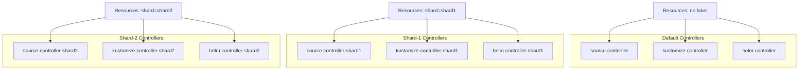

# How to Configure Flux CD Horizontal Scaling with Sharding

Author: [nawazdhandala](https://github.com/nawazdhandala)

Tags: Flux CD, GitOps, Kubernetes, Horizontal Scaling, Sharding, Multi-Tenancy, Performance

Description: Learn how to horizontally scale Flux CD using controller sharding to distribute reconciliation workloads across multiple controller instances.

---

When vertical scaling reaches its limits, Flux CD supports horizontal scaling through a sharding mechanism. Sharding allows you to run multiple instances of Flux controllers, each responsible for a subset of resources. This is essential for large-scale clusters or multi-tenant environments where a single set of controllers cannot keep up with the reconciliation demand. This guide explains how to configure Flux CD sharding from scratch.

## When to Use Sharding

Sharding is appropriate when:

- A single controller instance cannot handle the volume of resources even with increased resources and concurrency
- You need isolation between teams or tenants
- Reconciliation latency is unacceptable despite vertical scaling
- You manage hundreds of GitRepositories or HelmReleases in a single cluster

## How Flux Sharding Works

Flux sharding uses Kubernetes labels to partition resources across controller instances. Each controller shard watches only resources that match its shard label. Resources without a shard label are handled by the default controller.



## Step 1: Plan Your Sharding Strategy

Decide how to partition your workloads. Common strategies include:

- **By team or tenant** -- Each team gets its own shard
- **By environment** -- Separate shards for staging and production resources
- **By resource type** -- Separate shards for Helm-heavy vs Kustomize-heavy workloads

For this guide, we will create two additional shards alongside the default controllers.

## Step 2: Create a Shard Controller Deployment

Each shard requires its own set of controller Deployments. Create them by duplicating and modifying the default controller manifests.

Here is a kustomization that creates a shard of the source-controller:

```yaml
# shards/shard1/source-controller.yaml
apiVersion: apps/v1
kind: Deployment
metadata:
  name: source-controller-shard1
  namespace: flux-system
  labels:
    app: source-controller-shard1
    sharding.fluxcd.io/role: shard
spec:
  replicas: 1
  selector:
    matchLabels:
      app: source-controller-shard1
  template:
    metadata:
      labels:
        app: source-controller-shard1
    spec:
      serviceAccountName: source-controller
      containers:
        - name: manager
          image: ghcr.io/fluxcd/source-controller:v1.4.1
          args:
            - --events-addr=http://notification-controller.flux-system.svc.cluster.local./
            - --watch-all-namespaces=true
            - --log-level=info
            - --log-encoding=json
            - --enable-leader-election
            - --storage-path=/data
            - --storage-adv-addr=source-controller-shard1.$(RUNTIME_NAMESPACE).svc.cluster.local.
            # This flag tells the controller to only watch resources with this shard label
            - --watch-label-selector=sharding.fluxcd.io/key=shard1
            - --concurrent=10
          env:
            - name: RUNTIME_NAMESPACE
              valueFrom:
                fieldRef:
                  fieldPath: metadata.namespace
          resources:
            requests:
              cpu: 250m
              memory: 512Mi
            limits:
              cpu: 1000m
              memory: 2Gi
          volumeMounts:
            - name: data
              mountPath: /data
      volumes:
        - name: data
          emptyDir:
            sizeLimit: 2Gi
```

Create a corresponding Service for the shard's source-controller so that other controllers can download artifacts from it:

```yaml
# shards/shard1/source-controller-service.yaml
apiVersion: v1
kind: Service
metadata:
  name: source-controller-shard1
  namespace: flux-system
spec:
  selector:
    app: source-controller-shard1
  ports:
    - name: http
      port: 80
      targetPort: http
```

## Step 3: Create Kustomize Controller Shard

```yaml
# shards/shard1/kustomize-controller.yaml
apiVersion: apps/v1
kind: Deployment
metadata:
  name: kustomize-controller-shard1
  namespace: flux-system
  labels:
    app: kustomize-controller-shard1
    sharding.fluxcd.io/role: shard
spec:
  replicas: 1
  selector:
    matchLabels:
      app: kustomize-controller-shard1
  template:
    metadata:
      labels:
        app: kustomize-controller-shard1
    spec:
      serviceAccountName: kustomize-controller
      containers:
        - name: manager
          image: ghcr.io/fluxcd/kustomize-controller:v1.4.0
          args:
            - --events-addr=http://notification-controller.flux-system.svc.cluster.local./
            - --watch-all-namespaces=true
            - --log-level=info
            - --log-encoding=json
            - --enable-leader-election
            # Only process resources labeled for shard1
            - --watch-label-selector=sharding.fluxcd.io/key=shard1
            - --concurrent=10
          resources:
            requests:
              cpu: 500m
              memory: 512Mi
            limits:
              cpu: 2000m
              memory: 2Gi
```

## Step 4: Create Helm Controller Shard

```yaml
# shards/shard1/helm-controller.yaml
apiVersion: apps/v1
kind: Deployment
metadata:
  name: helm-controller-shard1
  namespace: flux-system
  labels:
    app: helm-controller-shard1
    sharding.fluxcd.io/role: shard
spec:
  replicas: 1
  selector:
    matchLabels:
      app: helm-controller-shard1
  template:
    metadata:
      labels:
        app: helm-controller-shard1
    spec:
      serviceAccountName: helm-controller
      containers:
        - name: manager
          image: ghcr.io/fluxcd/helm-controller:v1.1.0
          args:
            - --events-addr=http://notification-controller.flux-system.svc.cluster.local./
            - --watch-all-namespaces=true
            - --log-level=info
            - --log-encoding=json
            - --enable-leader-election
            # Only process resources labeled for shard1
            - --watch-label-selector=sharding.fluxcd.io/key=shard1
            - --concurrent=10
          resources:
            requests:
              cpu: 250m
              memory: 512Mi
            limits:
              cpu: 1000m
              memory: 2Gi
```

## Step 5: Label Resources for Sharding

Assign resources to a shard by adding the corresponding label. All resources in a reconciliation chain must have the same shard label.

```yaml
# A GitRepository assigned to shard1
apiVersion: source.toolkit.fluxcd.io/v1
kind: GitRepository
metadata:
  name: team-a-app
  namespace: flux-system
  labels:
    sharding.fluxcd.io/key: shard1
spec:
  interval: 5m
  url: https://github.com/your-org/team-a-app
  ref:
    branch: main
---
# The Kustomization must also be labeled for the same shard
apiVersion: kustomize.toolkit.fluxcd.io/v1
kind: Kustomization
metadata:
  name: team-a-app
  namespace: flux-system
  labels:
    sharding.fluxcd.io/key: shard1
spec:
  interval: 10m
  targetNamespace: team-a
  sourceRef:
    kind: GitRepository
    name: team-a-app
  path: ./deploy
  prune: true
```

Resources without the shard label continue to be processed by the default controllers.

## Step 6: Configure the Default Controllers to Ignore Sharded Resources

To prevent the default controllers from processing sharded resources, configure them to skip resources that have shard labels. Add the `--watch-label-selector` flag with a negation.

```yaml
# Patch for the default kustomize-controller to exclude sharded resources
apiVersion: apps/v1
kind: Deployment
metadata:
  name: kustomize-controller
  namespace: flux-system
spec:
  template:
    spec:
      containers:
        - name: manager
          args:
            - --events-addr=http://notification-controller.flux-system.svc.cluster.local./
            - --watch-all-namespaces=true
            - --log-level=info
            - --log-encoding=json
            - --enable-leader-election
            # Exclude resources that have any shard label
            - --watch-label-selector=!sharding.fluxcd.io/key
```

Apply the same exclusion to the default source-controller and helm-controller.

## Step 7: Apply and Verify

Apply the shard configurations and verify that controllers are running.

```bash
# Apply the shard manifests
kubectl apply -f shards/shard1/

# Verify all shard controllers are running
kubectl get deployments -n flux-system

# Check that sharded resources are being reconciled by the correct controller
kubectl logs -n flux-system deployment/kustomize-controller-shard1 | head -20

# Verify the default controllers are not processing sharded resources
kubectl logs -n flux-system deployment/kustomize-controller | grep "team-a-app"
```

## Organizing Shards with Kustomize

For production deployments, organize your shards using Kustomize overlays:

```yaml
# clusters/my-cluster/flux-system/kustomization.yaml
apiVersion: kustomize.config.k8s.io/v1beta1
kind: Kustomization
resources:
  - gotk-components.yaml
  - gotk-sync.yaml
  - shards/shard1/
  - shards/shard2/
patches:
  # Patch default controllers to exclude sharded resources
  - patch: |
      apiVersion: apps/v1
      kind: Deployment
      metadata:
        name: source-controller
      spec:
        template:
          spec:
            containers:
              - name: manager
                args:
                  - --watch-label-selector=!sharding.fluxcd.io/key
    target:
      kind: Deployment
      name: "(source|kustomize|helm)-controller"
      namespace: flux-system
```

## Summary

Flux CD sharding enables horizontal scaling by running multiple instances of controllers, each watching a labeled subset of resources. The key steps are: deploy additional controller instances with `--watch-label-selector` flags, label your Flux resources with the appropriate shard key, and configure default controllers to exclude sharded resources. This approach is essential for large clusters managing hundreds of resources or for multi-tenant environments where workload isolation between teams is required. Combine sharding with vertical scaling for optimal performance.
