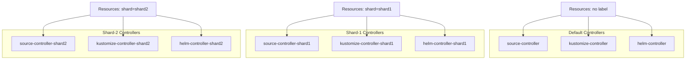

# How to Configure Flux CD Horizontal Scaling with Sharding

Author: [nawazdhandala](https://github.com/nawazdhandala)

Tags: Flux CD, GitOps, Kubernetes, Horizontal Scaling, Sharding, Multi-Tenancy, Performance

Description: Learn how to horizontally scale Flux CD using controller sharding to distribute reconciliation workloads across multiple controller instances.

---

When vertical scaling reaches its limits, Flux CD supports horizontal scaling through a sharding mechanism. Sharding allows you to run multiple instances of Flux controllers, each responsible for a subset of resources. This is essential for large-scale clusters or multi-tenant environments where a single set of controllers cannot keep up with the reconciliation demand. This guide explains how to configure Flux CD sharding from scratch.

## When to Use Sharding

Sharding is appropriate when:

- A single controller instance cannot handle the volume of resources even with increased resources and concurrency
- You need isolation between teams or tenants
- Reconciliation latency is unacceptable despite vertical scaling
- You manage hundreds of GitRepositories or HelmReleases in a single cluster

## How Flux Sharding Works

Flux sharding uses Kubernetes labels to partition resources across controller instances. Each controller shard watches only resources that match its shard label. Resources without a shard label are handled by the default controller.


```mermaid
flowchart TD
    subgraph Default Controllers
        SC1[source-controller]
        KC1[kustomize-controller]
        HC1[helm-controller]
    end
    subgraph Shard-1 Controllers
        SC2[source-controller-shard1]
        KC2[kustomize-controller-shard1]
        HC2[helm-controller-shard1]
    end
    subgraph Shard-2 Controllers
        SC3[source-controller-shard2]
        KC3[kustomize-controller-shard2]
        HC3[helm-controller-shard2]
    end
    R1[Resources: no label] --> SC1
    R1 --> KC1
    R1 --> HC1
    R2[Resources: shard=shard1] --> SC2
    R2 --> KC2
    R2 --> HC2
    R3[Resources: shard=shard2] --> SC3
    R3 --> KC3
    R3 --> HC3
```

## Step 1: Plan Your Sharding Strategy

Decide how to partition your workloads. Common strategies include:

- **By team or tenant** -- Each team gets its own shard
- **By environment** -- Separate shards for staging and production resources
- **By resource type** -- Separate shards for Helm-heavy vs Kustomize-heavy workloads

For this guide, we will create two additional shards alongside the default controllers.

## Step 2: Create a Shard Controller Deployment

Each shard requires its own set of controller Deployments. The recommended way to create them is to reuse `gotk-components.yaml` and patch the generated manifests for the shard.

Here is a kustomization that creates a shard of the source-controller, kustomize-controller, and helm-controller:

```yaml
# clusters/my-cluster/flux-system/shard1/kustomization.yaml
apiVersion: kustomize.config.k8s.io/v1beta1
kind: Kustomization
namespace: flux-system
resources:
  - ../gotk-components.yaml
nameSuffix: "-shard1"
commonAnnotations:
  sharding.fluxcd.io/role: "shard"
patches:
  - target:
      kind: (Namespace|CustomResourceDefinition|ClusterRole|ClusterRoleBinding|ServiceAccount|NetworkPolicy|ResourceQuota)
      labelSelector: "app.kubernetes.io/part-of=flux"
    patch: |
      apiVersion: v1
      kind: all
      metadata:
        name: all
      $patch: delete
  - target:
      labelSelector: "app.kubernetes.io/component=notification-controller"
    patch: |
      apiVersion: v1
      kind: all
      metadata:
        name: all
      $patch: delete
  - target:
      labelSelector: "app.kubernetes.io/component=source-watcher"
    patch: |
      apiVersion: v1
      kind: all
      metadata:
        name: all
      $patch: delete
  - target:
      kind: Deployment
      name: (image-reflector-controller|image-automation-controller)
    patch: |
      apiVersion: v1
      kind: Deployment
      metadata:
        name: all
      $patch: delete
  - target:
      kind: Service
      name: source-controller
    patch: |
      - op: replace
        path: /spec/selector/app
        value: source-controller-shard1
  - target:
      kind: Deployment
      name: source-controller
    patch: |
      - op: replace
        path: /spec/selector/matchLabels/app
        value: source-controller-shard1
      - op: replace
        path: /spec/template/metadata/labels/app
        value: source-controller-shard1
      - op: replace
        path: /spec/template/spec/containers/0/args/6
        value: --storage-adv-addr=source-controller-shard1.$(RUNTIME_NAMESPACE).svc.cluster.local.
  - target:
      kind: Deployment
      name: kustomize-controller
    patch: |
      - op: replace
        path: /spec/selector/matchLabels/app
        value: kustomize-controller-shard1
      - op: replace
        path: /spec/template/metadata/labels/app
        value: kustomize-controller-shard1
  - target:
      kind: Deployment
      name: helm-controller
    patch: |
      - op: replace
        path: /spec/selector/matchLabels/app
        value: helm-controller-shard1
      - op: replace
        path: /spec/template/metadata/labels/app
        value: helm-controller-shard1
  - target:
      kind: Deployment
      name: (source-controller|kustomize-controller|helm-controller)
    patch: |
      - op: add
        path: /spec/template/spec/containers/0/args/-
        value: --watch-label-selector=sharding.fluxcd.io/key=shard1
```

This overlay generates `source-controller-shard1`, `kustomize-controller-shard1`, and `helm-controller-shard1`. It also patches the shard's source-controller Service selector so that other controllers can download artifacts from the sharded source-controller.

## Step 3: Create Kustomize Controller Shard

The shard kustomization above patches the generated kustomize-controller Deployment to use the `kustomize-controller-shard1` selector and the `--watch-label-selector=sharding.fluxcd.io/key=shard1` argument. You do not need to maintain a separate hand-written kustomize-controller Deployment.

## Step 4: Create Helm Controller Shard

The same shard kustomization patches the generated helm-controller Deployment to use the `helm-controller-shard1` selector and the `--watch-label-selector=sharding.fluxcd.io/key=shard1` argument. Keep HelmRelease resources and their generated HelmChart source labels on the same shard.

## Step 5: Label Resources for Sharding

Assign resources to a shard by adding the corresponding label. All resources in a reconciliation chain must have the same shard label.

```yaml
# A GitRepository assigned to shard1
apiVersion: source.toolkit.fluxcd.io/v1
kind: GitRepository
metadata:
  name: team-a-app
  namespace: flux-system
  labels:
    sharding.fluxcd.io/key: shard1
spec:
  interval: 5m
  url: https://github.com/your-org/team-a-app
  ref:
    branch: main
---
# The Kustomization must also be labeled for the same shard
apiVersion: kustomize.toolkit.fluxcd.io/v1
kind: Kustomization
metadata:
  name: team-a-app
  namespace: flux-system
  labels:
    sharding.fluxcd.io/key: shard1
spec:
  interval: 10m
  targetNamespace: team-a
  sourceRef:
    kind: GitRepository
    name: team-a-app
  path: ./deploy
  prune: true
```

Resources without the shard label continue to be processed by the default controllers.

## Step 6: Configure the Default Controllers to Ignore Sharded Resources

To prevent the default controllers from processing sharded resources, configure them to skip resources that have shard labels. Add the `--watch-label-selector` flag with a negation.

```yaml
# Patch for the default controllers to exclude sharded resources
patches:
  - target:
      kind: Deployment
      name: "(source-controller|kustomize-controller|helm-controller)"
      annotationSelector: "!sharding.fluxcd.io/role"
    patch: |
      - op: add
        path: /spec/template/spec/containers/0/args/0
        value: --watch-label-selector=!sharding.fluxcd.io/key
```

Apply this exclusion to the default source-controller, kustomize-controller, and helm-controller.

## Step 7: Apply and Verify

Apply the shard configurations and verify that controllers are running.

```bash
# Build and apply the shard manifests
kubectl apply -k clusters/my-cluster/flux-system/shard1/

# Verify all shard controllers are running
kubectl get deployments -n flux-system

# Check that sharded resources are being reconciled by the correct controller
kubectl logs -n flux-system deployment/kustomize-controller-shard1 | head -20

# Verify the default controllers are not processing sharded resources
kubectl logs -n flux-system deployment/kustomize-controller | grep "team-a-app"
```

## Organizing Shards with Kustomize

For production deployments, organize your shards using Kustomize overlays:

```yaml
# clusters/my-cluster/flux-system/kustomization.yaml
apiVersion: kustomize.config.k8s.io/v1beta1
kind: Kustomization
resources:
  - gotk-components.yaml
  - gotk-sync.yaml
  - shard1
  - shard2
patches:
  # Patch default controllers to exclude sharded resources
  - target:
      kind: Deployment
      name: "(source-controller|kustomize-controller|helm-controller)"
      annotationSelector: "!sharding.fluxcd.io/role"
    patch: |
      - op: add
        path: /spec/template/spec/containers/0/args/0
        value: --watch-label-selector=!sharding.fluxcd.io/key
```

## Summary

Flux CD sharding enables horizontal scaling by running multiple instances of controllers, each watching a labeled subset of resources. The key steps are: deploy additional controller instances with `--watch-label-selector` flags, label your Flux resources with the appropriate shard key, and configure default controllers to exclude sharded resources. This approach is essential for large clusters managing hundreds of resources or for multi-tenant environments where workload isolation between teams is required. Combine sharding with vertical scaling for optimal performance.
