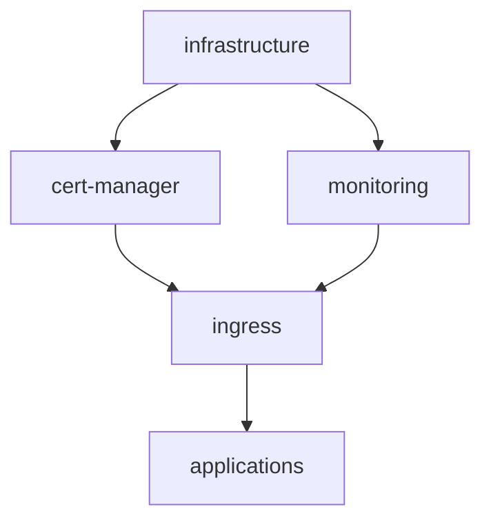

# How to Configure Kustomization Dependencies in Flux

Author: [nawazdhandala](https://github.com/nawazdhandala)

Tags: Flux CD, GitOps, Kubernetes, Kustomize, Dependencies, Ordering

Description: Learn how to use spec.dependsOn in Flux Kustomizations to define deployment ordering and ensure infrastructure is ready before applications are deployed.

---

## Introduction

In real-world Kubernetes deployments, resources often depend on each other. A database must be running before an application can connect to it. A certificate manager must be installed before ingress resources can use TLS certificates. The `spec.dependsOn` field in a Flux Kustomization lets you define these dependencies so that Flux deploys resources in the correct order. This guide covers how to configure dependencies, build dependency chains, and handle common patterns.

## How Dependencies Work

When a Kustomization has a `spec.dependsOn` entry, Flux will not start reconciling it until all referenced Kustomizations have a `Ready` status of `True`. If a dependency fails or is not yet ready, the dependent Kustomization waits.



In this diagram, the `applications` Kustomization depends on `ingress`, which depends on both `cert-manager` and `monitoring`, and all of these depend on `infrastructure`.

## Basic Dependency Configuration

To declare a dependency, add the name (and optionally namespace) of the Kustomization you depend on.

```yaml
# infrastructure.yaml - No dependencies, deployed first
apiVersion: kustomize.toolkit.fluxcd.io/v1
kind: Kustomization
metadata:
  name: infrastructure
  namespace: flux-system
spec:
  interval: 10m
  sourceRef:
    kind: GitRepository
    name: flux-system
  path: ./infrastructure
  prune: true
  timeout: 5m
  wait: true
---
# apps.yaml - Depends on infrastructure being ready
apiVersion: kustomize.toolkit.fluxcd.io/v1
kind: Kustomization
metadata:
  name: apps
  namespace: flux-system
spec:
  interval: 10m
  sourceRef:
    kind: GitRepository
    name: flux-system
  path: ./apps
  prune: true
  timeout: 5m
  # This Kustomization waits for infrastructure to be Ready
  dependsOn:
    - name: infrastructure
```

The `apps` Kustomization will not reconcile until `infrastructure` has successfully applied and all its health checks (or `wait` condition) have passed.

## Multiple Dependencies

A Kustomization can depend on multiple other Kustomizations. All dependencies must be ready before reconciliation begins.

```yaml
# app-kustomization.yaml - Depends on multiple Kustomizations
apiVersion: kustomize.toolkit.fluxcd.io/v1
kind: Kustomization
metadata:
  name: web-application
  namespace: flux-system
spec:
  interval: 10m
  sourceRef:
    kind: GitRepository
    name: flux-system
  path: ./apps/web
  prune: true
  timeout: 5m
  # All listed dependencies must be ready
  dependsOn:
    - name: database
    - name: cache
    - name: message-queue
```

## Cross-Namespace Dependencies

If the dependency is in a different namespace, specify it in the `dependsOn` entry.

```yaml
# cross-namespace-dependency.yaml - Depend on a Kustomization in another namespace
apiVersion: kustomize.toolkit.fluxcd.io/v1
kind: Kustomization
metadata:
  name: my-app
  namespace: team-a
spec:
  interval: 10m
  sourceRef:
    kind: GitRepository
    name: team-a-repo
    namespace: team-a
  path: ./deploy
  prune: true
  dependsOn:
    # Reference a Kustomization in a different namespace
    - name: shared-infrastructure
      namespace: flux-system
```

## Full Dependency Chain Example

Here is a complete example of a multi-tier deployment with a dependency chain. This is a common pattern for deploying an application stack.

```yaml
# 1-infrastructure.yaml - Base infrastructure (no dependencies)
apiVersion: kustomize.toolkit.fluxcd.io/v1
kind: Kustomization
metadata:
  name: infrastructure
  namespace: flux-system
spec:
  interval: 10m
  sourceRef:
    kind: GitRepository
    name: flux-system
  path: ./infrastructure/base
  prune: true
  timeout: 5m
  wait: true
---
# 2-cert-manager.yaml - Certificate management (depends on infrastructure)
apiVersion: kustomize.toolkit.fluxcd.io/v1
kind: Kustomization
metadata:
  name: cert-manager
  namespace: flux-system
spec:
  interval: 10m
  sourceRef:
    kind: GitRepository
    name: flux-system
  path: ./infrastructure/cert-manager
  prune: true
  timeout: 5m
  wait: true
  dependsOn:
    - name: infrastructure
---
# 3-database.yaml - Database (depends on infrastructure)
apiVersion: kustomize.toolkit.fluxcd.io/v1
kind: Kustomization
metadata:
  name: database
  namespace: flux-system
spec:
  interval: 10m
  sourceRef:
    kind: GitRepository
    name: flux-system
  path: ./infrastructure/database
  prune: true
  timeout: 10m
  wait: true
  dependsOn:
    - name: infrastructure
---
# 4-applications.yaml - Applications (depends on cert-manager and database)
apiVersion: kustomize.toolkit.fluxcd.io/v1
kind: Kustomization
metadata:
  name: applications
  namespace: flux-system
spec:
  interval: 10m
  sourceRef:
    kind: GitRepository
    name: flux-system
  path: ./apps
  prune: true
  timeout: 5m
  wait: true
  dependsOn:
    - name: cert-manager
    - name: database
```

## Why Health Checks Matter for Dependencies

Dependencies only work correctly when the upstream Kustomization reports an accurate health status. If the `infrastructure` Kustomization is marked as `Ready` before its resources are actually operational, the downstream `apps` Kustomization may fail.

Always use `wait: true` or explicit `healthChecks` on Kustomizations that other Kustomizations depend on.

```yaml
# dependency-with-health.yaml - Ensure dependency is truly healthy
apiVersion: kustomize.toolkit.fluxcd.io/v1
kind: Kustomization
metadata:
  name: database
  namespace: flux-system
spec:
  interval: 10m
  sourceRef:
    kind: GitRepository
    name: flux-system
  path: ./infrastructure/database
  prune: true
  timeout: 10m
  # Explicit health checks ensure the database is actually running
  healthChecks:
    - apiVersion: apps/v1
      kind: StatefulSet
      name: postgresql
      namespace: database
```

## Debugging Dependency Issues

When a Kustomization is stuck waiting for a dependency, check the dependency's status.

```bash
# Check which Kustomizations are not ready
flux get kustomizations

# Check a specific dependency status
kubectl describe kustomization infrastructure -n flux-system

# Force reconciliation of a stuck dependency
flux reconcile kustomization infrastructure

# View the dependency graph
flux tree kustomization apps
```

## Avoiding Circular Dependencies

Flux does not support circular dependencies. If Kustomization A depends on B and B depends on A, both will remain in a waiting state indefinitely. Always design your dependency graph as a directed acyclic graph (DAG).

```bash
# This will cause a deadlock - DO NOT do this
# A dependsOn B, B dependsOn A
```

## Best Practices

1. **Keep the dependency graph shallow** to minimize deployment latency. Deep dependency chains increase the total time to deploy everything.
2. **Always use health checks or wait on dependency targets** so that dependent Kustomizations only start when upstream resources are truly ready.
3. **Set appropriate timeouts** on dependencies. If a dependency times out, all downstream Kustomizations will also be blocked.
4. **Avoid circular dependencies**. Plan your dependency graph as a DAG before implementing it.
5. **Use the Flux CLI** to visualize your dependency graph with `flux tree kustomization` to verify the structure is correct.

## Conclusion

The `spec.dependsOn` field is essential for orchestrating multi-component deployments in Flux CD. By declaring explicit dependencies between Kustomizations, you ensure that infrastructure is ready before applications are deployed, databases are running before services connect to them, and certificate managers are operational before ingress resources are created. Combined with health checks and appropriate timeouts, dependencies give you a reliable, ordered deployment pipeline.
