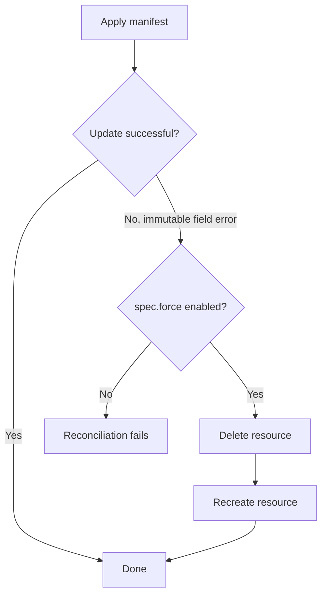

# How to Configure Kustomization Force Apply in Flux

Author: [nawazdhandala](https://github.com/nawazdhandala)

Tags: Flux CD, GitOps, Kubernetes, Kustomize, Force Apply, Immutable Fields

Description: Learn how to use spec.force in a Flux Kustomization to handle immutable field changes by deleting and recreating resources during reconciliation.

---

## Introduction

Certain Kubernetes resources have immutable fields that cannot be updated after creation. For example, a Job's `spec.template` or a Service's `spec.clusterIP` cannot be changed through a normal update. When Flux encounters such a change, the apply operation fails. The `spec.force` field in a Flux Kustomization tells the controller to delete and recreate resources when an update is not possible due to immutable field constraints. This guide covers when and how to use force apply safely.

## The Immutable Field Problem

Kubernetes enforces immutability on certain fields for good reasons. However, in a GitOps workflow, you sometimes need to change these fields. Here is a typical scenario.

You have a Job manifest in your Git repository:

```yaml
# deploy/job.yaml - A batch job
apiVersion: batch/v1
kind: Job
metadata:
  name: data-migration
  namespace: default
spec:
  template:
    spec:
      containers:
        - name: migrate
          image: myregistry.io/migration:v1
          command: ["./migrate.sh"]
      restartPolicy: Never
```

If you change the image from `v1` to `v2` and push the update, Flux will try to update the Job. But because `spec.template` is immutable on a Job, the update fails with an error like:

```text
field is immutable
```

## How spec.force Works

When `spec.force` is set to `true`, the Kustomize controller handles immutable field errors by deleting the existing resource and recreating it with the new specification. This is equivalent to running `kubectl delete` followed by `kubectl apply`.



## Enabling Force Apply

```yaml
# kustomization-force.yaml - Enable force apply
apiVersion: kustomize.toolkit.fluxcd.io/v1
kind: Kustomization
metadata:
  name: batch-jobs
  namespace: flux-system
spec:
  interval: 10m
  sourceRef:
    kind: GitRepository
    name: my-repo
  path: ./jobs
  prune: true
  # Force delete and recreate when immutable fields change
  force: true
```

With this configuration, if Flux encounters an immutable field error while updating any resource managed by this Kustomization, it will delete and recreate the resource.

## When to Use Force Apply

### Jobs and CronJobs

Jobs are the most common use case for force apply because their `spec.template` is immutable.

```yaml
# kustomization-jobs.yaml - Force apply for batch workloads
apiVersion: kustomize.toolkit.fluxcd.io/v1
kind: Kustomization
metadata:
  name: batch-workloads
  namespace: flux-system
spec:
  interval: 10m
  sourceRef:
    kind: GitRepository
    name: my-repo
  path: ./batch
  prune: true
  force: true
  timeout: 5m
```

### Services with ClusterIP Changes

If you need to change a Service's `spec.clusterIP`, force apply will handle the delete and recreate.

### StatefulSets with VolumeClaimTemplate Changes

Changes to `spec.volumeClaimTemplates` in a StatefulSet are immutable and require force apply.

## Force Apply with a Specific Kustomization

It is important to scope force apply carefully. Rather than enabling it on a large Kustomization that manages many resources, create a separate Kustomization for resources that frequently need force apply.

```yaml
# stable-kustomization.yaml - Normal apply for stable resources
apiVersion: kustomize.toolkit.fluxcd.io/v1
kind: Kustomization
metadata:
  name: stable-resources
  namespace: flux-system
spec:
  interval: 10m
  sourceRef:
    kind: GitRepository
    name: my-repo
  path: ./deploy/stable
  prune: true
  # No force - standard server-side apply
  force: false
---
# volatile-kustomization.yaml - Force apply for resources with immutable fields
apiVersion: kustomize.toolkit.fluxcd.io/v1
kind: Kustomization
metadata:
  name: volatile-resources
  namespace: flux-system
spec:
  interval: 10m
  sourceRef:
    kind: GitRepository
    name: my-repo
  path: ./deploy/volatile
  prune: true
  # Force apply for Jobs, certain Services, etc.
  force: true
```

## Risks of Force Apply

Force apply is a powerful feature, but it comes with risks:

### Downtime

When a resource is deleted and recreated, there is a brief period where the resource does not exist. For Deployments, this means all pods are terminated before new ones are created, causing downtime. For Services, the endpoint is temporarily unavailable.

### Data Loss

Force applying a PersistentVolumeClaim will delete the PVC and its associated data (unless the PersistentVolume has a `Retain` reclaim policy). Be extremely careful with stateful resources.

### Race Conditions

If other controllers or processes depend on the resource, the brief deletion window may cause errors or unexpected behavior.

## Safer Alternative: Recreating Specific Resources

Instead of enabling `spec.force` on the entire Kustomization, you can use a naming strategy for resources like Jobs. By including a version or hash in the Job name, you create a new resource instead of trying to update the existing one.

```yaml
# deploy/job.yaml - Use a unique name to avoid immutable field issues
apiVersion: batch/v1
kind: Job
metadata:
  # Include a version in the name so each change creates a new Job
  name: data-migration-v2
  namespace: default
spec:
  template:
    spec:
      containers:
        - name: migrate
          image: myregistry.io/migration:v2
          command: ["./migrate.sh"]
      restartPolicy: Never
```

With this approach, you do not need `spec.force` because Flux creates a new Job with a new name rather than trying to update the immutable existing one. Combined with `prune: true`, the old Job will be cleaned up automatically.

## Combining Force Apply with Other Fields

```yaml
# kustomization-force-complete.yaml - Force apply with health checks and timeout
apiVersion: kustomize.toolkit.fluxcd.io/v1
kind: Kustomization
metadata:
  name: batch-workloads
  namespace: flux-system
spec:
  interval: 10m
  sourceRef:
    kind: GitRepository
    name: my-repo
  path: ./batch
  prune: true
  force: true
  # Give resources time to be recreated and become healthy
  timeout: 5m
  # Wait for recreated resources to be ready
  wait: true
  # Retry quickly if force apply fails
  retryInterval: 1m
```

## Debugging Force Apply Issues

```bash
# Check the Kustomization status for force apply events
kubectl describe kustomization batch-workloads -n flux-system

# Look for delete and create events
kubectl get events -n default --sort-by=.lastTimestamp

# Verify the resource was recreated
kubectl get jobs -n default

# Force an immediate reconciliation to test force apply
flux reconcile kustomization batch-workloads
```

## Best Practices

1. **Use force apply sparingly** and only for Kustomizations that manage resources with immutable fields, such as Jobs.
2. **Separate volatile resources** into their own Kustomization with `force: true` to avoid unintended deletions of stable resources.
3. **Consider naming strategies** for Jobs and similar resources to avoid the need for force apply entirely.
4. **Never use force apply on stateful resources** like PersistentVolumeClaims unless you understand the data loss implications.
5. **Set appropriate timeouts** when using force apply, as the delete-and-recreate cycle takes longer than a normal update.
6. **Monitor events** after enabling force apply to ensure resources are being recreated as expected.

## Conclusion

The `spec.force` field solves the specific problem of updating resources with immutable fields in a GitOps workflow. By enabling force apply, you allow Flux to delete and recreate resources when a standard update is not possible. However, this power comes with risks including downtime and potential data loss. Use it judiciously, scope it to specific Kustomizations, and consider alternative approaches like unique resource naming before reaching for force apply.
