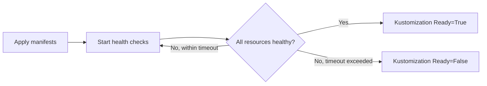

# How to Configure Kustomization Health Checks in Flux

Author: [nawazdhandala](https://github.com/nawazdhandala)

Tags: Flux CD, GitOps, Kubernetes, Kustomize, Health Checks, Monitoring

Description: Learn how to configure health checks in a Flux Kustomization to verify that deployed resources reach a healthy state after reconciliation.

---

## Introduction

When Flux applies manifests to your cluster, it is not enough to know that the resources were created. You need to verify that they are actually running and healthy. The `spec.healthChecks` field in a Flux Kustomization lets you define which resources Flux should monitor after applying manifests. If a health check fails, the Kustomization is marked as unhealthy, and dependent Kustomizations will not proceed. This guide covers how to configure health checks effectively.

## How Health Checks Work

After Flux applies the manifests from a Kustomization, it evaluates the health of specified resources by checking their status conditions. Different resource types have different health criteria:

- **Deployments**: All replicas are available and up to date
- **StatefulSets**: All replicas are ready
- **DaemonSets**: The desired number of pods are scheduled and ready
- **Services**: Endpoints are available (for ClusterIP/LoadBalancer types)
- **Custom Resources**: The `Ready` condition is `True`



## Configuring Health Checks

To add health checks, specify the resources you want to monitor in the `spec.healthChecks` array.

```yaml
# kustomization-health.yaml - Kustomization with health checks
apiVersion: kustomize.toolkit.fluxcd.io/v1
kind: Kustomization
metadata:
  name: my-app
  namespace: flux-system
spec:
  interval: 10m
  sourceRef:
    kind: GitRepository
    name: my-repo
  path: ./deploy
  prune: true
  # Timeout for health checks to pass
  timeout: 5m
  # Resources to monitor for health
  healthChecks:
    - apiVersion: apps/v1
      kind: Deployment
      name: frontend
      namespace: default
    - apiVersion: apps/v1
      kind: Deployment
      name: backend
      namespace: default
```

Each entry in `healthChecks` requires:

- `apiVersion`: The API version of the resource
- `kind`: The resource kind
- `name`: The resource name
- `namespace`: The namespace where the resource lives

## Health Checks for Different Resource Types

### Deployments and StatefulSets

```yaml
# health-checks-workloads.yaml - Health checks for various workload types
apiVersion: kustomize.toolkit.fluxcd.io/v1
kind: Kustomization
metadata:
  name: workloads
  namespace: flux-system
spec:
  interval: 10m
  sourceRef:
    kind: GitRepository
    name: my-repo
  path: ./workloads
  prune: true
  timeout: 5m
  healthChecks:
    # Check that a Deployment is fully rolled out
    - apiVersion: apps/v1
      kind: Deployment
      name: api-server
      namespace: production
    # Check that a StatefulSet has all pods ready
    - apiVersion: apps/v1
      kind: StatefulSet
      name: database
      namespace: production
    # Check that a DaemonSet is scheduled on all nodes
    - apiVersion: apps/v1
      kind: DaemonSet
      name: log-collector
      namespace: production
```

### Services and Ingresses

```yaml
# health-checks-networking.yaml - Health checks for networking resources
apiVersion: kustomize.toolkit.fluxcd.io/v1
kind: Kustomization
metadata:
  name: networking
  namespace: flux-system
spec:
  interval: 10m
  sourceRef:
    kind: GitRepository
    name: my-repo
  path: ./networking
  prune: true
  timeout: 3m
  healthChecks:
    # Check that a Service has endpoints
    - apiVersion: v1
      kind: Service
      name: api-gateway
      namespace: production
    # Check that an Ingress is configured
    - apiVersion: networking.k8s.io/v1
      kind: Ingress
      name: api-ingress
      namespace: production
```

### Custom Resources

For custom resources, Flux checks for a `Ready` condition in the resource's status. This works with any operator that follows the Kubernetes status condition convention.

```yaml
# health-checks-custom.yaml - Health checks for custom resources
apiVersion: kustomize.toolkit.fluxcd.io/v1
kind: Kustomization
metadata:
  name: databases
  namespace: flux-system
spec:
  interval: 10m
  sourceRef:
    kind: GitRepository
    name: my-repo
  path: ./databases
  prune: true
  timeout: 10m
  healthChecks:
    # Check a PostgreSQL custom resource managed by an operator
    - apiVersion: postgresql.cnpg.io/v1
      kind: Cluster
      name: app-database
      namespace: production
```

## Using spec.wait Instead of healthChecks

As an alternative to listing individual resources in `healthChecks`, you can use `spec.wait` to tell Flux to wait for all resources applied by the Kustomization to become ready.

```yaml
# kustomization-wait.yaml - Wait for all resources to be healthy
apiVersion: kustomize.toolkit.fluxcd.io/v1
kind: Kustomization
metadata:
  name: my-app
  namespace: flux-system
spec:
  interval: 10m
  sourceRef:
    kind: GitRepository
    name: my-repo
  path: ./deploy
  prune: true
  timeout: 5m
  # Wait for ALL applied resources to become ready
  wait: true
```

The difference is:

- `healthChecks`: You explicitly list which resources to monitor. Only those resources are checked.
- `wait`: Flux waits for every resource applied by the Kustomization to become ready.

Use `healthChecks` when you want fine-grained control. Use `wait` when you want all resources checked without listing them individually.

## Combining Health Checks with Timeout

The `spec.timeout` field controls how long Flux waits for health checks to pass. If the timeout expires before all health checks succeed, the Kustomization is marked as failed.

```yaml
# kustomization-timeout-health.yaml - Health checks with a generous timeout
apiVersion: kustomize.toolkit.fluxcd.io/v1
kind: Kustomization
metadata:
  name: slow-startup-app
  namespace: flux-system
spec:
  interval: 10m
  sourceRef:
    kind: GitRepository
    name: my-repo
  path: ./deploy
  prune: true
  # Allow 10 minutes for the app to become healthy
  timeout: 10m
  healthChecks:
    - apiVersion: apps/v1
      kind: Deployment
      name: ml-model-server
      namespace: default
```

## Debugging Failed Health Checks

When health checks fail, use the following commands to diagnose the issue.

```bash
# Check the Kustomization status for health check failures
flux get kustomization my-app

# Get detailed status including health check results
kubectl describe kustomization my-app -n flux-system

# Check the actual resource that failed the health check
kubectl describe deployment frontend -n default

# Check pod events for the failing deployment
kubectl get events -n default --field-selector involvedObject.name=frontend
```

## Best Practices

1. **Always set a timeout** when using health checks. Without a timeout, Flux may wait indefinitely for resources that will never become healthy.
2. **Start with critical resources** in your health checks rather than listing every resource. Focus on Deployments and StatefulSets that indicate the application is truly running.
3. **Use `wait: true`** for simple setups where you want all resources checked. Switch to explicit `healthChecks` when you need to exclude certain resources.
4. **Set appropriate timeouts** based on how long your application takes to start. Applications with large container images or slow initialization may need longer timeouts.
5. **Combine health checks with dependencies** so that downstream Kustomizations only proceed when upstream resources are confirmed healthy.

## Conclusion

Health checks are essential for a reliable GitOps workflow. They ensure that Flux does not consider a reconciliation successful until the deployed resources are actually running and healthy. By combining `spec.healthChecks` with `spec.timeout`, you create a deployment pipeline that catches failures early and prevents cascading issues across dependent Kustomizations.
