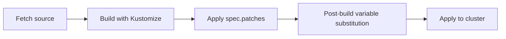

# How to Configure Kustomization Patches in Flux

Author: [nawazdhandala](https://github.com/nawazdhandala)

Tags: Flux CD, GitOps, Kubernetes, Kustomize, Patches, Inline Patches

Description: Learn how to use spec.patches in a Flux Kustomization to modify resources inline without changing the original manifests in your source repository.

---

## Introduction

The `spec.patches` field in a Flux Kustomization lets you apply patches to resources inline, directly within the Kustomization resource definition. This means you can modify manifests from your source repository without changing the actual source files. Patches are applied after Kustomize builds the manifests but before they are sent to the cluster. This is useful for environment-specific overrides, adding labels, changing replica counts, or any modification that should differ between clusters or environments.

## How Patches Work in Flux

Flux supports inline patches through the `spec.patches` field. Each patch entry consists of a `patch` (the modification to apply) and a `target` (the resource to modify). The patch format follows the standard Kubernetes strategic merge patch or JSON patch syntax.



Patches are applied before post-build variable substitution, which means patches can include `${VAR_NAME}` references that will be resolved later.

## Basic Patch Configuration

Here is a simple example that patches a Deployment to change its replica count.

```yaml
# kustomization-patch.yaml - Patch a deployment's replica count
apiVersion: kustomize.toolkit.fluxcd.io/v1
kind: Kustomization
metadata:
  name: my-app
  namespace: flux-system
spec:
  interval: 10m
  sourceRef:
    kind: GitRepository
    name: my-repo
  path: ./deploy
  prune: true
  patches:
    # Patch to override the replica count
    - patch: |
        apiVersion: apps/v1
        kind: Deployment
        metadata:
          name: web-app
        spec:
          replicas: 5
      target:
        kind: Deployment
        name: web-app
```

The `patch` field contains a YAML document that is merged with the target resource. Only the fields you specify are modified; all other fields remain unchanged.

## Targeting Resources

The `target` field supports several selectors to identify which resources the patch applies to.

### By Name and Kind

```yaml
# Target a specific resource by name and kind
patches:
  - patch: |
      apiVersion: apps/v1
      kind: Deployment
      metadata:
        name: api-server
      spec:
        replicas: 3
    target:
      kind: Deployment
      name: api-server
```

### By Label Selector

```yaml
# Target all resources matching a label selector
patches:
  - patch: |
      apiVersion: apps/v1
      kind: Deployment
      metadata:
        name: not-used
      spec:
        template:
          metadata:
            annotations:
              prometheus.io/scrape: "true"
    target:
      kind: Deployment
      labelSelector: "app.kubernetes.io/part-of=my-system"
```

### By Namespace

```yaml
# Target resources in a specific namespace
patches:
  - patch: |
      apiVersion: apps/v1
      kind: Deployment
      metadata:
        name: not-used
      spec:
        replicas: 1
    target:
      kind: Deployment
      namespace: staging
```

### By Annotation Selector

```yaml
# Target resources with a specific annotation
patches:
  - patch: |
      apiVersion: apps/v1
      kind: Deployment
      metadata:
        name: not-used
      spec:
        template:
          spec:
            nodeSelector:
              dedicated: high-memory
    target:
      kind: Deployment
      annotationSelector: "tier=premium"
```

## Common Patch Use Cases

### Adding Labels and Annotations

```yaml
# kustomization-labels.yaml - Add labels to all Deployments
apiVersion: kustomize.toolkit.fluxcd.io/v1
kind: Kustomization
metadata:
  name: my-app
  namespace: flux-system
spec:
  interval: 10m
  sourceRef:
    kind: GitRepository
    name: my-repo
  path: ./deploy
  prune: true
  patches:
    # Add environment labels to all Deployments
    - patch: |
        apiVersion: apps/v1
        kind: Deployment
        metadata:
          name: not-used
          labels:
            environment: production
            managed-by: flux
    target:
      kind: Deployment
```

### Modifying Container Resources

```yaml
# kustomization-resources.yaml - Override container resource limits
apiVersion: kustomize.toolkit.fluxcd.io/v1
kind: Kustomization
metadata:
  name: my-app-production
  namespace: flux-system
spec:
  interval: 10m
  sourceRef:
    kind: GitRepository
    name: my-repo
  path: ./deploy
  prune: true
  patches:
    # Set resource limits for production
    - patch: |
        apiVersion: apps/v1
        kind: Deployment
        metadata:
          name: web-app
        spec:
          template:
            spec:
              containers:
                - name: web
                  resources:
                    requests:
                      cpu: 500m
                      memory: 256Mi
                    limits:
                      cpu: "1"
                      memory: 512Mi
      target:
        kind: Deployment
        name: web-app
```

### Adding Environment Variables

```yaml
# kustomization-env.yaml - Add environment variables
apiVersion: kustomize.toolkit.fluxcd.io/v1
kind: Kustomization
metadata:
  name: my-app
  namespace: flux-system
spec:
  interval: 10m
  sourceRef:
    kind: GitRepository
    name: my-repo
  path: ./deploy
  prune: true
  patches:
    - patch: |
        apiVersion: apps/v1
        kind: Deployment
        metadata:
          name: web-app
        spec:
          template:
            spec:
              containers:
                - name: web
                  env:
                    - name: NODE_ENV
                      value: production
                    - name: LOG_FORMAT
                      value: json
      target:
        kind: Deployment
        name: web-app
```

### Adding Tolerations and Node Affinity

```yaml
# kustomization-scheduling.yaml - Add scheduling constraints
apiVersion: kustomize.toolkit.fluxcd.io/v1
kind: Kustomization
metadata:
  name: my-app
  namespace: flux-system
spec:
  interval: 10m
  sourceRef:
    kind: GitRepository
    name: my-repo
  path: ./deploy
  prune: true
  patches:
    - patch: |
        apiVersion: apps/v1
        kind: Deployment
        metadata:
          name: web-app
        spec:
          template:
            spec:
              tolerations:
                - key: "dedicated"
                  operator: "Equal"
                  value: "web"
                  effect: "NoSchedule"
              nodeSelector:
                node-type: web
      target:
        kind: Deployment
        name: web-app
```

## Multiple Patches

You can define multiple patches in a single Kustomization. They are applied in order.

```yaml
# kustomization-multiple-patches.yaml - Multiple patches
apiVersion: kustomize.toolkit.fluxcd.io/v1
kind: Kustomization
metadata:
  name: my-app
  namespace: flux-system
spec:
  interval: 10m
  sourceRef:
    kind: GitRepository
    name: my-repo
  path: ./deploy
  prune: true
  patches:
    # Patch 1: Set replicas
    - patch: |
        apiVersion: apps/v1
        kind: Deployment
        metadata:
          name: web-app
        spec:
          replicas: 5
      target:
        kind: Deployment
        name: web-app
    # Patch 2: Add labels to all Services
    - patch: |
        apiVersion: v1
        kind: Service
        metadata:
          name: not-used
          labels:
            environment: production
      target:
        kind: Service
    # Patch 3: Set image pull policy for all containers
    - patch: |
        apiVersion: apps/v1
        kind: Deployment
        metadata:
          name: not-used
        spec:
          template:
            spec:
              containers:
                - name: "*"
                  imagePullPolicy: Always
      target:
        kind: Deployment
```

## Verifying Patches

```bash
# Preview how patches will modify the manifests
flux build kustomization my-app

# Check the Kustomization status for patch-related errors
kubectl describe kustomization my-app -n flux-system
```

## Best Practices

1. **Use patches for environment-specific overrides** rather than duplicating manifests across environments.
2. **Keep patches focused**: Each patch should make one logical change. Use multiple patches rather than one large patch.
3. **Use label selectors** to apply the same patch to multiple resources when the modification is common (like adding labels or annotations).
4. **Test patches** with `flux build kustomization` before pushing changes to verify the expected output.
5. **Document why each patch exists** with comments in your YAML, especially for non-obvious modifications.

## Conclusion

The `spec.patches` field in Flux Kustomizations provides a powerful way to modify resources inline without changing the source manifests. Whether you need to adjust replica counts, add labels, modify resource limits, or configure scheduling constraints, patches let you make environment-specific changes while keeping your base manifests clean and reusable. For more advanced patching scenarios, see the companion guides on strategic merge patches and JSON patches.
