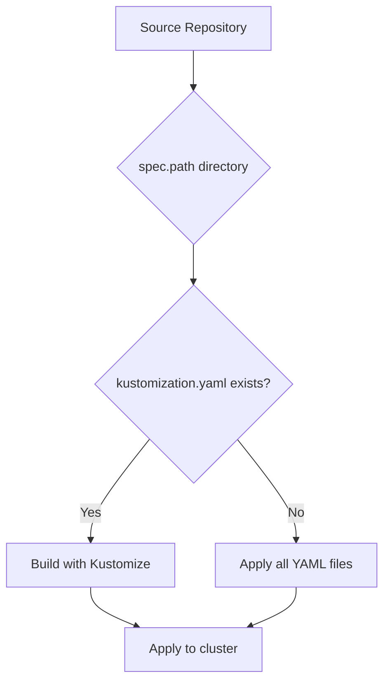

# How to Configure Kustomization Path in Flux

Author: [nawazdhandala](https://github.com/nawazdhandala)

Tags: Flux CD, GitOps, Kubernetes, Kustomize, Kustomization Path, Repository Structure

Description: Learn how to configure the spec.path field in a Flux Kustomization to point to the correct directory of manifests in your source repository.

---

## Introduction

The `spec.path` field in a Flux Kustomization resource defines which directory within a source repository contains the Kubernetes manifests that Flux should apply. Getting this configuration right is essential because it determines what gets deployed to your cluster. This guide covers how to set the path correctly, common repository structures, and best practices for organizing your manifests.

## How spec.path Works

When Flux reconciles a Kustomization, it fetches the artifact from the referenced source (such as a GitRepository), then looks inside the directory specified by `spec.path` for Kubernetes manifests. If a `kustomization.yaml` file exists in that directory, Flux uses Kustomize to build the manifests. If no `kustomization.yaml` file is present, Flux applies all YAML files in the directory.



## Basic Path Configuration

The path is relative to the root of the source repository. Here is a simple example.

```yaml
# kustomization.yaml - Basic path configuration
apiVersion: kustomize.toolkit.fluxcd.io/v1
kind: Kustomization
metadata:
  name: my-app
  namespace: flux-system
spec:
  interval: 10m
  sourceRef:
    kind: GitRepository
    name: my-repo
  # Path relative to the repository root
  path: ./deploy
  prune: true
```

The `./` prefix is conventional and indicates the repository root. You can also use paths without it, but using `./` makes the intent clearer.

## Common Repository Structures

### Single Application Repository

For a repository that contains a single application, you might place manifests at the root or in a dedicated directory.

```yaml
# Point to a subdirectory in a single-app repo
apiVersion: kustomize.toolkit.fluxcd.io/v1
kind: Kustomization
metadata:
  name: my-app
  namespace: flux-system
spec:
  interval: 10m
  sourceRef:
    kind: GitRepository
    name: my-app-repo
  # Manifests are in the kubernetes directory
  path: ./kubernetes
  prune: true
```

### Multi-Environment Repository

A common pattern is to have separate directories for each environment. Each environment gets its own Kustomization resource pointing to a different path.

```yaml
# staging-kustomization.yaml - Path for staging environment
apiVersion: kustomize.toolkit.fluxcd.io/v1
kind: Kustomization
metadata:
  name: my-app-staging
  namespace: flux-system
spec:
  interval: 5m
  sourceRef:
    kind: GitRepository
    name: my-repo
  # Staging overlay directory
  path: ./environments/staging
  prune: true
---
# production-kustomization.yaml - Path for production environment
apiVersion: kustomize.toolkit.fluxcd.io/v1
kind: Kustomization
metadata:
  name: my-app-production
  namespace: flux-system
spec:
  interval: 10m
  sourceRef:
    kind: GitRepository
    name: my-repo
  # Production overlay directory
  path: ./environments/production
  prune: true
```

This assumes a repository structure like:

```bash
# Typical multi-environment repository layout
# my-repo/
# ├── base/
# │   ├── deployment.yaml
# │   ├── service.yaml
# │   └── kustomization.yaml
# ├── environments/
# │   ├── staging/
# │   │   ├── kustomization.yaml   <-- references ../base with patches
# │   │   └── patch-replicas.yaml
# │   └── production/
# │       ├── kustomization.yaml   <-- references ../base with patches
# │       └── patch-replicas.yaml
```

### Multi-Cluster Repository

For managing multiple clusters from a single repository, organize paths by cluster.

```yaml
# cluster-a-kustomization.yaml - Path for cluster A
apiVersion: kustomize.toolkit.fluxcd.io/v1
kind: Kustomization
metadata:
  name: infrastructure
  namespace: flux-system
spec:
  interval: 10m
  sourceRef:
    kind: GitRepository
    name: fleet-repo
  # Path specific to this cluster
  path: ./clusters/cluster-a/infrastructure
  prune: true
```

### Nested Path with Kustomize Overlays

When using Kustomize overlays, the path should point to the overlay directory, not the base directory. The overlay's `kustomization.yaml` file will reference the base directory internally.

```yaml
# overlay-kustomization.yaml - Point to the overlay, not the base
apiVersion: kustomize.toolkit.fluxcd.io/v1
kind: Kustomization
metadata:
  name: my-app-with-overlay
  namespace: flux-system
spec:
  interval: 10m
  sourceRef:
    kind: GitRepository
    name: my-repo
  # Point to the overlay directory that references base internally
  path: ./overlays/production
  prune: true
```

## Using Path with the Root Directory

If your manifests are at the repository root, set the path to `./`.

```yaml
# root-path-kustomization.yaml - Manifests at repository root
apiVersion: kustomize.toolkit.fluxcd.io/v1
kind: Kustomization
metadata:
  name: my-app
  namespace: flux-system
spec:
  interval: 10m
  sourceRef:
    kind: GitRepository
    name: my-repo
  # Apply manifests from the repository root
  path: ./
  prune: true
```

## Verifying the Path

If your Kustomization fails to reconcile, the path is one of the first things to check. Use the following commands to debug.

```bash
# Check the Kustomization status for path-related errors
flux get kustomization my-app

# Get detailed error messages
kubectl describe kustomization my-app -n flux-system

# Preview what Flux would apply from the configured path
flux build kustomization my-app
```

Common error messages related to path misconfiguration include "path not found" or "no Kubernetes manifests found." These indicate that the configured path does not exist in the source repository or contains no valid YAML files.

## Best Practices

1. **Always use relative paths** starting with `./` to make the path reference clear and consistent.
2. **Keep environment-specific configurations in separate directories** and use one Kustomization per environment.
3. **Use Kustomize overlays** with a shared base directory to avoid duplicating manifests across environments.
4. **Avoid deeply nested paths** when possible, as they make debugging harder and repository navigation more complex.
5. **Name your Kustomization resources** to reflect the path they point to, making it easy to identify which directory each resource manages.

## Conclusion

The `spec.path` field is a straightforward but critical part of any Flux Kustomization configuration. It determines which manifests Flux applies to your cluster. By organizing your repository with clear directory structures and pointing each Kustomization at the right path, you build a maintainable GitOps workflow that scales across environments and clusters.
