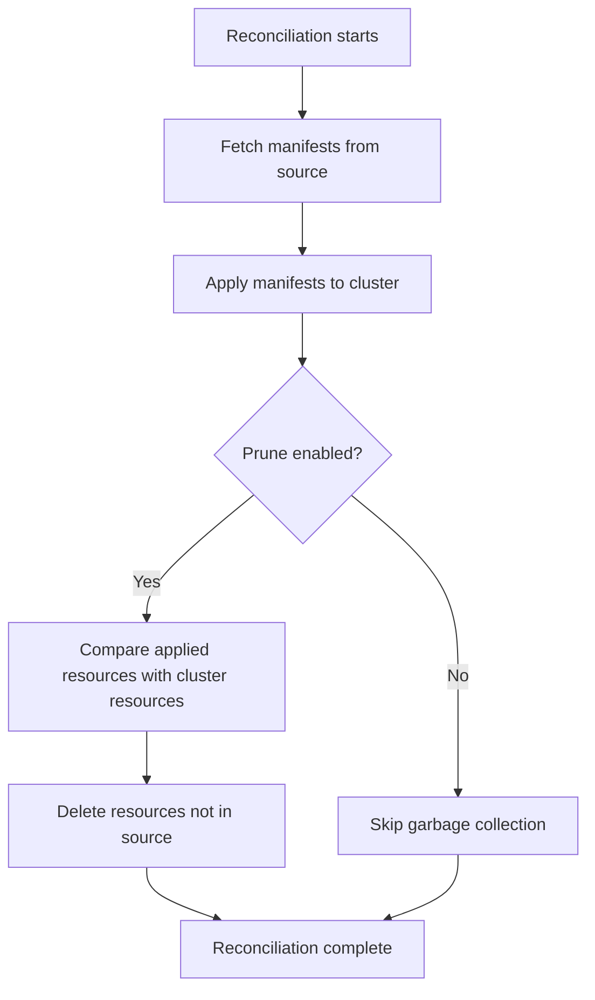

# How to Configure Kustomization Prune in Flux

Author: [nawazdhandala](https://github.com/nawazdhandala)

Tags: Flux CD, GitOps, Kubernetes, Kustomize, Pruning, Garbage Collection

Description: Learn how to configure the spec.prune field in a Flux Kustomization to automatically remove Kubernetes resources that are no longer defined in your Git repository.

---

## Introduction

One of the core principles of GitOps is that your Git repository is the single source of truth for your cluster state. When you remove a manifest from your repository, the corresponding resource should also be removed from the cluster. The `spec.prune` field in a Flux Kustomization enables this behavior by automatically garbage collecting resources that are no longer present in the source. This guide explains how pruning works, how to configure it, and what safeguards to consider.

## How Pruning Works

When Flux applies manifests from a Kustomization, it labels every resource it creates with metadata that ties it back to the Kustomization. During subsequent reconciliations, Flux compares the set of resources in the source with the set of labeled resources in the cluster. If a resource exists in the cluster but is no longer in the source, and pruning is enabled, Flux deletes it.



## Enabling Pruning

To enable pruning, set `spec.prune` to `true` in your Kustomization resource.

```yaml
# kustomization-with-prune.yaml - Enable automatic pruning
apiVersion: kustomize.toolkit.fluxcd.io/v1
kind: Kustomization
metadata:
  name: my-app
  namespace: flux-system
spec:
  interval: 10m
  sourceRef:
    kind: GitRepository
    name: my-repo
  path: ./deploy
  # Enable pruning to garbage collect removed resources
  prune: true
```

With this configuration, if you delete `service.yaml` from the `./deploy` directory in your Git repository and push the change, Flux will detect on the next reconciliation that the Service resource is no longer in the source and will delete it from the cluster.

## Disabling Pruning

If you set `spec.prune` to `false`, Flux will only create and update resources but will never delete them automatically.

```yaml
# kustomization-no-prune.yaml - Disable pruning
apiVersion: kustomize.toolkit.fluxcd.io/v1
kind: Kustomization
metadata:
  name: my-app
  namespace: flux-system
spec:
  interval: 10m
  sourceRef:
    kind: GitRepository
    name: my-repo
  path: ./deploy
  # Do not delete resources removed from the source
  prune: false
```

This is useful during initial setup or migration phases when you want full control over resource deletion.

## Protecting Resources from Pruning

Sometimes you want pruning enabled for most resources but need to protect specific resources from being deleted. You can annotate individual resources to prevent Flux from pruning them.

```yaml
# protected-configmap.yaml - Prevent this resource from being pruned
apiVersion: v1
kind: ConfigMap
metadata:
  name: important-config
  namespace: default
  annotations:
    # This annotation prevents Flux from deleting this resource
    kustomize.toolkit.fluxcd.io/prune: disabled
data:
  key: value
```

When Flux encounters a resource with the `kustomize.toolkit.fluxcd.io/prune: disabled` annotation, it will skip that resource during garbage collection even if it is no longer present in the source.

## Pruning and Resource Ordering

Flux deletes pruned resources in reverse order of their apply order. This means that resources that depend on others are deleted first. For example, if a Deployment depends on a ConfigMap, Flux will delete the Deployment before deleting the ConfigMap.

## Practical Example: Removing a Service

Here is a walkthrough of how pruning works in practice. Suppose your repository has the following manifests.

```yaml
# deploy/deployment.yaml - Application deployment
apiVersion: apps/v1
kind: Deployment
metadata:
  name: web-app
  namespace: default
spec:
  replicas: 2
  selector:
    matchLabels:
      app: web-app
  template:
    metadata:
      labels:
        app: web-app
    spec:
      containers:
        - name: web
          image: nginx:1.25
---
# deploy/service.yaml - Service exposing the deployment
apiVersion: v1
kind: Service
metadata:
  name: web-app
  namespace: default
spec:
  selector:
    app: web-app
  ports:
    - port: 80
      targetPort: 80
```

Now you decide to remove the Service. You delete `deploy/service.yaml` from your repository and commit the change.

```bash
# Remove the service manifest and push
cd my-repo
git rm deploy/service.yaml
git commit -m "Remove web-app service"
git push
```

On the next reconciliation, Flux detects that the Service resource is no longer in the source and deletes it from the cluster. You can verify this.

```bash
# Check that the service has been removed
kubectl get service web-app -n default
# Expected: Error from server (NotFound): services "web-app" not found

# Check Flux events for pruning activity
kubectl get events -n flux-system --field-selector reason=Prune
```

## What Happens When a Kustomization Is Deleted

If you delete the Kustomization resource itself while `spec.prune` is `true`, Flux will garbage collect all resources that were managed by that Kustomization. This is the expected behavior: deleting the Kustomization is equivalent to removing all its managed manifests.

```bash
# Deleting a Kustomization with prune=true removes all managed resources
kubectl delete kustomization my-app -n flux-system
```

If you want to delete the Kustomization without removing its managed resources, first set `spec.prune` to `false`, wait for a reconciliation, and then delete the Kustomization.

```bash
# Step 1: Disable pruning first
kubectl patch kustomization my-app -n flux-system \
  --type merge -p '{"spec":{"prune":false}}'

# Step 2: Wait for reconciliation
flux reconcile kustomization my-app

# Step 3: Now safely delete the Kustomization without affecting managed resources
kubectl delete kustomization my-app -n flux-system
```

## Best Practices

1. **Always enable pruning in production** to ensure your cluster stays in sync with your Git repository. Without pruning, orphaned resources accumulate over time.
2. **Use the prune-disabled annotation** for critical resources such as PersistentVolumeClaims or custom resource definitions that should never be automatically deleted.
3. **Test pruning in staging first** before enabling it in production to understand which resources will be affected.
4. **Monitor Flux events** for pruning activity so you are aware of what is being garbage collected.
5. **Be careful when deleting a Kustomization** with `prune: true` as it will remove all managed resources from the cluster.

## Conclusion

The `spec.prune` field is a powerful feature that keeps your cluster in lockstep with your Git repository. By enabling pruning, you ensure that removed manifests result in removed cluster resources, preventing configuration drift and orphaned objects. Combine pruning with the prune-disabled annotation for fine-grained control over which resources Flux can automatically delete.
