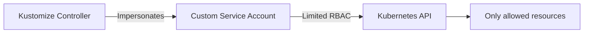

# How to Configure Kustomization Service Account in Flux

Author: [nawazdhandala](https://github.com/nawazdhandala)

Tags: Flux CD, GitOps, Kubernetes, Kustomize, Service Account, RBAC, Multi-Tenancy

Description: Learn how to use spec.serviceAccountName in a Flux Kustomization to control RBAC permissions and limit what resources Flux can manage in a multi-tenancy setup.

---

## Introduction

By default, the Flux Kustomize controller uses its own service account to apply resources to the cluster. This gives it broad permissions. In multi-tenancy environments or security-conscious setups, you may want to restrict what a Kustomization can do by specifying a custom service account with limited RBAC permissions. The `spec.serviceAccountName` field lets you impersonate a specific service account when applying resources. This guide covers how to set this up, create the necessary RBAC roles, and use service accounts effectively.

## How serviceAccountName Works

When you set `spec.serviceAccountName`, the Kustomize controller impersonates that service account when applying manifests. The controller itself needs permission to impersonate service accounts, and the specified service account must have the RBAC permissions needed to create, update, and delete the resources defined in the Kustomization.



If the service account lacks permission to create a resource, the apply will fail with a forbidden error. This is the intended behavior and provides a security boundary.

## Setting Up a Service Account

### Step 1: Create the Service Account

```yaml
# service-account.yaml - Service account for the tenant
apiVersion: v1
kind: ServiceAccount
metadata:
  name: tenant-a-reconciler
  namespace: tenant-a
```

### Step 2: Create a Role with Limited Permissions

Define a Role that grants only the permissions needed for the resources the Kustomization will manage.

```yaml
# role.yaml - Limited permissions for tenant resources
apiVersion: rbac.authorization.k8s.io/v1
kind: Role
metadata:
  name: tenant-a-reconciler
  namespace: tenant-a
rules:
  # Allow managing Deployments
  - apiGroups: ["apps"]
    resources: ["deployments"]
    verbs: ["get", "list", "watch", "create", "update", "patch", "delete"]
  # Allow managing Services
  - apiGroups: [""]
    resources: ["services", "configmaps", "secrets"]
    verbs: ["get", "list", "watch", "create", "update", "patch", "delete"]
  # Allow managing Ingresses
  - apiGroups: ["networking.k8s.io"]
    resources: ["ingresses"]
    verbs: ["get", "list", "watch", "create", "update", "patch", "delete"]
```

### Step 3: Bind the Role to the Service Account

```yaml
# rolebinding.yaml - Bind the role to the service account
apiVersion: rbac.authorization.k8s.io/v1
kind: RoleBinding
metadata:
  name: tenant-a-reconciler
  namespace: tenant-a
subjects:
  - kind: ServiceAccount
    name: tenant-a-reconciler
    namespace: tenant-a
roleRef:
  kind: Role
  name: tenant-a-reconciler
  apiGroup: rbac.authorization.k8s.io
```

### Step 4: Apply the RBAC Resources

```bash
# Apply the service account and RBAC configuration
kubectl apply -f service-account.yaml
kubectl apply -f role.yaml
kubectl apply -f rolebinding.yaml
```

## Using the Service Account in a Kustomization

Reference the service account in your Kustomization with `spec.serviceAccountName`.

```yaml
# kustomization-sa.yaml - Use a custom service account
apiVersion: kustomize.toolkit.fluxcd.io/v1
kind: Kustomization
metadata:
  name: tenant-a-app
  namespace: flux-system
spec:
  interval: 10m
  sourceRef:
    kind: GitRepository
    name: tenant-a-repo
  path: ./deploy
  prune: true
  targetNamespace: tenant-a
  # Impersonate this service account when applying resources
  serviceAccountName: tenant-a-reconciler
```

Now when Flux applies the manifests for this Kustomization, it will do so as the `tenant-a-reconciler` service account, which is limited to the permissions defined in the Role.

## Multi-Tenancy Pattern

A complete multi-tenancy setup typically involves creating a service account per tenant, each with permissions scoped to their namespace.

```yaml
# tenant-a-rbac.yaml - Complete RBAC setup for tenant A
apiVersion: v1
kind: Namespace
metadata:
  name: tenant-a
---
apiVersion: v1
kind: ServiceAccount
metadata:
  name: tenant-a-reconciler
  namespace: tenant-a
---
apiVersion: rbac.authorization.k8s.io/v1
kind: Role
metadata:
  name: tenant-a-reconciler
  namespace: tenant-a
rules:
  - apiGroups: ["", "apps", "networking.k8s.io"]
    resources: ["deployments", "services", "configmaps", "secrets", "ingresses"]
    verbs: ["get", "list", "watch", "create", "update", "patch", "delete"]
---
apiVersion: rbac.authorization.k8s.io/v1
kind: RoleBinding
metadata:
  name: tenant-a-reconciler
  namespace: tenant-a
subjects:
  - kind: ServiceAccount
    name: tenant-a-reconciler
    namespace: tenant-a
roleRef:
  kind: Role
  name: tenant-a-reconciler
  apiGroup: rbac.authorization.k8s.io
```

```yaml
# tenant-a-kustomization.yaml - Tenant A application
apiVersion: kustomize.toolkit.fluxcd.io/v1
kind: Kustomization
metadata:
  name: tenant-a-app
  namespace: flux-system
spec:
  interval: 10m
  sourceRef:
    kind: GitRepository
    name: tenant-a-repo
  path: ./deploy
  prune: true
  targetNamespace: tenant-a
  serviceAccountName: tenant-a-reconciler
  timeout: 5m
```

This ensures that tenant A's Kustomization cannot modify resources in tenant B's namespace or create cluster-scoped resources like ClusterRoles.

## Granting Impersonation Permissions

The Flux Kustomize controller needs permission to impersonate the specified service accounts. This is typically configured during Flux installation. If you need to add impersonation permissions manually, create a ClusterRole and ClusterRoleBinding.

```yaml
# impersonation-rbac.yaml - Allow the controller to impersonate tenant service accounts
apiVersion: rbac.authorization.k8s.io/v1
kind: ClusterRole
metadata:
  name: flux-impersonate-tenant-sa
rules:
  - apiGroups: [""]
    resources: ["serviceaccounts"]
    verbs: ["impersonate"]
    resourceNames:
      - tenant-a-reconciler
      - tenant-b-reconciler
---
apiVersion: rbac.authorization.k8s.io/v1
kind: ClusterRoleBinding
metadata:
  name: flux-impersonate-tenant-sa
subjects:
  - kind: ServiceAccount
    name: kustomize-controller
    namespace: flux-system
roleRef:
  kind: ClusterRole
  name: flux-impersonate-tenant-sa
  apiGroup: rbac.authorization.k8s.io
```

## Debugging Permission Issues

When a Kustomization fails because the service account lacks permissions, Flux reports the error in the Kustomization status.

```bash
# Check for RBAC-related errors
kubectl describe kustomization tenant-a-app -n flux-system

# Verify the service account exists
kubectl get serviceaccount tenant-a-reconciler -n tenant-a

# Test what the service account can do
kubectl auth can-i create deployments \
  --as=system:serviceaccount:tenant-a:tenant-a-reconciler \
  -n tenant-a

# List all permissions for the service account
kubectl auth can-i --list \
  --as=system:serviceaccount:tenant-a:tenant-a-reconciler \
  -n tenant-a
```

## Security Considerations

Using `serviceAccountName` provides several security benefits:

- **Namespace isolation**: Tenants cannot modify resources outside their namespace
- **Resource type restriction**: You can limit which resource types a tenant can create
- **Verb restriction**: You can allow read-only access for certain resource types
- **Prevents privilege escalation**: Tenants cannot create ClusterRoles or modify RBAC

However, be aware that:

- The service account must exist before the Kustomization reconciles
- RBAC changes require careful planning to avoid breaking existing deployments
- Over-restrictive permissions will cause legitimate deployments to fail

## Best Practices

1. **Use service accounts in multi-tenancy setups** to enforce namespace isolation between tenants.
2. **Follow the principle of least privilege** by granting only the permissions each tenant needs.
3. **Manage RBAC with Flux** by deploying service accounts, roles, and role bindings through a platform-admin Kustomization that runs before tenant Kustomizations.
4. **Test permissions** using `kubectl auth can-i` before deploying to avoid surprises.
5. **Monitor reconciliation failures** for RBAC errors, which indicate that the service account needs additional permissions.

## Conclusion

The `spec.serviceAccountName` field provides RBAC-based access control for Flux Kustomizations. By impersonating a service account with limited permissions, you can enforce security boundaries between tenants, prevent accidental or malicious modifications to resources outside a tenant's scope, and follow the principle of least privilege in your GitOps workflow.
