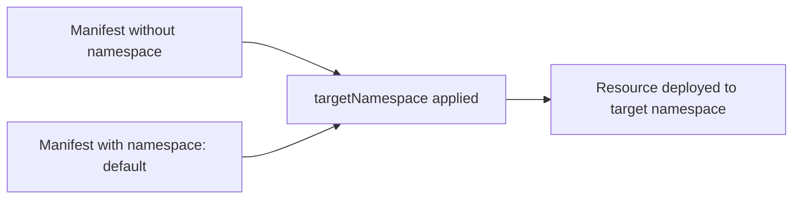

# How to Configure Kustomization Target Namespace in Flux

Author: [nawazdhandala](https://github.com/nawazdhandala)

Tags: Flux CD, GitOps, Kubernetes, Kustomize, Target Namespace, Multi-Tenancy

Description: Learn how to use spec.targetNamespace in a Flux Kustomization to override the namespace of all resources applied by the Kustomization.

---

## Introduction

The `spec.targetNamespace` field in a Flux Kustomization lets you override the namespace for all resources that the Kustomization applies. This is useful when you want to deploy the same set of manifests to different namespaces without modifying the manifests themselves. It is especially valuable in multi-tenancy scenarios where each tenant gets their own namespace with identical applications. This guide covers how to configure `targetNamespace`, when to use it, and what to watch out for.

## How targetNamespace Works

When you set `spec.targetNamespace`, Flux overrides the `metadata.namespace` field of every namespaced resource in the rendered manifests. Resources that already have a namespace set will have it replaced. Resources without a namespace will have one added.



Cluster-scoped resources (like ClusterRole, ClusterRoleBinding, and Namespace objects) are not affected by `targetNamespace` because they do not belong to any namespace.

## Basic targetNamespace Configuration

```yaml
# kustomization-target-ns.yaml - Override namespace for all resources
apiVersion: kustomize.toolkit.fluxcd.io/v1
kind: Kustomization
metadata:
  name: my-app
  namespace: flux-system
spec:
  interval: 10m
  sourceRef:
    kind: GitRepository
    name: my-repo
  path: ./deploy
  prune: true
  # All namespaced resources will be deployed to this namespace
  targetNamespace: production
```

With this configuration, even if a manifest has `namespace: default` or no namespace at all, Flux will deploy it to the `production` namespace.

Given this manifest in the source repository:

```yaml
# deploy/deployment.yaml - No namespace specified
apiVersion: apps/v1
kind: Deployment
metadata:
  name: web-app
  # No namespace set here
spec:
  replicas: 2
  selector:
    matchLabels:
      app: web-app
  template:
    metadata:
      labels:
        app: web-app
    spec:
      containers:
        - name: web
          image: nginx:1.25
```

Flux will apply this Deployment to the `production` namespace.

## Multi-Tenancy with targetNamespace

A common pattern is to deploy the same application to multiple namespaces for different tenants. Each tenant gets their own Kustomization with a different `targetNamespace`.

```yaml
# tenant-a-kustomization.yaml - Deploy to tenant-a namespace
apiVersion: kustomize.toolkit.fluxcd.io/v1
kind: Kustomization
metadata:
  name: app-tenant-a
  namespace: flux-system
spec:
  interval: 10m
  sourceRef:
    kind: GitRepository
    name: my-repo
  path: ./deploy/app
  prune: true
  targetNamespace: tenant-a
---
# tenant-b-kustomization.yaml - Same app, different namespace
apiVersion: kustomize.toolkit.fluxcd.io/v1
kind: Kustomization
metadata:
  name: app-tenant-b
  namespace: flux-system
spec:
  interval: 10m
  sourceRef:
    kind: GitRepository
    name: my-repo
  path: ./deploy/app
  prune: true
  targetNamespace: tenant-b
---
# tenant-c-kustomization.yaml - Same app, yet another namespace
apiVersion: kustomize.toolkit.fluxcd.io/v1
kind: Kustomization
metadata:
  name: app-tenant-c
  namespace: flux-system
spec:
  interval: 10m
  sourceRef:
    kind: GitRepository
    name: my-repo
  path: ./deploy/app
  prune: true
  targetNamespace: tenant-c
```

All three Kustomizations point to the same `path` and source but deploy to different namespaces. The manifests do not need any modification.

## Creating the Target Namespace

The target namespace must exist before resources can be deployed to it. You can ensure the namespace exists by creating it as part of your infrastructure Kustomization.

```yaml
# namespaces.yaml - Create namespaces before deploying apps
apiVersion: v1
kind: Namespace
metadata:
  name: tenant-a
---
apiVersion: v1
kind: Namespace
metadata:
  name: tenant-b
---
apiVersion: v1
kind: Namespace
metadata:
  name: tenant-c
```

Deploy namespaces with a separate Kustomization that other Kustomizations depend on:

```yaml
# namespace-kustomization.yaml - Deploy namespaces first
apiVersion: kustomize.toolkit.fluxcd.io/v1
kind: Kustomization
metadata:
  name: namespaces
  namespace: flux-system
spec:
  interval: 10m
  sourceRef:
    kind: GitRepository
    name: my-repo
  path: ./infrastructure/namespaces
  prune: true
---
# app-kustomization.yaml - App depends on namespaces
apiVersion: kustomize.toolkit.fluxcd.io/v1
kind: Kustomization
metadata:
  name: app-tenant-a
  namespace: flux-system
spec:
  interval: 10m
  sourceRef:
    kind: GitRepository
    name: my-repo
  path: ./deploy/app
  prune: true
  targetNamespace: tenant-a
  dependsOn:
    - name: namespaces
```

## Combining targetNamespace with Variable Substitution

You can combine `targetNamespace` with variable substitution for even more flexibility.

```yaml
# kustomization-combined.yaml - targetNamespace with variable substitution
apiVersion: kustomize.toolkit.fluxcd.io/v1
kind: Kustomization
metadata:
  name: app-tenant-a
  namespace: flux-system
spec:
  interval: 10m
  sourceRef:
    kind: GitRepository
    name: my-repo
  path: ./deploy/app
  prune: true
  targetNamespace: tenant-a
  postBuild:
    substitute:
      TENANT_NAME: tenant-a
      TENANT_TIER: premium
      MAX_REPLICAS: "10"
```

Your manifests can use both the namespace override and the substituted variables:

```yaml
# deploy/app/deployment.yaml - Uses variable substitution
apiVersion: apps/v1
kind: Deployment
metadata:
  name: web-app
  labels:
    tenant: ${TENANT_NAME}
    tier: ${TENANT_TIER}
spec:
  replicas: ${MAX_REPLICAS}
  selector:
    matchLabels:
      app: web-app
  template:
    metadata:
      labels:
        app: web-app
    spec:
      containers:
        - name: web
          image: nginx:1.25
```

## Important Caveats

### Cross-Namespace References

If your manifests contain references to resources in other namespaces (such as a ServiceAccount referencing a Secret in a different namespace), `targetNamespace` will not update those cross-namespace references. You will need to handle these manually or through variable substitution.

### Cluster-Scoped Resources

`targetNamespace` only affects namespaced resources. If your manifests include cluster-scoped resources like ClusterRole or ClusterRoleBinding, those are applied as-is without namespace modification.

### Health Checks with targetNamespace

When using `targetNamespace`, your health checks must reference the target namespace, not the original namespace in the manifest.

```yaml
# health-check-with-target-ns.yaml - Health check uses the target namespace
apiVersion: kustomize.toolkit.fluxcd.io/v1
kind: Kustomization
metadata:
  name: app-tenant-a
  namespace: flux-system
spec:
  interval: 10m
  sourceRef:
    kind: GitRepository
    name: my-repo
  path: ./deploy/app
  prune: true
  targetNamespace: tenant-a
  timeout: 5m
  healthChecks:
    - apiVersion: apps/v1
      kind: Deployment
      name: web-app
      # Must match the targetNamespace, not the original manifest namespace
      namespace: tenant-a
```

## Verifying targetNamespace

```bash
# Check that resources are deployed to the correct namespace
kubectl get all -n tenant-a

# Preview the Kustomization output to see namespace overrides
flux build kustomization app-tenant-a

# Verify the Kustomization status
flux get kustomization app-tenant-a
```

## Best Practices

1. **Ensure the target namespace exists** before the Kustomization tries to deploy to it. Use `dependsOn` with a namespace-creating Kustomization.
2. **Use targetNamespace for multi-tenancy** to avoid duplicating manifests for each tenant.
3. **Be aware of cluster-scoped resources** in your manifests, as they are not affected by `targetNamespace`.
4. **Update health check namespaces** to match the `targetNamespace` rather than the namespace in the original manifest.
5. **Combine with variable substitution** to inject tenant-specific values alongside the namespace override.

## Conclusion

The `spec.targetNamespace` field is a simple but powerful feature that lets you deploy the same manifests to different namespaces without modification. It is particularly useful in multi-tenancy scenarios, environment separation, and any situation where you need namespace-level isolation with shared manifests. Combined with variable substitution and dependency ordering, it enables scalable, DRY GitOps workflows.
